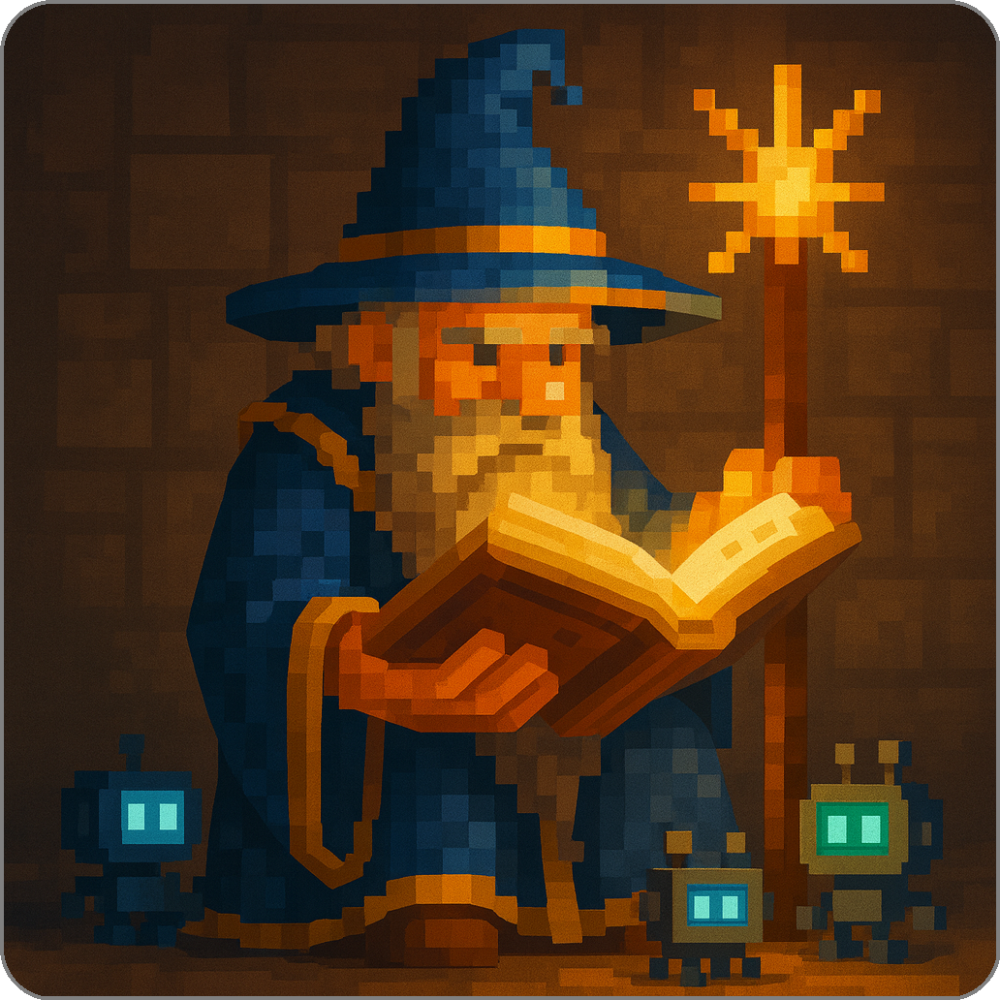

# The Official Documentation for Summoner

  

**HTML version of this page**: [here](https://summoner-network.github.io/summoner-docs)

**Summoner Standard Profile**: [here](https://summoner-network.github.io/summoner-standard)

## 🔎 Technical Index (quick search by keywords)

See list of keywords

### By role

| Topic        | Level     | Page link                                                                          |
| ------------ | --------- | ----------------------------------------------------------------------------- |
| Server       | Beginner  | [miniSummoner perspective (gentle mockup)](introduction/mini_sdk.md)          |
| Server       | Beginner  | [miniSummoner simulation (gentle mockup)](introduction/minisdk/multiparty.md) |
| Server       | Beginner  | [Basics](guide_sdk/getting_started/quickstart/basics_server.md)               |
| Server       | Initiated | [Getting started](guide_sdk/getting_started/quickstart/begin_server.md)       |
| Server       | Adept     | [Server configuration](guide_sdk/fundamentals/server_relay.md)                |
| Client / Agent | Beginner  | [miniSummoner perspective (gentle mockup)](introduction/mini_sdk.md)          |
| Client / Agent | Beginner  | [miniSummoner simulation (gentle mockup)](introduction/minisdk/multiparty.md) |
| Client / Agent | Beginner  | [Basics](guide_sdk/getting_started/quickstart/basics_client.md)               |
| Client / Agent | Initiated | [Getting started](guide_sdk/getting_started/quickstart/begin_client.md)       |
| Client / Agent | Adept     | [Client configuration](guide_sdk/fundamentals/client_agent.md)                |
| Client / Agent | Adept     | [Agent design](guide_sdk/fundamentals/design.md)                              |

### By concept

| Concept         | Level      | Page link                                                                                                                          |
| --------------- | ---------- | ----------------------------------------------------------------------------------------------------------------------------- |
| Receive / Send  | Beginner   | [miniSummoner perspective](introduction/mini_sdk.md)                                                                          |
| Receive / Send  | Beginner   | [miniSummoner simulation](introduction/minisdk/multiparty.md)                                                                 |
| Receive / Send  | Initiated  | [Simple agents](guide_sdk/getting_started/quickstart/begin_client.md#building-interactive-agents)                             |
| Receive / Send  | Apprentice | [Flows for receive/send](guide_sdk/getting_started/quickstart/begin_flow.md#orchestrating-receivesend-with-flows)             |
| Receive / Send  | Adept      | [Messaging primitives and idioms](guide_sdk/fundamentals/design.md#messaging-primitives-and-idioms)                           |
| Routes & States | Beginner   | [miniSummoner finite-state mockup](introduction/minisdk/mini_fsm_agents.md)                                                   |
| Routes & States | Beginner   | [Knowledge requirements](guide_sdk/getting_started/prerequisites.md#knowledge-requirements)                                   |
| Routes & States | Beginner   | [Basics (graph logic)](guide_sdk/getting_started/quickstart/basics_client.md#graphs-of-endpoints)                             |
| Routes & States | Initiated  | [Composition in capabilities](guide_sdk/getting_started/quickstart/begin_client.md#composition-thinking-in-capabilities)      |
| Routes & States | Apprentice | [Advanced route shapes](guide_sdk/getting_started/quickstart/begin_flow.md#advanced-route-shapes)                             |
| Routes & States | Adept      | [State and flows (explicit automata)](guide_sdk/fundamentals/design.md#state-and-flows-explicit-automata-over-implicit-flags) |
| Hooks           | Apprentice | [Hooks & priorities](guide_sdk/getting_started/quickstart/begin_flow.md#hooks--priorities-prepost-processing)                 |
| Travel          | Adept      | [Command-gating your agent](guide_sdk/fundamentals/design.md#command-gating-your-agent)                                       |
| Events          | Apprentice | [Route DSL & semantics](guide_sdk/getting_started/quickstart/begin_flow.md#route-dsl--semantics)                              |

### Aurora (upcoming release)

* [What does the Summoner SDK do?](guide_sdk/getting_started/what_is.md)
* [Update Installation](guide_sdk/getting_started/installation.md)
* [Windows Installation](guide_sdk/getting_started/windows_install.md)
* [server's basics](guide_sdk/getting_started/quickstart/basics_server.md)
* [client's basics](guide_sdk/getting_started/quickstart/basics_client.md)
* [Getting started: Server](guide_sdk/getting_started/quickstart/begin_server.md)
* [Getting started: clients & agents](guide_sdk/getting_started/quickstart/basics_client.md)
* [reference](reference/index.md)
* [Advanced usage: server](guide_sdk/advanced_usage/server_setup.md)
* [Advanced usage: server](guide_sdk/advanced_usage/agent_setup.md)

## 📚 Documentation Overview

- [**🎬 Prologue**](prologue/index.md)
- [**💡 Introduction**](introduction/index.md)
    - [***Why Summoner specifically?***](introduction/why_summoner.md)
        - [Our agent model](introduction/more/why1_world.md)
        - [Mobility and ownership](introduction/more/why2_self.md)
        - [Composability in agent networks](introduction/more/why3_compose.md)
        - [Summoner: the basis for a persistent world](introduction/more/why4_mmo.md)
        - [Comparison with existing frameworks](introduction/more/why5_diff.md)
    - [***The mini SDK concept***](introduction/mini_sdk.md)
        - [Multiparty communication](introduction/minisdk/multiparty.md)
        - [Finite state machine logic](introduction/minisdk/mini_fsm_agents.md)
        - [From miniSummoner to Summoner](introduction/minisdk/conclusion.md)

- [**🚀 Summoner SDK Guides**](guide_sdk/index.md)
    - [***Getting started***](guide_sdk/getting_started/index.md)
        - [What does the Summoner SDK do?](guide_sdk/getting_started/what_is.md)
        - [Prerequisites](getting_started/prerequesites.md)
        - [Installation](guide_sdk/getting_started/installation.md)
        - [Quickstart](guide_sdk/getting_started/quickstart/index.md)
            * [Basics](guide_sdk/getting_started/quickstart/basics.md) 
                * [Server](guide_sdk/getting_started/quickstart/basics_server.md)
                * [Client](guide_sdk/getting_started/quickstart/basics_client.md)
            * [Beginners guide to Summoner](guide_sdk/getting_started/quickstart/begin.md)
                * [Getting started with servers](guide_sdk/getting_started/quickstart/begin_server.md)
                * [Getting started with clients & agents](guide_sdk/getting_started/quickstart/begin_client.md)  
                * [Agent behavior as flows](guide_sdk/getting_started/quickstart/begin_flow.md)
                * [Working with asynchronous programming](guide_sdk/getting_started/quickstart/begin_async.md)
    - [***The Zen of Summoner***](guide_sdk/fundamentals/index.md)
        - [Servers and relay](guide_sdk/fundamentals/server_relay.md) 
        - [Clients and agents](guide_sdk/fundamentals/client_agent.md)
        - [Agent design principles](guide_sdk/fundamentals/design.md)
        
- [**💻 Desktop App Guide**](guide_app/index.md)
    - [What Does the Desktop App Do?](guide_app/what_is.md)
    - [Installation](guide_app/installation.md)
    - [Create an account and login](guide_app/login.md)
    * **By features**
        - [Import an agent to the desktop app](guide_app/features/import_agent.md)
        - [Build your agent dependencies](guide_app/features/build_agent.md) 
        - [Launch your agent](guide_app/features/launch_agent.md) 
        - [Launch a server](guide_app/features/launch_server.md) 

- [**📚 SDK Reference**](reference/index.md)
    - [***Core SDK***](reference/sdk_doc/index.md)
        - [<code style="background: transparent;">Summoner<b>.client</b></code>](reference/sdk_doc/client.md)
        - [<code style="background: transparent;">Summoner<b>.server</b></code>](reference/sdk_doc/server.md)
        - [<code style="background: transparent;">Summoner<b>.protocol</b></code>](reference/sdk_doc/proto.md)
    - [***Agent Extensions***](reference/lib_agent/index.md)
        - [<code style="background: transparent;">Summoner<b>.aurora</b></code>](reference/lib_agent/aurora.md)
    - [***Utility Extensions***](reference/lib_utils/index.md)
        - [<code style="background: transparent;">Summoner<b>.visionary</b></code>](reference/lib_utils/visionary.md)
        - [<code style="background: transparent;">Summoner<b>.pdf_tools</b></code>](reference/lib_utils/pdf_tools.md)
        - [<code style="background: transparent;">Summoner<b>.code_tools</b></code>](reference/lib_utils/code_tools.md)
        - [<code style="background: transparent;">Summoner<b>.curl_tools</b></code>](reference/lib_utils/curl_tools.md)
        - [<code style="background: transparent;">Summoner<b>.llm_guardrails</b></code>](reference/lib_utils/llm_guardrails.md)
        - [<code style="background: transparent;">Summoner<b>.crypto_utils</b></code>](reference/lib_utils/crypto_utils.md)

- [**🔧 Developer & Contribution**](development/index.md)
    - [**Development and infrastructure**](development/infrastructure/index.md)
        - [Github repo organization](development/infrastructure/github_infra.md)
        - [How to use templates](development/infrastructure/template_howto.md)
        - [Summoner updates and extensions](development/infrastructure/summoner_ext.md)
    - [**How to contribute**](development/contribution/index.md)
        - [Submitting an issue](development/contribution/issues.md)
        - [Contributing to the server code base](development/contribution/server_code.md)
        - [Creating an agent class](development/contribution/agent_framework.md)

- [**❓ Frequently Asked Questions**](faq/index.md)
