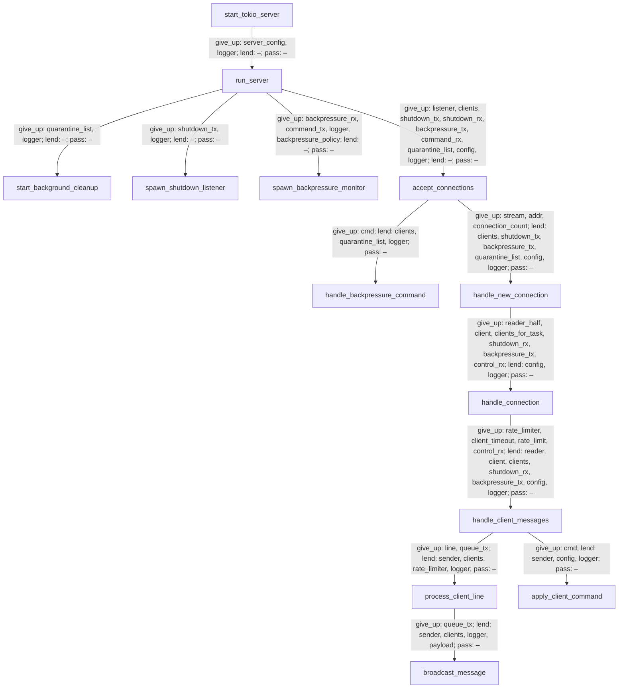

# Contributing to the Rust Server Codebase

<p align="center">

</p>

This guide is intended for developers who want to contribute to the Rust-based server implementations that power our agent platform. The diagram above provides a high-level overview of the architecture: clients written in Python (and powered by our core SDK) communicate with a server that can run on either a Rust or Python backend, all coordinated through a Python wrapper.

If you are looking to understand how the Rust components integrate into the broader system, or you plan to extend, optimize, or patch the server logic, this document will walk you through the process step by step.

## Overview

The Rust server logic is located under the `summoner/` directory, which also houses the Python core SDK for client agents. While client interactions are handled purely in Python, the server logic supports two interchangeable implementations:

- A **Python-based server** (`summoner/server/server.py`) designed for experimentation and testing.
- A **Rust-based server** (`summoner/rust/`) designed for high performance and production readiness.

These Rust modules are exposed to Python via [PyO3](https://pyo3.rs/), allowing seamless integration with the core SDK. You can switch between server implementations by specifying an option when launching the server.

**Guideline**: All features available in the Python server should also be implemented (and extended upon) in the Rust version.

### Project Structure

```bash
summoner
├── client             # Agent core SDK (Python)
├── protocol
├── rust               # Rust server implementations
│   ├── rust_server_sdk
│   └── rust_server_sdk_1
│   └── rust_server_sdk_2
└── server             # Python server
```

By default, the agent core SDK operates with Python. However, the server supports both Python and Rust backends, selectable via an option:

```python
myserver = SummonerServer(name="MyServer", option=args.option)
```

When contributing a new Rust server implementation, choose a unique identifier for it. You can then launch the server using that identifier:

```python
myserver = SummonerServer(name="MyServer", option="my_new_rust_patch")
```

The following sections guide you through setting up and integrating your custom Rust implementation.


## Prerequisites

Ensure Python is installed. To install Rust:

### On macOS (via Homebrew)
```bash
brew install rustup
```

### On macOS/Linux (via installer script)
```bash
curl --proto '=https' --tlsv1.2 -sSf https://sh.rustup.rs | sh
```

Restart your terminal, then verify the installation:
```bash
rustc --version   # ✅ Should print the version
cargo --version
```

If you have just cloned the repository, run the setup script:
```bash
source setup.sh
```

This will:
- Set up a Python virtual environment (`venv`)
- Create a `.env` file
- Install all active Rust server implementations

More details are available in the [Installation Guide](doc_installation.md).


## Creating a New Rust Server Module

To begin development on a new Rust server implementation:

1. **Identify a base module**  
   Navigate to `summoner/rust/` and locate the most recent module (e.g. `rust_server_sdk_2`).

2. **Duplicate and rename**  
   Copy the folder and rename it (e.g. `awesome_rust_server`).

3. **Update `Cargo.toml`**  
   Modify the package and library names:
   ```toml
   [package]
   name = "awesome_rust_server"
   version = "0.1.0"
   edition = "2024"

   [lib]
   name = "awesome_rust_server"
   crate-type = ["cdylib"]

   [dependencies]
   # Add required dependencies
   ```

4. **Update `lib.rs`**  
   At the bottom of `src/lib.rs`, define the exported Python module with the correct name:
   ```rust
   #[pymodule]
   fn awesome_rust_server(_py: Python, m: &Bound<'_, PyModule>) -> PyResult<()> {
       m.add_function(wrap_pyfunction!(start_tokio_server, m)?)?;
       Ok(())
   }
   ```

5. **Modify the codebase**  
   You may now develop and test your implementation.

6. **Reinstall your module**  
   Use the helper script to (re)install your module:
   ```bash
   bash reinstall_rust_server.sh awesome_rust_server
   ```

7. **Register the module in Python**  
   Edit `server.py` to import and register your implementation in `SummonerServer.run()`:
   ```python
   import awesome_rust_server as awesome_rust_server

   # ... scroll down the code until you reach run() ...

   def run(self, host='127.0.0.1', port=8888, config_path = ""):
       server_config = load_config(config_path=config_path, debug=True)

       rust_dispatch = {
           "rss": lambda h, p: rss.start_tokio_server(self.name, h, p),
           # .... previous Rust implementations here ...
           "my_new_rust_patch": lambda h, p: awesome_rust_server.start_tokio_server(
               self.name, 
               {
                   "host": h,
                   "port": p,
                   **server_config.get("hyper_parameters", {})
               }),
       }
   ```

Thank you for the correction. Here is a slightly more concise version with the correct filename:


8. **Refresh the Python core SDK installation**  
   By default, the `summoner` module is installed in _editable mode_, so changes to files like `server.py` take effect automatically. If you have modified `setup.sh` and removed the `--dev-core` flag from the call to `reinstall_python_sdk.sh`, editable mode will be disabled. In that case, reinstall the module manually:

   ```bash
   pip uninstall -y summoner
   pip install .
   ```

9. **Test your server**  
   Use the `myserver.py` script in `templates`:
   ```bash
   python templates/myserver.py --config server_config.json
   ```

   To launch clients for testing:
   ```bash
   python templates/myclient.py
   ```

10. **Optional: Add to setup script**  
    If your module should be installed automatically via `setup.sh`, add:
    ```bash
    bash reinstall_python_sdk.sh awesome_rust_server --dev-core
    ```
    The `--dev-core` flag ensures the summoner module is installed in _editable mode_, which is recommended during development.

## Module Documentation: `rust_server_sdk_2`

This diagram shows how our core server functions call one another **top-to-bottom**, and exactly how data moves between them:

- **Nodes** are functions in `mod.rs`, from `start_tokio_server` down to low-level helpers.
- **Arrows** show “A → B” when **A** directly calls **B**.
- **Edge labels** explain three kinds of data movement on each call:
  - **give_up:** ownership is moved from caller to callee (caller can no longer use it).
  - **lend:** caller retains ownership but lends a borrow (mutable or immutable) to callee.
  - **pass:** caller passes along a reference it itself borrowed.

Knowing “who owns what” at each step makes it easier to reason about lifetimes, avoid accidental clones, and ensure thread-safe access across `async` tasks.




<p align="center">
  <a href="issues.md">&laquo; Previous: Submitting an Issue </a> &nbsp;&nbsp;&nbsp;|&nbsp;&nbsp;&nbsp; <a href="agent_framework.md">Next: Creating an Agent Class &raquo;</a>
</p>