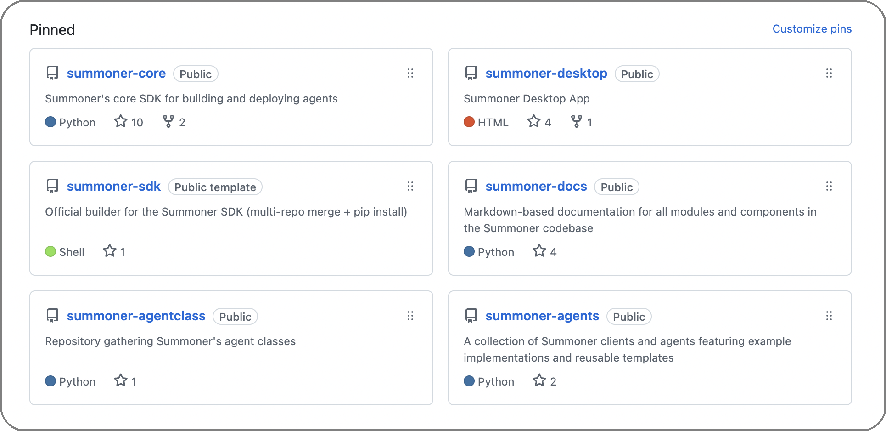

# Github Repo Organization

This page gives a quick map of the pinned repositories in the Summoner organization and how to use each one.

<p align="center">
  
</p>

> [!NOTE]
> The screenshot reflects the current set of pinned repositories as of September 16, 2025.

## Overview at a glance

| Repo                    | Purpose                                                                                | Primary tech            | Key scripts                               | Typical use                                                  | License    |
| ----------------------- | -------------------------------------------------------------------------------------- | ----------------------- | ----------------------------------------- | ------------------------------------------------------------ | ---------- |
| **summoner-core**       | Core runtime used by agents and servers. Python client SDK and Rust server.            | Python, Rust            | `setup.sh`                                | Develop against the core. Build and run servers locally.     | Apache-2.0 |
| **summoner-agents**     | Runnable agents that demonstrate SDK patterns like `@receive` and `@send(multi=True)`. | Python                  | `build_sdk.sh`, `install_requirements.sh` | Try examples and learn message patterns.                     | Apache-2.0 |
| **summoner-docs**       | Documentation you are reading. Concepts, design notes, and developer guides.           | Markdown, static assets | n/a                                       | Read and contribute documentation improvements.              | Apache-2.0 |
| **summoner-sdk**        | Assembles an SDK from listed modules in `build.txt`.                                   | Bash, Python            | `build_sdk.sh`                            | Build your own SDK from modules. Use `setup` or `dev_setup`. | Apache-2.0 |
| **summoner-desktop**    | Optional desktop UI for running agents and servers.                                    | Node, Electron          | repo-specific commands                    | Inspect and manage agents visually.                          | Apache-2.0 |
| **starter-template**    | Template to author a native module that plugs into the SDK.                            | Python, Rust            | `install.sh`                              | Create and test a new module under `tooling/`.               | Apache-2.0 |
| **summoner-agentclass** | Native module that adds security and orchestration features to `SummonerClient`.       | Python                  | repo-specific                             | Use DID and cryptographic envelopes in your agents.          | Apache-2.0 |

> [!IMPORTANT]
> **Licensing and scope**
>
> * All public repositories in the Summoner organization are intended to be licensed under the **Apache License, Version 2.0**. The **controlling terms are the `LICENSE` file at the root of each repository**. If a repository lacks a `LICENSE`, no license is granted and you should open an issue.
> * You may use, modify, and redistribute the code, including commercially, subject to the Apache-2.0 terms.
> * Keep the repository `LICENSE` and any `NOTICE` file with your distributions. Respect third-party dependency licenses.
> * Trademarks, logos, and brand names are not licensed.
> * Direct code changes to `summoner-core` and official server implementations are maintained by the internal team. Propose behavior changes through issues first or publish a module.

## How each repo is used

**summoner-core**
Core runtime and reference servers. The setup installs `summoner` in editable mode for clean imports.

```bash
git clone https://github.com/Summoner-Network/summoner-core
cd summoner-core
source setup.sh
# Python 3.9+ and Rust toolchain required
```

> [!IMPORTANT]
> Contributions are accepted under **Apache-2.0**. See the repo `CONTRIBUTING.md` for DCO sign-off or CLA details, if applicable.

**summoner-agents**
Runnable examples that exercise the SDK.

```bash
git clone https://github.com/Summoner-Network/summoner-agents
cd summoner-agents
source build_sdk.sh setup
source venv/bin/activate
python agents/agent_EchoAgent_0/agent.py
```

**summoner-docs**
Houses the documentation. Improve clarity, fix typos, and add examples through issues or doc-only PRs where allowed.

**summoner-sdk**
Build an SDK from a recipe of modules listed in `build.txt`.

```bash
git clone https://github.com/Summoner-Network/summoner-sdk
cd summoner-sdk
# Standard setup
source build_sdk.sh setup
# Use the core dev branch when needed
source build_sdk.sh dev_setup
```

**summoner-desktop**
Desktop UI. Follow the repo README for Node prerequisites and run commands.

**starter-template**
Start a new module in `tooling/`, validate with the test server, then publish. Include your own `LICENSE` (Apache-2.0 recommended) and any `NOTICE` content.

```bash
git clone https://github.com/Summoner-Network/starter-template my-module
cd my-module
source install.sh setup
bash install.sh test_server
```

**summoner-agentclass**
Provides DID support and cryptographic envelopes that integrate with `SummonerClient`. Use when you need secure messaging and orchestration features in your agents.

> [!NOTE]
> **License reminders**
>
> * Keep `LICENSE` and `NOTICE` files with any redistribution.
> * State significant changes you make.
> * Respect third-party licenses included in dependencies.

<p align="center">
  <a href="index.md">&laquo; Previous: Development and Infrastructure </a> &nbsp;&nbsp;&nbsp;|&nbsp;&nbsp;&nbsp; <a href="template_howto.md">Next: How to Use Templates &raquo;</a>
</p>
