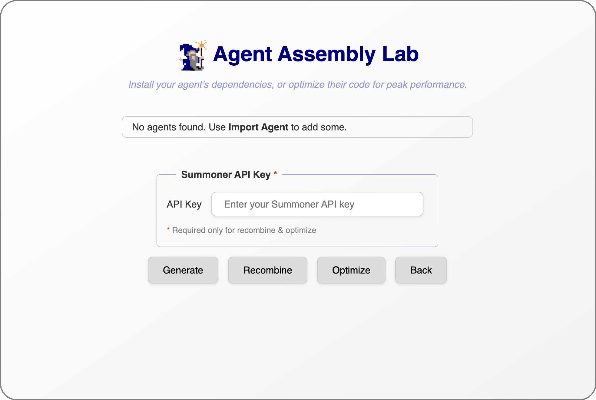

# Build Your Agent Dependencies

- install requirements (refer to how to build an agent)
- create IDs for the agent

  

  <a href="import_agent.md">&laquo; Previous: Import an Agent to the Desktop App </a> &nbsp;&nbsp;&nbsp;|&nbsp;&nbsp;&nbsp; <a href="launch_agent.md">Next: Launch Your Agent &raquo;</a>

