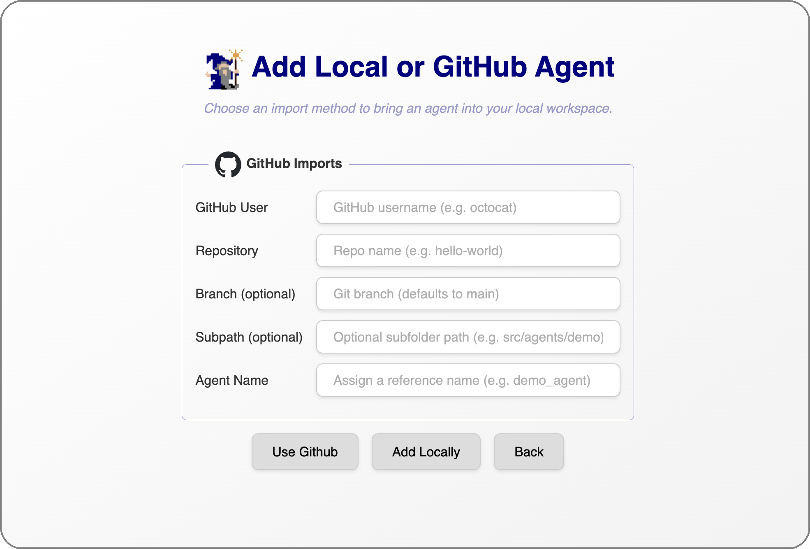

# Import an Agent to the Desktop App

  

  <a href="../login.md">&laquo; Previous: Create an Account and Login </a> &nbsp;&nbsp;&nbsp;|&nbsp;&nbsp;&nbsp; <a href="build_agent.md">Next: Build Your Agent Dependencies &raquo;</a>

