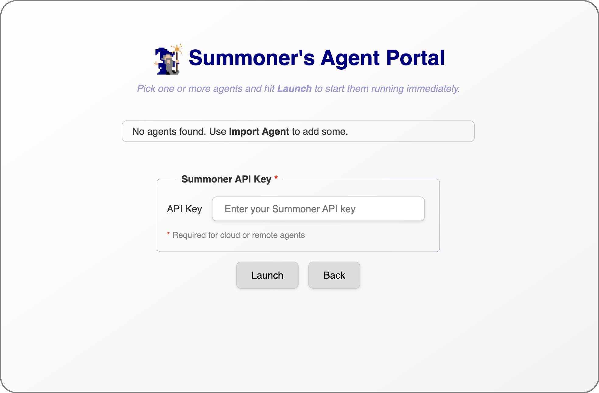

# Launch Your Agent

🛠️

  <strong>Work in progress</strong>

  <em>Thanks for your patience — we're polishing things up ✨</em>

## Preview

  

  <a href="build_agent.md">&laquo; Previous: Build Your Agent Dependencies </a> &nbsp;&nbsp;&nbsp;|&nbsp;&nbsp;&nbsp; <a href="launch_server.md">Next: Launch a Server &raquo;</a>

