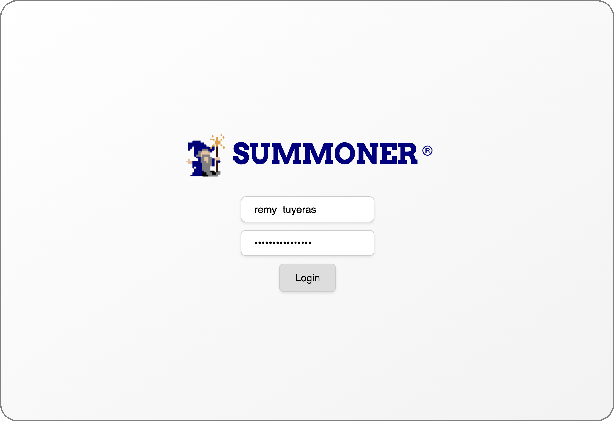

# Account Creation and Login Procedure

🛠️

  <strong>Work in progress</strong>

  <em>Thanks for your patience — we're polishing things up ✨</em>

## Preview

  

  

  <a href="installation.md">&laquo; Previous: Installation </a> &nbsp;&nbsp;&nbsp;|&nbsp;&nbsp;&nbsp; <a href="features/import_agent.md">Next: Import an Agent to the Desktop App &raquo;</a>

