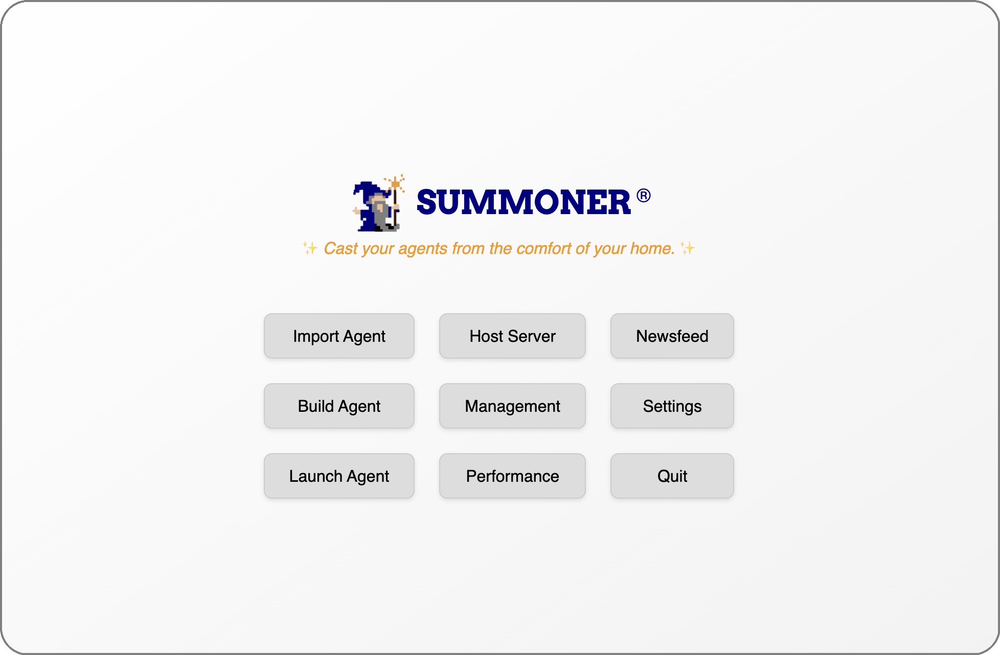

# What Does the Desktop App Do?

<!-- The desktop app allows you to do operational (DevOps) that would be more cumbersome with the SDK. In addition, it provides more visual features such as analytics. -->

🛠️

  <strong>Work in progress</strong>

  <em>Thanks for your patience — we're polishing things up ✨</em>

## Preview

  

  <a href="./index.md">&laquo; Previous: Create Your Own Agent Framework Using Summoner </a> &nbsp;&nbsp;&nbsp;|&nbsp;&nbsp;&nbsp; <a href="installation.md">Next: Installation &raquo;</a>

