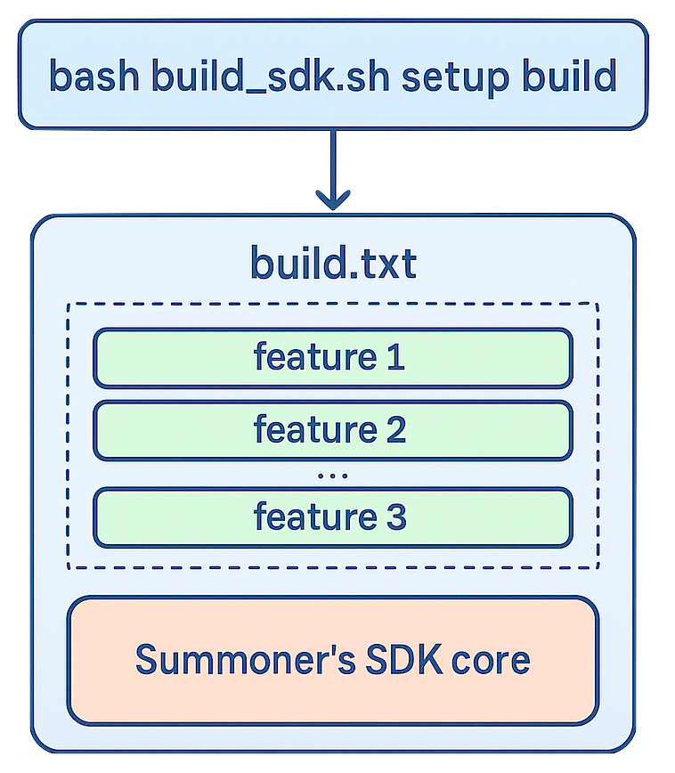
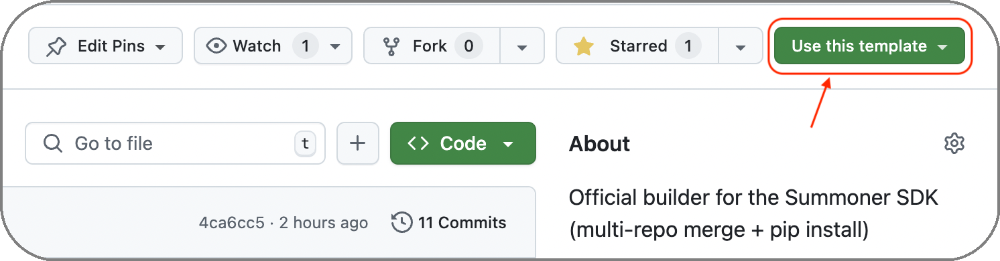

# Installation of the Summoner SDK

Because the Summoner SDK is composed of multiple repositories, we do **not** currently support installation via package registries like PyPI. Instead, we use Bash-based installation scripts to manage setup and composition.

This script-based approach is consistent across key components of the platform, including:

* [`summoner-desktop`](https://github.com/Summoner-Network/summoner-desktop): the Electron-based desktop app
* [`summoner-core`](https://github.com/Summoner-Network/summoner-core): the core logic of the SDK
* [`summoner-agentclass`](https://github.com/Summoner-Network/summoner-agentclass): agent extensions and features

Each of these repositories contains its own `setup.sh`, `install.sh` or build script, and these scripts **chain together** during installation. For example, installing the SDK via `summoner-desktop` will trigger the `summoner-sdk` script, which in turn calls the setup scripts from `summoner-core` and any modules specified in `build.txt`.

<p align="center">
  
</p>

For Windows users, we provide a setup guide adapted to the Windows environment [here](windows_install.md).

## A Template-Based SDK

The [`summoner-sdk`](https://github.com/Summoner-Network/summoner-sdk) repository is a **GitHub template repository**, meaning users should not modify it directly. Instead, use GitHub's "Use this template" feature to generate a new repository that includes only the installation logic.


You then customize your new SDK by editing the `build.txt` file to specify which modules to include. This modular architecture allows for many valid SDK compositions based on different combinations of features surrounding the SDK core.

> [!NOTE]
> The default `build.txt` in the template includes:
>   * `summoner-smart-tools` (currently private)
>   * `summoner-agentclass` (public)

A best practice is to only publish new code or features specific to your SDK, and keep the actual installation logic clean and declarative through `build.txt`. For example, [`summoner-agents`](https://github.com/Summoner-Network/summoner-agents) is built from this template and contains only agent code — the SDK is installed via `build_sdk.sh` based on its own `build.txt`.


<p align="center">
  
</p>


## Required Languages and Setup Scripts

Summoner's SDK uses a layered script system to orchestrate installation and composition. These scripts handle environment setup, dependency resolution, and module integration. They rely on both **Python** and **Rust**, which are foundational to the platform.

The key scripts involved are:

* [`build_sdk.sh`](https://github.com/Summoner-Network/summoner-sdk/blob/main/build_sdk.sh) – top-level installer for assembling the SDK (from `summoner-sdk`)
* [`setup.sh`](https://github.com/Summoner-Network/summoner-core/blob/main/setup.sh) – initializes the SDK core (from `summoner-core`)
* [`reinstall_python_sdk.sh`](https://github.com/Summoner-Network/summoner-core/blob/main/reinstall_python_sdk.sh) – installs Python dependencies (from `summoner-core`)
* [`reinstall_rust_server.sh`](https://github.com/Summoner-Network/summoner-core/blob/main/reinstall_rust_server.sh) – builds and installs the Rust server (from `summoner-core`)

These scripts **assume** that both **Python 3.9+** and the **Rust toolchain** are already installed and available in your environment.

If you are not yet set up, the following section will guide you through installing both languages. This is a one-time setup required before building or running the SDK.


### 1. Install Python

Check your current Python version:

```bash
python3 --version
```

If Python is not installed, install it using your system's package manager:

**On macOS:**

```bash
brew install python
```

**On Ubuntu/Debian:**

```bash
sudo apt update
sudo apt install python3 python3-venv python3-pip
```


### 2. Install Rust

Install Rust using [`rustup`](https://rustup.rs):

**On macOS (via Homebrew):**

```bash
brew install rustup
rustup-init
```

**On macOS/Linux (via curl):**

```bash
curl --proto '=https' --tlsv1.2 -sSf https://sh.rustup.rs | sh
```

Restart your terminal and verify:

```bash
rustc --version     # Should print the Rust compiler version
cargo --version     # Should print the Cargo package manager version
```


## 🔧 Build the SDK with a Custom `build.txt`

Once Python and Rust are installed, you can define your SDK composition and install it.

### Step 1: Create Your SDK Repository

1. Go to the [`summoner-sdk` template repository](https://github.com/Summoner-Network/summoner-sdk)
2. Click **"Use this template"**
3. Choose **"Create a new repository"**, name your project, and confirm

<p align="center">
  
</p>

Clone your new repository:

```bash
git clone https://github.com/<your_account>/<your_repo>.git
cd <your_repo>
```


### Step 2: Define the SDK in `build.txt`

Edit the `build.txt` file to include the modules you want. For example, to include the `aurora` agent module from `summoner-agentclass`:

```txt
https://github.com/Summoner-Network/summoner-agentclass.git:
aurora
```

> [!WARNING]
>  As of this writing, the `aurora` module is still under development. Full support for agent behavior will be available soon.

You can modify this file at any time to add or remove modules.


### Step 3: Run the Installer

> _🔁 The demo below is a looping animation. If you want to view it from the beginning, **right-click → Open Image in New Tab** or **refresh the page**._


<p align="center">
  
</p>

Once `build.txt` is configured, run the script:

```bash
source build_sdk.sh setup
```

This will:

* Create a Python `venv/`
* Install all required Python and Rust dependencies
* Pull in the requested features defined in `build.txt`
* Link them together into a functional SDK workspace

If you prefer to execute the script instead of sourcing it:

```bash
bash build_sdk.sh setup
source venv/bin/activate
```

You are now ready to begin development using your custom Summoner SDK.

<p align="center">
  <a href="prerequisites.md">&laquo; Previous: Prerequisites</a> &nbsp;&nbsp;&nbsp;|&nbsp;&nbsp;&nbsp; <a href="quickstart/index.md">Next: Quickstart &raquo;</a>
</p>
