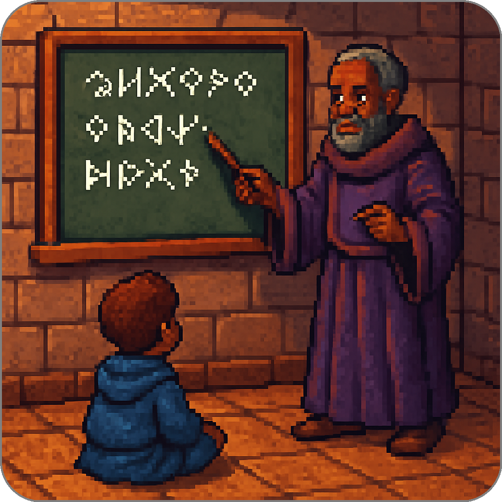

# Basics

Summoner is a **protocol** for secure, reliable communication between independent agents.
Let us briefly review what a protocol is, and why it matters for coordination.

## What is a Protocol?

A protocol defines the rules that enable effective communication and coordination. Protocols determine:

* How messages are formatted and sent.
* How silence, delays, or errors are handled.
* The expectations and behavior of all participating components.

Without clear protocols, systems become inefficient or fail entirely.

  

## Summoner in Practice

Summoner builds on TCP, a foundational **internet protocol** introduced in the 1970s, to ensure reliable communication between agents and servers. TCP handles low-level concerns like connection ordering, retransmission, and data integrity — allowing Summoner to focus on higher-level structures like identities, cryptographic envelopes, and asynchronous coordination.

  

To understand how these systems interact, see how a basic [client](guide_sdk/getting_started/quickstart/basics_client.md) or [server](guide_sdk/getting_started/quickstart/basics_server.md) connects via TCP. The [Beginner's Guide](beginner.md) explains how Summoner servers and clients are structured on top of these basics.

  <a href="index.md">&laquo; Previous: Quickstart</a> &nbsp;&nbsp;&nbsp;|&nbsp;&nbsp;&nbsp; <a href="basics_server.md">Next: Server (Basics) &raquo;</a>

