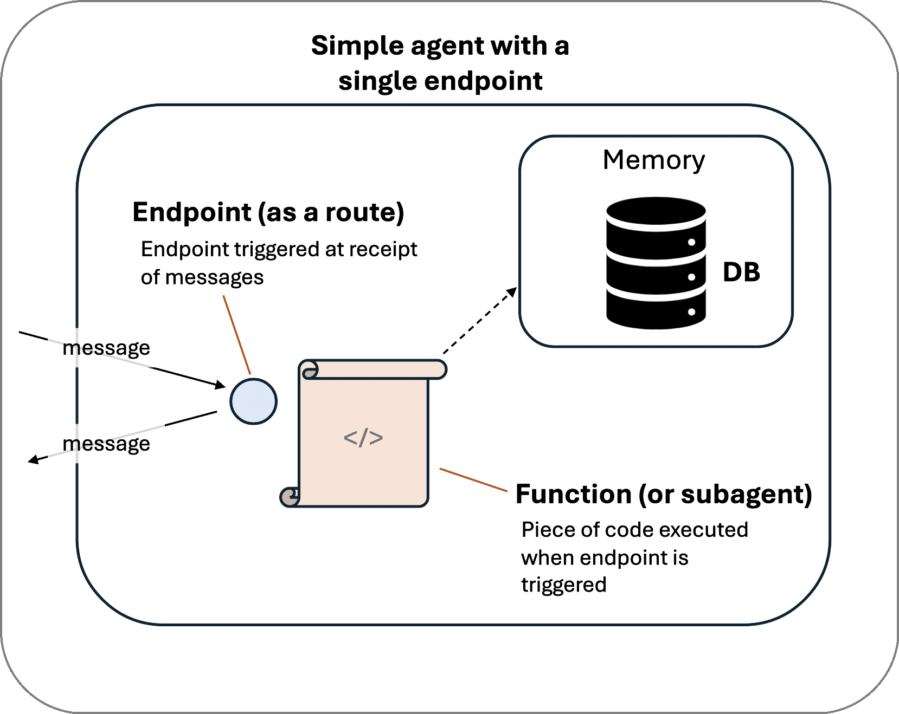
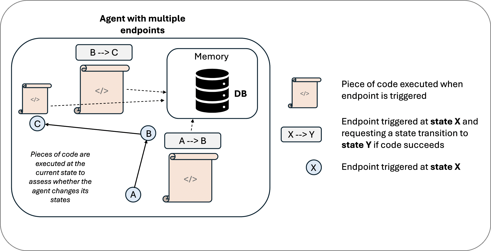

# Basics on TCP-Based Summoner Clients

Summoner clients are built on top of Python's `asyncio` TCP functionality, but they go far beyond basic socket connections. The client architecture introduces orchestration logic and a security layer, transforming a simple TCP client into a programmable, composable agent.

## From Client to Agent

A **Summoner agent** begins as a TCP client, but adds two essential layers:

* **Orchestration**: The ability to route and manage behaviors dynamically across internal components.
* **✨(Planned)✨ Decentralized Identity**: Each agent cryptographically signs messages, owns a verifiable identity, and can participate in secure agent-to-agent communication.

This leads to the working definition:

> **Agent = TCP Client + Decentralized Identity + Orchestration Logic**

## Graphs of Endpoints

Clients and agents in Summoner are not monolithic. Internally, they are structured as **graphs of endpoints**:

* Each **endpoint** is a self-contained handler for a route or message type.
* Endpoints can act independently or in cooperation, enabling **subagents** to form inside larger agent structures.

This graph-based architecture enables modularity: endpoints can be created, composed, and nested to form rich agent behaviors.

<table>
  <tr>
    <th>
      
<strong>Single Agent</strong>

    </th>
    <th>
      
<strong>Multi-Agent System</strong>

    </th>
  </tr>
  <tr>
    <td>
      

        
      

    </td>
    <td>
      

        
      

    </td>
  </tr>
</table>

## Finite-State Coordination

The orchestration logic behind these endpoint graphs is modeled as a **finite-state machine (FSM)**:

* **Stateful transitions** dictate how the agent responds to events or messages.
* **Local state** at each endpoint allows agents to evolve their behavior over time.
* **Global coordination** across endpoints is driven by the underlying FSM logic.

This makes agents not just reactive, but **coordinated systems of intent**.

## Composability by Design

A key design principle in Summoner is composability:

* A **collection of endpoints** can be treated as a higher-order agent.
* Subagents can be embedded, routed, or delegated to — because all communication is structured and orchestrated consistently.

This allows you to:

* Build simple agents with one or two routes.
* Compose complex multi-agent systems from reusable building blocks.

    <strong>Composition of Simple Agents Into a Multi-Subagent System</strong> 
    

---

Summoner clients, therefore, are not just TCP sockets with callbacks. They are the structural foundation for programmable, composable agents — each carrying its own identity, behavior graph, and orchestration model.

  <a href="basics_server.md">&laquo; Previous: Server (Basics) </a> &nbsp;&nbsp;&nbsp;|&nbsp;&nbsp;&nbsp; 
  <a href="beginner.md">Next: Beginner's Guide &raquo;</a>

