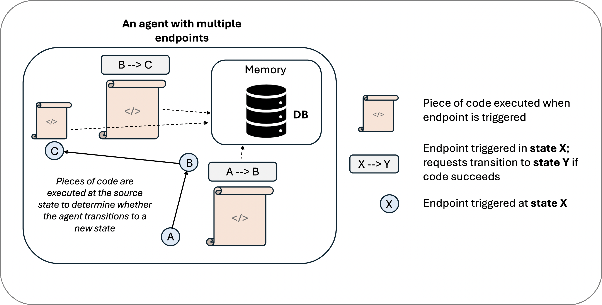

# Basics of Summoner Clients

<!-- Given that we still have the server page and the intro page to review, the following modification might be enough? -->

> [!NOTE] 
> **Definition.** A _client_ is a program that initiates a connection to a server to send requests and receive responses. In Summoner, clients evolve into programmable agents that go far beyond this basic role.

**Summoner clients** are built on top of Python's `asyncio` TCP functionality, but they go far beyond basic socket connections. The client architecture forms the foundation for **Summoner agents**, which add orchestration logic and a security layer, transforming a simple TCP client into a programmable, composable agent.

## From Summoner Client to Summoner Agent

> [!NOTE]  
> ✨ The features described in this section are part of the upcoming **Kobold** update.

At the lowest level, a **Summoner agent** is just a Summoner client: it connects to a TCP server and exchanges messages. But Summoner layers additional capabilities on top:

<!-- A **Summoner agent** begins as a Summoner client, but adds two essential layers: -->

* **Orchestration**: the ability to initiate or complete tasks through a [programmable graph of handlers](#graphs-of-endpoints), allowing the agent to behave as a coordinated system.
* **Decentralized Identity**: each agent cryptographically signs messages, owns a verifiable identity, and participates in secure agent-to-agent communication.
* **Reputation Logic**: the combination of orchestration and decentralized identity enables richer control over protocol event validity, allowing agents to infer trust through reputation metrics.

This leads to the working definition:

> **Agent = TCP Client + Orchestration + Decentralized Identity + Reputation Logic**

## Graphs of Endpoints

Summoner clients and agents are not monolithic. Internally, they are structured as **graphs of endpoints**:

* Each **endpoint** is a self-contained handler for a route or message type.
* Endpoints can act independently or in cooperation, enabling **subagents** to form inside larger agent structures.

> [!NOTE]
> In other words, an _endpoint_ is a named message handler — a function that reacts to specific routes or message types. You can think of it like a local mailbox, waiting to respond when the right message arrives.

This graph-based architecture enables modularity: endpoints can be created, composed, and nested to form rich agent behaviors.

<table>
  <tr>
    <th>
      
<strong>Single Subagent</strong>

    </th>
    <th>
      
<strong>Multi-Subagent System</strong>

    </th>
  </tr>
  <tr>
    <td>
      

        
      

    </td>
    <td>
      

        
      

    </td>
  </tr>
</table>

## Finite-State Coordination

The orchestration logic behind these endpoint graphs is modeled as a **finite-state machine (FSM)**:

* **Stateful transitions** dictate how the agent responds to events or messages.
* **Local state** at each endpoint allows agents to evolve their behavior over time.
* **Global coordination** across endpoints is driven by the underlying FSM logic.

This makes agents not just reactive, but **coordinated systems of intent**.

## Composability by Design

A key design principle in Summoner is composability:

* A **collection of endpoints** can be treated as a higher-order agent.
* Subagents can be embedded, routed, or delegated to, because all communication is structured and orchestrated consistently.

This allows you to:

* Build simple agents with one or two routes.
* Compose complex multi-agent systems from reusable building blocks.

    <strong>Composition of Three Simple Agents into a Multi-Subagent System</strong> 
    

---

Summoner clients, therefore, are not just TCP sockets with callbacks. They are the structural foundation for programmable, composable agents — each carrying its own identity, behavior graph, and orchestration model.

  <a href="basics_server.md">&laquo; Previous: Server (Basics) </a> &nbsp;&nbsp;&nbsp;|&nbsp;&nbsp;&nbsp; 
  <a href="begin.md">Next: Beginner's Guide &raquo;</a>

