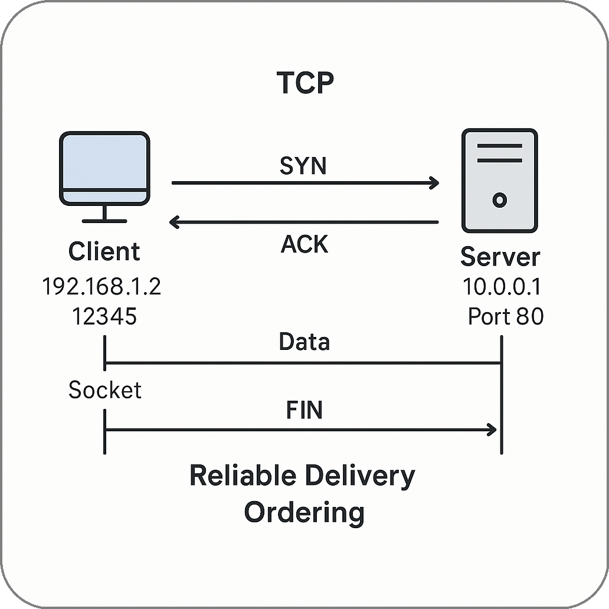

# Basics on TCP-Based Servers

## Why Start with TCP?

Summoner is a protocol for orchestrating agents across machines. It builds on TCP — the bedrock of internet communication — to ensure reliable delivery, ordered messages, and stable connections. Before we explain what makes Summoner unique, we ground ourselves in the basics.

## What Is TCP?

**TCP (Transmission Control Protocol)** ensures that data sent between machines arrives intact, in order, and without duplication. Introduced in the 1970s, it remains central to the modern internet.

TCP is a **transport-layer** protocol, operating above physical and routing layers:

* **MAC (Media Access Control):** Manages data access to the physical network (e.g., Ethernet, Wi-Fi).
* **IP (Internet Protocol):** Handles routing of packets from source to destination.

Built atop these, TCP establishes a virtual pipe between programs on separate machines.

## Ports and Addresses

Each TCP connection is defined by two endpoints:

* **IP Address** — The location of a machine (e.g., `127.0.0.1`, `192.168.0.12`, or a public WAN IP).
* **Port** — The application-level channel on that machine (e.g., `8000`, `443`).

Summoner servers bind to a specific host and port. Clients initiate connections by targeting these identifiers.

<p align="center">
  
</p>

## Sample Code: Binding to Host and Port

To better understand how TCP connections are established in practice, it helps to look at concrete code examples. The concept of "binding" refers to the process where a server reserves a specific IP address and port on which it listens for incoming connections. Clients then connect to this address\:port pair to initiate communication.

Below are two simple echo server examples: one written in Python using `asyncio`, and one in Rust using the `tokio` async runtime. Both demonstrate the same principles: 
- listening on a port, 
- accepting client connections, 
- and responding to received messages.

### Python (asyncio)

```python
async def handle_client(reader, writer):
    data = await reader.read(100)
    writer.write(data)
    await writer.drain()
    writer.close()

async def main():
    server = await asyncio.start_server(handle_client, '127.0.0.1', 8000)
    async with server:
        await server.serve_forever()

asyncio.run(main())
```

### Rust (Tokio)

```rust
#[tokio::main]
async fn main() -> tokio::io::Result<()> {
    let listener = TcpListener::bind("127.0.0.1:8000").await?;

    loop {
        let (mut socket, _) = listener.accept().await?;
        tokio::spawn(async move {
            let mut buf = [0; 1024];
            let n = socket.read(&mut buf).await.unwrap();
            socket.write_all(&buf[0..n]).await.unwrap();
        });
    }
}
```

## Local, LAN, WAN, and DNS

Understanding how machines are addressed and located on networks is essential for deploying Summoner servers. Here's a breakdown:

* **Localhost (`127.0.0.1`)**: Refers to the local machine itself. Connections to this address stay entirely within the same computer and are typically used for development or self-contained processes.

* **LAN (Local Area Network)**: Includes private IP ranges like `192.168.x.x` or `10.x.x.x`, used within home, office, or cluster networks. Machines on the same LAN can communicate directly without needing internet access.

* **WAN (Wide Area Network)**: Represents public IP addresses that are globally reachable. WAN addresses allow machines to communicate across the internet, but typically require port forwarding or firewall rules to accept inbound connections.

* **DNS (Domain Name System)**: Resolves human-readable domain names (like `summoner.org`) into IP addresses. It abstracts away numerical addressing, making services easier to locate and move between machines.

These distinctions guide where and how to launch Summoner nodes:


| Use Case                  | Address Type              | Description                                                 |                                                                                                                
| ------------------------- | ------------------------- | ----------------------------------------------------------- | 
| Isolated testing          | `localhost`               | Runs entirely on the local machine                          |                                                                                                                
| Internal networks (LAN)   | `192.168.x.x`, `10.x.x.x` | Trusted machines within a private network                   |                                                                                                                
| Internet-facing services  | Public IP (WAN)           | Reachable from anywhere, requires firewall/port setup       |                                                                                                                
| Discoverability & scaling | DNS                       | Maps domain names to IPs, useful for discoverability and dynamic infrastructure   |


## The Role of Protocols in Coordination

Protocols are not just data formats, they also define expectations: 
- _Who speaks first?_
- _How are delays handled?_
- _What happens when a message is malformed?_

Summoner introduces a higher-level protocol designed for **asynchronous, agent-to-agent communication**, enabling coordination through a shared server without relying on centralized scheduling.

## TLS and What Summoner Replaces

**TLS (Transport Layer Security)** encrypts communication and verifies server identities via centralized Certificate Authorities. It secures data in transit but does not support:

* Persistent peer identities
* Decentralized trust
* Agent-level message signing or verification

**Summoner introduces a cryptographically verifiable identity layer**, replacing TLS with agent-specific keys and persistent reputations. This enables secure messaging and coordination without third-party trust anchors.

In essence, Summoner builds on TCP's transport layer, bypasses TLS's centralized model, and defines a new coordination protocol tailored for autonomous agents.


<p align="center">
  <a href="basics.md">&laquo; Previous: Basics (Intro) </a> &nbsp;&nbsp;&nbsp;|&nbsp;&nbsp;&nbsp; <a href="basics_client.md">Next: Client (Basics) &raquo;</a>
</p>
