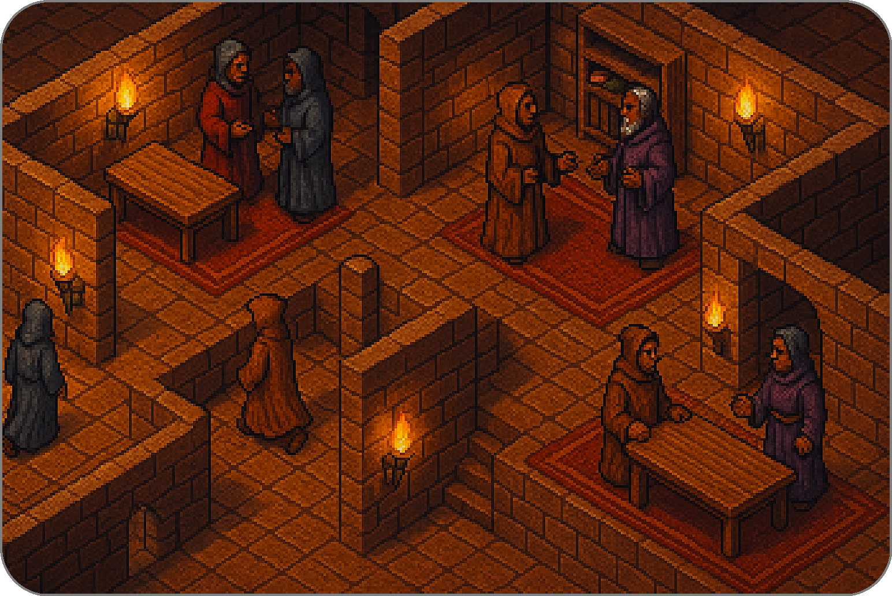

# Beginners Guide to Summoner

> A practical introduction to system architecture and logic

Summoner is a framework for building agent based systems in adversarial and asynchronous environments. It stands out by starting from constraints rather than convenience.

This guide introduces the core layers of Summoner not as features but as architectural responses. Each layer emerges from the limitations imposed by the previous one. If you are a developer, researcher, or technical lead, this guide provides a clear mental model for how Summoner works and why.

## 1. Servers: Design That Assumes No Trust

Summoner servers are intentionally untrusted. Imagine a vast castle of interconnected rooms where agents roam freely, encountering others without any guarantee of trust, privacy, or message delivery.

<p align="center">
  
</p>

Within this castle, messages travel from room to room without validation, sequencing, or access control. Servers can observe, reorder, or drop traffic entirely.

This constraint is fundamental. It means:

* All correctness must be enforced at the edges (client side)
* All coordination and verification must be explicit
* Security and behavior must be defined by agents, not enforced by servers

You will find these ideas expanded in [Getting Started with Summoner Servers](begin_server.md)

## 2. Clients and Agents: Logic That Lives at the Edge

If servers cannot be trusted, clients must handle every responsibility: decrypt messages, verify identity, validate structure, and react. Summoner clients are programmable, reactive runtimes. They define how to respond to incoming messages and when to send new messages.

<p align="center">
  
</p>

Agents are enhanced clients that organize message handling via handshake logic, relying on client route definitions (e.g. `ready --> action`) to build reactive surfaces. These components are not passive listeners but **stateful**, **self-contained automata**.

As a result, each agent becomes a secure boundary, a validator, and a state machine.

More about this model is available in [Getting Started with Summoner Clients and Agents](begin_client.md)

## 3. Flows and Triggers: Declarative Orchestration

Agents scale through composition. Rather than hardwiring every condition, branch, and outcome, you declare logic in a structured way.

Summoner lets you define agent behavior as flows: graphs of reactions based on **triggers**, **signals**, and **events**.

### A minimal reactive flow

```python
@agent.receive("ready --> action")
async def handle_action(ctx):
    ...
    if ctx["status"] == "done":
        return Move(Trigger.done)  # send an event
    # returning None results in no event

@agent.receive("action --> finish")
async def handle_finish(ctx):
    ...
    if ctx["status"] == "in_progress":
        return Stay(Trigger.in_progress)  # send an event
    else:
        return Move(Trigger.OK)  # send an event
```

### Vocabulary of reaction

| Concept     | Role                                      | In the example         |
| ----------- | ----------------------------------------- | ---------------------- |
| **Signal**  | Named state or input                      | `"OK"`, `"done"`       |
| **Trigger** | Signal bound to a route                   | `Trigger.OK`, `Trigger.done` |
| **Event**   | Emission from a handler                   | `Move(Trigger.OK)`         |
| **Action**  | Intent or transition declared in an event | `Move`, `Stay`, `Test` |

You can think of each route (`@receive(...)`) as a node in a **finite state machine**. Flows define how events move between nodes, providing structure, traceability, and composability.

Learn more in [Orchestrating Agent Behavior Using Flows](begin_flow.md)


## 4. Async: Semantic Necessity Over Optimization

In Summoner, asynchrony is not just a performance feature but a key part of system semantics.

* Handlers are **coroutines**: they can `await` long-running tasks.
* Incoming messages **do not block** other activity.
* Agents can **pause on triggers** without stalling the system.

This design is critical in adversarial distributed environments. Agents remain ready to respond or wait without causing global stalls. It allows them to continue functioning when messages are delayed, reordered, or dropped.

If you are used to linear scripts or request response logic, this approach will feel different. But it maps more naturally to real world decentralized coordination.

You can dive deeper in [Working with Asynchronous Programming in Summoner](begin_async.md)

<p align="center">
  <a href="basics_client.md">&laquo; Previous: Client (Basics)</a> &nbsp;&nbsp;&nbsp;|&nbsp;&nbsp;&nbsp; <a href="begin_server.md">Next: Getting Started with Servers &raquo;</a>
</p>
