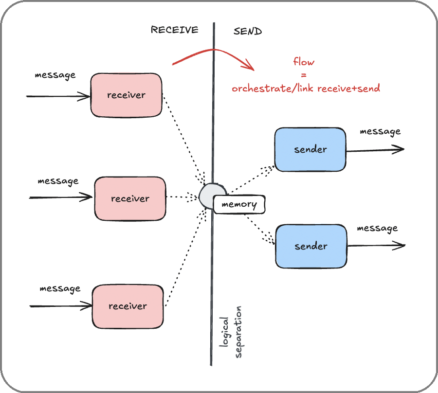

# Orchestrating Agent Behavior Using Flows

<p align="center">
  
</p>

<p align="center">
  <em>
    The Summoner, channeling his magic, peers into the hidden forces of the universe, the atom.  
    He observes how an electron rests in a stable state until it <b>absorbs</b> a photon, leaping to a higher level.  
    In time, it <b>emits</b> a photon and falls back, revealing the rhythm of energy and transition at the heart of matter.
  </em>
</p>


## Overview

A Summoner agent lives in a small rhythm: it **receives** something, evaluates and **transitions** its internal state, and may **send** something in response or on a later tick. The point of a *flow* is to make that rhythm explicit, debuggable, and easy to extend. When you turn the flow engine on, routes stop being just labels and become a tiny Domain Specific Language (DSL) for graph-shaped behavior: nodes, arrows, and outcomes.

The rest of this page builds that model from first principles, then shows how to express it idiomatically in Summoner. You will see the full loop: 

> **upload → receive → (Move/Stay/Test) → download → send**

along with the minimal examples that make each part click. The style stays practical: short, runnable fragments with clear invariants.

## Route DSL & Semantics

### Core Concepts: Inputs, Events, Triggers, Nodes

A flow advances in response to **inputs** (incoming messages, timers). Receivers return an **Event** that encodes the next step. A **Trigger** labels that outcome. **Nodes** are named gates that select which receivers can run next.

- **Inputs**: what the agent observes (messages, timers).
- **Events**: what a receiver returns (`Move`, `Stay`, `Test`).
- **Triggers**: outcome tokens attached to Events (e.g., `ok`, `error`).
- **Nodes**: named behavioral states (`"A"`, `"B"`, `"locked"`, `"opened"`).

The examples below are minimal and runnable. Each illustrates one mechanic.

### Flow Activation (and what Changes)

A client behaves like a simple message pump until you flip the flow switch. Call `client.flow().activate()` to let the runtime select receivers based on **state** and to interpret **routes** using the flow DSL. Because there is no default **arrow style**, you must declare at least one. A common choice is the ASCII arrow with double dashes and optional labels in square brackets:

```python
from summoner.client import SummonerClient

client = SummonerClient()
flow = client.flow().activate()
flow.add_arrow_style(stem="-", brackets=("[", "]"), separator=",", tip=">")
flow.ready()  # compiles the regexes; do this after declaring styles
Trigger = flow.triggers()  # loads tokens from TRIGGERS (e.g., Trigger.ok, Trigger.error)
```

> [!IMPORTANT]
> If any `@receive`/`@send` uses an **arrow** (e.g. `"A --> B"`), you **must** call:
>
> 1. `flow.add_arrow_style(...)`, then
> 2. `flow.ready()`
>    **before** those decorators register. Otherwise, the arrow string will be parsed as a plain token and fail validation.

With flows active, `@receive(route=...)` uses the route DSL. See [Routes and Node Logic](#routes-and-node-logic-the-small-dsl-that-decides-who-runs) for the full syntax (arrows, labels, object routes).


### Triggers: Loading & Using

Triggers are outcome tokens attached to the **Event** a receiver returns. After you have created and activated a flow, call:

```python
Trigger = flow.triggers()  # loads names from TRIGGERS next to your code
```

The file is an indented tree of valid names:

```yaml
# TRIGGERS
ok
  ignore
  error
```

You can then write `Move(Trigger.ok)` or `Stay(Trigger.ignore)`. Send hubs filter on *exact* triggers; if you want a hierarchy of outcomes, encode it in the file and in your policy, not by prefix matching.

### Routing Semantics: Who Runs When

A route parses into three parts — **source**, **label**, **target** — each represented as a `Node` set. Write it as `source --[label]--> target`. Omit the label if you do not need one (`source --> target`). Omit one side to get a dangling arrow: `--[boot]--> target` (no source) or `source -->` (no target). A route with no arrow (for example, `"opened,notify"`) is an **object route**. It selects by sources only and never proposes a target.

A node can be a plain token like `opened`; the wildcard `/all`; a negative `/not(x,y)`; or a choice `/oneof(a,b,c)`. A receiver is eligible if any source gate accepts any uploaded state for the same key.


Matching is simple:
- `plain` matches itself.
- `/not(x,y)` matches anything not in the set.
- `/oneof(a,b,c)` matches any in the set.
- `/all` matches everything.

This makes it easy to say "while *not* locked", or "for one of these features".

For example, consider the following basic acceptance rules for plain tokens and the `/all` wildcard.

```python
from summoner.protocol import Node
Node('/all').accepts(Node('opened'))              # True
Node('opened').accepts(Node('opened'))            # True
Node('opened').accepts(Node('closed'))            # False
```

The tag `/not(...)` works both as a state and as a gate:

```python
Node('opened').accepts(Node('/not(locked,closed)'))  # True
Node('opened').accepts(Node('/not(opened)'))         # False
Node('/not(locked)').accepts(Node('locked'))         # False
Node('/not(locked)').accepts(Node('opened'))         # True
```

Use `/oneof(...)` to express choices:

```python
Node('beta').accepts(Node('/oneof(alpha,beta,gamma)'))  # True
Node('delta').accepts(Node('/oneof(alpha,beta,gamma)')) # False
```

**Composite-to-composite matching:** when both sides denote sets, a gate accepts a state if their intersection is non-empty after exclusions:

```python
Node('/oneof(a,b)').accepts(Node('b'))            # True  b ∈ {a,b}
Node('/oneof(a,b)').accepts(Node('/oneof(b,c)'))  # True  intersection = {b}
Node('/oneof(a,b)').accepts(Node('/not(a)'))      # True  remaining = {b}
Node('/oneof(a)').accepts(Node('/not(a)'))        # False remaining = ∅

```

Invalid tokens are rejected at construction time:

```python
try:
    Node('inv&alid')
except ValueError as e:
    print(type(e).__name__)  # ValueError
```

**Label activation.** When a receiver returns `Move(trigger)`, the engine activates the label and the target. `Test(trigger)` activates only the label. `Stay(trigger)` keeps the source set. Use labels to stage guard rails or to attach event-driven senders without forcing a node change.

To see how labels are activated, we can set up a flow and parse a simple labeled arrow:

```python
from summoner.protocol import Move, Test, Stay, Flow

flow = Flow().activate()
flow.add_arrow_style(stem="-", brackets=("[", "]"), separator=",", tip=">")
flow.ready()
Trigger = flow.triggers()

arr = flow.parse_route("A --[ guard ]--> B")
```

> [!NOTE]
> You rarely need `Flow()` directly; it's used here only to parse a route in isolation.

When a receiver returns `Move`, the label and the target are activated.

```python
arr.activated_nodes(Move(Trigger.ok))   # (Node('guard'),Node('B'))
```

When a receiver returns `Test`, only the label is activated.

```python
arr.activated_nodes(Test(Trigger.ok))   # (Node('guard'),)
```

When a receiver returns `Stay`, the source is kept.

```python
arr.activated_nodes(Stay(Trigger.ok))   # (Node('A'),)
```

Two useful shapes complete the picture. A route with no source (a **left-dangling** arrow: `--[boot]--> ready`) is *initial*: it is eligible **on every inbound message** regardless of current state, and is often used for boot logic. A route with no arrow (`"opened,notify"`) is a pure "object" route; it selects on the current source set and never proposes a target. For full semantics of left- and right-dangling arrows, see [**Advanced Route Shapes**](#advanced-route-shapes).


Borrowing category-theoretic language, a left-dangling route acts like an initial arrow (no source object). You can detect it with `is_initial`:

```python
flow.parse_route("--[boot]--> ready").is_initial   # True
```

You can also check that an object route has no arrow and only selects on sources:

```python
obj = flow.parse_route("opened,notify")
(obj.is_object, obj.is_arrow)  # (True, False)
```

Object routes return their sources when activated.

```python
obj.activated_nodes(None)  # ('opened','notify')
```

> [!TIP]
> Object routes (no arrow, e.g., `opened,notify`) **do not express a transition**. When their receiver runs, they contribute **only their source tokens** to the proposals, regardless of whether the handler returns `Move`, `Stay`, or `Test`. Use labeled arrows when you actually need to change state.

## Orchestrating Receive/Send with Flows

<p align="center">
  
</p>

### Upload & Download: State Negotiation

Flows are driven by what you **upload** and what you then **commit** in **download**. Upload reports your current position in the graph; download is where you fold the engine's proposals back into your own state. The contract is simple and strict: upload may return one of four shapes, and download will mirror it with *Nodes* instead of strings.

1. **Single**: a single node.

```python
from typing import Any
from summoner.protocol import Node

current = "opened"

@client.upload_states()
async def upload(_: Any) -> str:
    return current  # e.g., "opened"

@client.download_states()
async def commit(proposed: list[Node]) -> None:
    # SINGLE/MANY reduce to a list; pick a winner by policy
    global current
    current = "opened" if Node("opened") in proposed else "locked"
```

2. **Many**: an ordered list of nodes.

```python
active = ["chat", "heartbeat"]

@client.upload_states()
async def upload(_: Any) -> list[str]:
    return active

@client.download_states()
async def commit(proposed: list[Node]) -> None:
    # choose a next set; often you preserve order
    slots = [n for n in proposed if n in {Node("chat"), Node("heartbeat")}]  # filter
    # write back to your own structure as strings
```

3. **Index (single)**: a mapping from keys to one node per key.

```python
# per-peer or per-room selection; keys are your choice
slots: dict[str, str] = {"room:alpha": "opened", "room:beta": "locked"}

@client.upload_states()
async def upload(_: Any) -> dict[str, str]:
    return dict(slots)

@client.download_states()
async def commit(proposed: dict[str, list[Node]]) -> None:
    # Values are lists of Nodes per key; pick one per key
    for key, options in proposed.items():
        slots[key] = "opened" if Node("opened") in options else "locked"
```

4. **Index (many)**: a mapping from keys to lists of nodes.

```python
# multiple lanes per peer
lanes: dict[str, list[str]] = {"user:alice": ["chat"], "user:bob": ["chat", "notify"]}

@client.upload_states()
async def upload(_: Any) -> dict[str, list[str]]:
    return {k: list(v) for k, v in lanes.items()}

@client.download_states()
async def commit(proposed: dict[str, list[Node]]) -> None:
    for key, nodes in proposed.items():
        # project Nodes back to your strings, with your ordering
        names = [str(n) for n in nodes]
        lanes[key] = names or ["chat"]
```

The engine never mutates your state. It computes *possible* nodes from the handlers that ran this tick and hands them to you; you decide what to keep. For indexed forms the keys are yours — often peer IDs — and are passed through unchanged. 

Internally the engine prefixes them during evaluation and strips the prefix in `download`; you will always see exactly the keys you supplied. 


| Upload returns            | Download receives                 |
| ---                       | ---                               |
| `"opened"`                | `list[Node]`                      |
| `["chat","heartbeat"]`    | `list[Node]`                      |
| `{key: "node"}`           | `{key: list[Node]}`               |
| `{key: ["n1","n2"]}`      | `{key: list[Node]}`               |

### State-Gated Receiving (Upload → Receive)

Use **object routes** to gate receivers by the node you upload: the uploaded node selects which `@receive(route=...)` runs.

Below, when the node is `"opened"`, one receiver runs, and when it is `"locked"`, a different one runs:

```python
# minimal_state_gate.py
import asyncio
from typing import Any
from summoner.client import SummonerClient
from summoner.protocol import Node  # used in download if you later expand

client = SummonerClient()
client.flow().activate()  # enable state-based routing

node = "opened"
lock = asyncio.Lock()

@client.upload_states()
async def current_node(_: Any) -> str:
    async with lock:
        return node

@client.receive(route="opened")
async def rx_opened(msg: Any) -> None:
    print("[opened] received:", msg)

@client.receive(route="locked")
async def rx_locked(msg: Any) -> None:
    print("[locked] received:", msg)

client.run(host="127.0.0.1", port=8888)
```

> [!NOTE]
> You do **not** need arrow styles there because routes are object routes: `"opened"` / `"locked"`.

The example above **mimics** the electron analogy: **upload** advertises the "level," and that level selects which **receive** runs. Changing `node` (e.g., from a local command or an internal timer) switches the active lane.

> [!TIP]
> Real examples that rely on this pattern:
> * [`ChatAgent_2`](https://github.com/Summoner-Network/summoner-agents/blob/main/agents/agent_ChatAgent_2/agent.py): Activates automaton routing via <code>@upload_states</code>; toggles <code>opened/locked</code> to gate remote commands.
> * [`ChatAgent_3`](https://github.com/Summoner-Network/summoner-agents/blob/main/agents/agent_ChatAgent_3/agent.py): Shows explicit automaton transitions with <code>Move</code>/<code>Stay</code> (<code>opened → locked → opened</code>); remote/self travel, lock/open, quit.
>
> These two examples are located in our [summoner-agents](https://github.com/Summoner-Network/summoner-agents) repo and are perfect **examples** that show how a tiny state variable controls which receiver runs.

### Receiving with Transitions (Pure Receivers)

A receiver has two jobs: normalize the input, then return an **Event** that proposes the next node. The Event can be:
- `Move(trigger)`: activate the label and the target.
- `Stay(trigger)`: keep the source.
- `Test(trigger)`: activate the label only.

Routes can encode transitions. For example, `A --> B` means *eligible while in A, and may propose B*. Keep receivers pure: express intent by returning an Event, and apply the state change in `download`.

```python
# minimal_transition.py
import asyncio
from typing import Any
from summoner.client import SummonerClient
from summoner.protocol import Move, Stay, Node, Event

client = SummonerClient()
flow = client.flow().activate()
flow.add_arrow_style(stem="-", brackets=("[", "]"), separator=",", tip=">")
flow.ready()
Trigger = flow.triggers()  # e.g., Trigger.ok, Trigger.error

node = "A"
lock = asyncio.Lock()

@client.upload_states()
async def current_node(_: Any) -> str:
    async with lock:
        return node

@client.download_states()
async def commit(candidates: list[Node]) -> None:
    global node
    async with lock:
        node = "B" if Node("B") in candidates else "A"

@client.receive(route="A --> B")
async def rx_on_A(msg: Any) -> Event:
    text = str(msg).strip().lower()
    return Move(Trigger.ok) if text == "go" else Stay(Trigger.ok)

@client.receive(route="B")
async def rx_on_B(msg: Any) -> Event:
    return Stay(Trigger.ok)

client.run(host="127.0.0.1", port=8888)
```

Here is the loop: the runtime calls **upload** to learn the current node, runs the matching **receive** handler, the handler returns `Move` or `Stay` with a **Trigger**, and then **download** is called with the **possible** nodes. You commit one (B or A), and the agent stabilizes there until the next input.

> [!NOTE]
> Triggers label outcomes (for example, `ok`, `error`, `ignore`). They do not carry payloads. They **gate** follow-up actions, such as running an "on ok" sender but not an "on error" sender.

> [!IMPORTANT]
> **Best practice.** Keep receivers pure. Emit outcomes (`Move`, `Stay`, `Test`) and do not mutate global state in the receiver. Commit changes only in `download`.
>
> **Why this policy?** In a tick, multiple receivers can run (across priorities or per-key subgraphs). If they update shared variables inline, you risk inconsistent intermediates and races, both between receivers and with senders. Let the runtime aggregate all outcomes first and call your `download(...)` with the unified proposals, then apply the mutation once. If you need side effects (I/O or messages) in reaction to those outcomes, do them in a **reactive sender** (for example, `@send(..., on_actions={...}, on_triggers={...})` or a consolidated `/all --> /all` hub) so effects run after the relevant receivers finish, deterministically.


### Sending: Ticks vs. Hubs

There are two ways an agent emits. A **tick sender** runs every cycle and decides on each pass whether to return a payload (and therefore send) or `None` (and remain quiet). A **hub sender** is *event-driven*: it runs immediately after a receiver has returned an Event that matches the hub's filters. Tick is how you do heartbeats and maintenance; hubs are how you react *right after* specific outcomes.

A tick sender is straightforward. Pace it with `await asyncio.sleep(...)`; return a value to send, or `None` to stay quiet.

```python
import asyncio

@client.send(route="telemetry")
async def heartbeat():
    await asyncio.sleep(1.0)  # pacing
    return {"kind": "hb"}
```

> [!NOTE]
> In the rest of this section, **`Action`** refers to an enumeration (i.e., `Action.MOVE`, `Action.STAY`, `Action.TEST`) used to filter `Event` kinds (`Move`, `Stay`, `Test`) in **send** decorators (hubs). For example:
> `@client.send(..., on_actions={Action.MOVE})`.

When you want a send to happen only because a **specific receive** just fired, bind them by route. Activate the flow, declare an arrow style, and give the hub the **same route** as the receiver.  Then filter by **action** (`Action.MOVE`, `Action.STAY`, `Action.TEST`) and/or by trigger (`Trigger.ok`, etc.). This one-to-one link is the most precise hub you can write.

```python
from summoner.protocol import Action, Move, Stay

flow = client.flow().activate()
flow.add_arrow_style(stem="-", brackets=("[", "]"), separator=",", tip=">")
flow.ready()
Trigger = flow.triggers()

@client.receive(route="A --> B")
async def on_A(msg):
    return Move(Trigger.ok) if str(msg).strip() == "go" else Stay(Trigger.ok)

@client.send(route="A --> B", on_actions={Action.MOVE}, on_triggers={Trigger.ok})
async def after_A_to_B():
    # runs only when the A→B receiver just returned Move(Trigger.ok)
    return {"kind": "transition", "from": "A", "to": "B"}
```

Sometimes a single hub should react to several transitions. That is where `/all --> /all` helps, but it is narrower than it sounds: it listens to **any complete arrow route** (those of the form `source --> target`) and ignores object routes (no arrow) or dangling arrows (missing a side). It only makes sense when your receivers themselves use concrete arrow routes, typically at least two, such as `"A --> B"` and `"B --> C"`.

```python
@client.receive(route="A --> B")
async def r1(msg):
    return Move(Trigger.ok)

@client.receive(route="B --> C")
async def r2(msg):
    return Move(Trigger.ok)

@client.send(route="/all --> /all", on_triggers={Trigger.ok})
async def on_any_success():
    # fires after r1 or r2 when they return Move/Stay/Test with Trigger.ok
    return {"log": "ok"}
```

> [!TIP]
> In hubs, use `on_actions` to filter by event kind (`Action.MOVE`/`STAY`/`TEST`) and `on_triggers` to filter by outcome signals (`Trigger.*`):
> * To react only to transitions, set `on_actions={Action.MOVE}` and leave `on_triggers` unset (i.e., `None`); 
> * To react only to particular signals, set `on_triggers={Trigger.ok, ...}` and leave `on_actions` unset. 
> * If you pass both, the hub fires only when **both** filters match (this is logical AND, or equivalently, the event's pair `(action, trigger)` must lie in `on_actions × on_triggers`). 
>
> Use `None` to disable a filter. An empty set `{}` matches nothing (i.e. `@send` cannot be triggered).


> [!NOTE]
> A route `"/all --> /all"` matches **any complete arrow**, labeled or unlabeled (e.g., both `"A --[x]--> B"` and `"A --> B"`). It does **not** match object routes (`"foo,bar"`) or dangling arrows (`"--[x]--> B"` or `"B -->"`).

Hubs often shepherd several cases or per-peer states at once. That is why they pair naturally with batching: when one receiver outcome should fan out into multiple outbound messages **in the same tick**, declare `multi=True` and return a list. The runtime sends each element, in order. This works for ticks and hubs alike; the only change is the return type.

```python
recipients = ["alice", "bob", "carol"]

@client.send(route="/all --> /all", multi=True, on_actions={Action.MOVE}, on_triggers={Trigger.ok})
async def fanout_after_A_to_B():
    # one message per recipient in the same tick
    return [{"to": u, "kind": "transition", "from": "A", "to": "B"} for u in recipients]
```

If you prefer a periodic batch instead of an event-driven one, the exact same `multi=True` applies to a tick sender:

```python
import asyncio

@client.send(route="batch", multi=True)
async def batch_tick():
    await asyncio.sleep(2)
    return [{"kind": "chunk", "i": i} for i in range(1, 4)]
```

> [!NOTE]
> * Returning `None` from a sender means "no message this cycle".
> * `/all --> /all` matches any complete arrow (labeled or not). It never matches object routes or dangling arrows.

## Advanced Route Shapes

At its core, the loop is a four-beat rhythm:

> **upload → receive → download (commit) → send** 

**However,** two arrow shapes — **left-dangling** and **right-dangling** — deserve special attention because they let you stitch logic in regardless of the current state.

A **left-dangling arrow** (`--> B`) is always eligible. It does not consult uploaded state; it runs on every inbound message and only influences state **if** it chooses to transition. Returning `Stay(...)` on such a route contributes no nodes (its source is empty), so nothing changes. Returning `Move(...)` activates the target `B`, and from that point your normal, state-gated receivers can take over.

```python
# always eligible; independent of current state
from summoner.client import SummonerClient
from summoner.protocol import Move, Stay, Node

client = SummonerClient()
flow   = client.flow().activate()
flow.add_arrow_style(stem="-", brackets=("[", "]"), separator=",", tip=">")
flow.ready()
Trigger = flow.triggers()

current = "cold"

@client.upload_states()
async def upload(_):  # SINGLE shape
    return current

@client.download_states()
async def commit(options: list[Node]) -> None:
    # only flip if the left-dangling handler actually moved
    global current
    if Node("ready") in options:
        current = "ready"

@client.receive(route="--> ready")
async def bootstrap(msg):
    text = str(msg).strip().lower()
    return Move(Trigger.ok) if text == "boot" else Stay(Trigger.ok)
```

When your **upload** uses an indexed form (a dict keyed by peer, room, or shard), the engine delivers activations from left-dangling routes under the special key `None`. That reflects the fact that the route was not scoped to any uploaded key. Handle that `None` bucket explicitly in `download` if you want the transition to affect a particular index.

```python
# INDEX (single) upload; left-dangling activations arrive under key=None
slots = {"room:alpha": "cold"}

@client.upload_states()
async def upload_idx(_):  # INDEX_SINGLE shape
    return dict(slots)

@client.download_states()
async def commit_idx(proposed: dict[object, list[Node]]) -> None:
    # 'None' carries proposals from left-dangling routes
    if None in proposed and Node("ready") in proposed[None]:
        slots["room:alpha"] = "ready"
```

A **right-dangling arrow** (`B -->`) is eligible only while in `B`. It has no target. If the handler returns `Move(...)`, it contributes no nodes, so the matched source `B` drops out of proposals. Use it to prune a lane.

```python
active = ["A", "B"]

@client.upload_states()
async def upload_many(_):
    return list(active)

@client.receive(route="B -->")
async def stop_B(_):
    return Move(Trigger.ok)  # contributes no nodes

@client.download_states()
async def commit_many(proposed: list[Node]) -> None:
    global active
    names = {str(n) for n in proposed}
    active = [n for n in active if n in names]  # B disappears after stop_B()

```

With those two shapes in mind, the "stitched" minimal loop reads cleanly: advertise where you are (or nothing at all), let a left-dangling route watch every message and decide if the graph should wake up, commit the transition in `download`, and keep periodic or event-driven senders layered on top. 

**Remember:** returning `None` from a sender means "no message this cycle", and labels let you hang hubs without forcing a node change.

## Hooks & Priorities: Pre/Post Processing

Hooks are small functions that run around handlers: at RECEIVE (before a payload reaches any receiver) and at SEND (just before a payload is emitted). Use them for cross-cutting concerns that sit outside your flow logic: authentication, schema validation, deduplication, stamping identity, or rate limits.

Order can matter. Both hooks and receivers accept a priority tuple; lower tuples run earlier. Keep hooks small and deterministic; they run on every tick around each handler.

```python
from summoner.protocol import Direction

BANNED = {"agent:badwolf"}
AGENT_ID = "agent:123"

@client.hook(direction=Direction.RECEIVE, priority=(0,))
async def reject_banned(msg):
    # Drop messages from banned senders before any receiver runs.
    if isinstance(msg, dict) and msg.get("from") in BANNED:
        return  # drop
    return msg

@client.hook(direction=Direction.RECEIVE, priority=(1,))
async def require_content(msg):
    # Basic schema check; prevents receivers from handling invalid shapes.
    if not isinstance(msg, dict) or "content" not in msg:
        return  # drop
    return msg

@client.hook(direction=Direction.SEND, priority=(0,))
async def stamp_identity(payload):
    # Attach identity once, centrally; senders stay pure.
    if isinstance(payload, dict):
        payload.setdefault("from", AGENT_ID)
    return payload
```

## Semantics & Best Practices

### Tick Lifecycle (Practical Semantics)

It helps to memorize the two core lookups that the engine performs at each tick.

**Who receives?** The engine takes your uploaded state — a single node, a list, or a per-key mapping — and finds every `@receive` whose **source** gates *accept* any of those nodes for the same key. Receivers with no source but with a label/target (left-dangling) are considered *initial* and are eligible on every inbound message.


**What becomes active next?** Each receiver returns an Event. For `Move`, the engine activates the route's label and target; for `Stay`, it keeps the source; for `Test`, it activates only the label. All these *possible* nodes are then presented to your `download` function, using the same shape as your upload. You choose what you actually become.

Putting it together:

1. **Upload** advertises the current node ("A" or "B").
2. **Receive** runs based on that node and returns `Move(...)` or `Stay(...)` with a **Trigger**.
3. **Download** sees the set of candidate nodes and **commits** one (your policy).
4. **Send** may act on the new node to emit a message now, later, or not at all.

This is the atom and electron analogy: **absorb** (receive), **jump** (Move/Stay + download), **emit** (send), **settle** (new node).

> [!TIP]
> Representative examples of complex agent orchestration can be found in:
> * [`ExamAgent_1`](https://github.com/Summoner-Network/summoner-agents/blob/main/agents/agent_ExamAgent_1/agent.py): Demonstrates use of <code>@receive</code> and <code>@send</code> with queues and delays to run an automated Q&amp;A round while delegating state handling to the flow engine.
> * [`HSAgent_0`](https://github.com/Summoner-Network/summoner-agents/blob/main/agents/agent_HSAgent_0/agent.py): Explores a nonce-echo handshake to initiate and finalize an exchange.
> * [`HSAgent_1`](https://github.com/Summoner-Network/summoner-agents/blob/main/agents/agent_HSAgent_1/agent.py): Explores a cryptographic handshake with persistent DID identity to initiate and finalize an exchange.
> * [`HSSellAgent_0`](https://github.com/Summoner-Network/summoner-agents/blob/main/agents/agent_HSSellAgent_0/agent.py): Explores a selling negotiation overlay on top of the handshake to initiate and finalize a deal.
> * [`HSBuyAgent_0`](https://github.com/Summoner-Network/summoner-agents/blob/main/agents/agent_HSBuyAgent_0/agent.py): Explores a buying negotiation overlay on top of the handshake to initiate and finalize a deal.
>
> all located in our [`summoner-agents`](https://github.com/Summoner-Network/summoner-agents/) repo.

### Patterns Worth Copying

Flows scale cleanly because they remain honest about the boundary between observation and choice. Keep receivers pure: compute outcomes, do not mutate global state. Centralize mutations in download. Prefer hubs over *ad hoc* flags when you need "run this right after that outcome". 

For multi‑peer logic, prefer indexed upload forms, say:

```python
{"initiator:<peer>": "init_ready"}
```

and let each peer carry its own subgraph. If you need full duplex orchestration (ping–pong, finalize, reconnect), split your senders into a slow, periodic background driver and one or more event hubs; this avoids nonce or reference races by minting fresh values after receivers have cleared the previous ones.

### Agents as Generalized Smart Contracts

Smart contracts expose a public service: any party can send an input and observe stateful effects and emitted events. Summoner agents generalize this pattern off-chain. 

An agent listens on routes anyone can reach, validates inputs, updates state, and emits results. Unlike on-chain contracts, agents may change their own structure, negotiate handshakes, or merge capabilities over time. The flow model keeps this flexible behavior transparent and testable.


### From FSMs to Higher-Order Graphs

At the base, your agent is a **finite state machine**: nodes are states, and `@receive`/`@send` define transition edges. If you prefer a category-theoretic view, nodes are objects and handlers are arrows (morphisms). Summoner does not stop there: a **label** on a route can itself become a higher-order node in a later flow, allowing arrows-between-arrows style orchestration. 

In practice, you reach for this when you want to coordinate whole sub-flows, not just single steps. The `priority` argument on `@receive` lets you order competing handlers, and more advanced peer-scoped downloads give you per-peer subgraphs when needed.

### Glossary (One-Breath)

To conclude, a **Summoner flow** uses the following pieces:

| Term            | What it is                                | Example / Syntax                                                             | Produced / Consumed by                                       |
| --------------- | ----------------------------------------- | ---------------------------------------------------------------------------- | ------------------------------------------------------------ |
| **Input**       | What the agent observes each tick.        | message, timer                                                               | Produced externally → consumed by `@receive`                 |
| **Event**       | The outcome a receiver returns.           | `Move(t)`, `Stay(t)`, `Test(t)`                                              | Produced by `@receive` → consumed by hubs / engine           |
| **Action**      | Event kind used for hub filtering.        | `Action.MOVE` / `STAY` / `TEST`                                              | Used by `@send(..., on_actions={...})`                       |
| **Trigger**     | Outcome token labeling an Event.          | `Trigger.ok`, `Trigger.error`                                                | Loaded via `flow.triggers()`; used in `Move/Stay/Test`, hubs |
| **Node**        | Named behavior gate (state).              | `"opened"`, `"locked"`                                                       | Uploaded by `@upload_states` → matched by routes             |
| **Route**       | Pattern over source, label, target.       | `A --[x]--> B`, `opened,notify`, `--> booted`                                | Declared on `@receive` / `@send`                             |
| **Upload**      | Current node(s), one of four shapes.      | `"opened"`, `["chat","hb"]`, `{k:"n"}`, `{k:["n1","n2"]}`                    | Implemented by `@upload_states`                              |
| **Download**    | Commit chosen node(s) from proposals.     | receives `list[Node]` or `dict[key, list[Node]]`                             | Implemented by `@download_states`                            |
| **Tick sender** | Runs every cycle; may emit or stay quiet. | `@send(route="telemetry")` returning value or `None`                         | Producer of outputs                                          |
| **Hub sender**  | Fires right after matching Events.        | `@send(route="A --> B", on_actions={Action.MOVE}, on_triggers={Trigger.ok})` | Producer of reactive outputs                                 |

Together, they form the atomic life cycle of a Summoner agent: absorb, jump, emit, settle.


<p align="center">
  <a href="./begin_client.md">&laquo; Previous: Getting Started with Summoner Clients & Agents</a>
  &nbsp;&nbsp;&nbsp;|&nbsp;&nbsp;&nbsp;
  <a href="./begin_async.md">Next: Asynchronous Programming in Summoner &raquo;</a>
</p>
