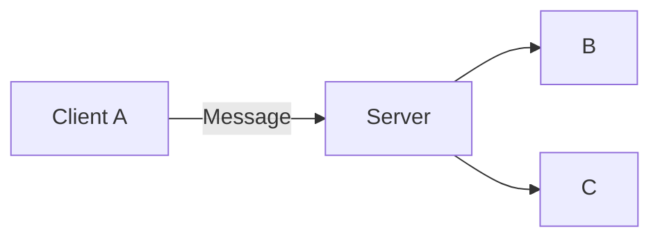

# Getting Started with Summoner Servers

> How to think about and run a Summoner server


## The Trust Model: Servers Are Just Pipes

**Summoner servers are untrusted relays.** They operate as public message hubs where any connected client can send, receive, or disconnect at any time. By default, servers forward all messages to all clients (excluding the sender), without enforcing validation, authentication, access control, or delivery guarantees.

Because the server is open source, users may modify its behavior — for example, to observe, reorder, delay, or drop messages. This reflects a key design principle: **trust should be established at the edges, not in the relay.**

<p align="center">
  
</p>

This architecture prioritizes flexibility and decentralization, but it also shifts critical responsibilities to the agents and the protocols they follow.

Rather than relying on the server for safety, developers are encouraged to adopt the following layered approach to structure trust and coordination:

| Layer             | Purpose in a Trustless Environment                                      |
| ----------------- | ----------------------------------------------------------------------- |
| **Identity**      | Agents use verifiable DIDs and sign their messages                      |
| **Orchestration** | Agents follow flows that declare valid behaviors and expected states    |
| **Handshakes**    | Agents establish shared expectations through protocol-level negotiation |

> These layers complement each other. Identity confirms who you are, orchestration defines what is allowed, and handshakes ensure both sides agree before interaction.

📘 For more on implementing these safeguards, see [Advanced Topics](../../advanced_usage/index.md).


## Running a Server (Python or Rust)

Summoner supports two server modes out of the box:
**Python-native** (default) and **Rust-backed** (via config). Both expose the same interface from your Python scripts.

Before continuing, ensure the Summoner SDK is installed. You can then create and launch a server by following one of the two options below.

### Option 1: Python Server (No Config Required)

Create a file named `first_server.py` in your working directory:

```python
from summoner.server import SummonerServer

if __name__ == "__main__":
    SummonerServer(name="first_server").run()
```

Run the server:

```bash
python first_server.py
```

This will launch the default Python server on `127.0.0.1:8888`. The output should look like:

```text
[DEBUG] Config file not found: 
2025-07-17 00:53:38.149 - first_server - INFO - Python server listening on 127.0.0.1:8888
```

### Option 2: Rust Server (Using a Config File)

To use the high-performance Rust implementation, follow these steps:

1. Create a `server_config.json` file:

   ```json
   {
     "version": "rss_3"
   }
   ```

2. Update your Python script:

   ```python
   from summoner.server import SummonerServer

   if __name__ == "__main__":
       SummonerServer(name="first_server").run(config_path="server_config.json")
   ```

3. Run the server:

   ```bash
   python first_server.py
   ```

You should now see:

```text
[DEBUG] Loaded config from: server_config.json
2025-07-17 00:58:40.428 - first_server - INFO - 🚀 Rust server listening on 127.0.0.1:8888
```


Here is the improved version that incorporates your points — especially demonstrating clearly that values in the config file **override** those given in the Python code. Option 2 now explicitly builds on Option 1:


## Customizing Host and Port

By default, the server listens on `127.0.0.1:8888`. You can change this in two ways: either in the Python code or in the config file.


### Option 1: Set Address in Code

You can specify a custom host and port directly in `.run()`:

```python
from summoner.server import SummonerServer

if __name__ == "__main__":
    SummonerServer(name="first_server").run(
        host="127.0.0.1",
        port=1234,
        config_path="server_config.json"
    )
```

Now run the server:

```bash
python first_server.py
```

You should see:

```text
[DEBUG] Loaded config from: server_config.json
2025-07-17 01:03:29.646 - first_server - INFO - 🚀 Rust server listening on 127.0.0.1:1234
```

This confirms the address from code was used.


### Option 2: Set Address in Config File

Now **keep the Python code from Option 1 unchanged**, and instead modify `server_config.json`:

```json
{
  "host": "0.0.0.0",
  "port": 5555,
  "version": "rss_3"
}
```

Then rerun:

```bash
python first_server.py
```

This time the server will **ignore the Python arguments** and use the config file instead:

```text
[DEBUG] Loaded config from: server_config.json
2025-07-17 01:07:32.500 - first_server - INFO - 🚀 Rust server listening on 0.0.0.0:5555
```

> [!TIP]
> If both code and config specify a host or port, the **config file takes precedence**. This makes it easier to manage server deployments with minimal code changes.


📘 See [Server Fundamentals](../../fundamentals/server_relay.md) for additional configuration options (e.g. logging, developer flags).


## Communication Model: Broadcast by Default

As of July 2025, Summoner servers use **broadcast messaging**:

* Every message is sent to all connected clients **except** the sender
* Clients must decide whether to process or ignore what they receive
* There is no concept of "targeted delivery" at the server level (yet)



This model simplifies transport and encourages openness, but it also means each agent is responsible for its own safety:

> [!IMPORTANT]
> It is strongly recommended that you implement identity checks, message validation, and encryption within your agent logic. The SDK provides hook functions to help with this.

📘 See [Advanced Usage](../../advanced_usage/index.md) for:

* Message filtering and validation
* Encryption and signing
* Upcoming server modes (Kobold update)


## Roadmap: Server Modes and Routing Models

The current broadcast model works well for open interaction. But depending on your use case, different routing topologies may be more appropriate. These are under active development.

| Mode          | Description                               | Example Use Case                     |
| ------------- | ----------------------------------------- | ------------------------------------ |
| **Broadcast** | All agents receive all messages (default) | Chat rooms, public boards            |
| **Dedicated** | Direct routing between a defined set of agents         | Private interactions, 2–3 player negotiations   |
| **Hosted**    | A central agent receives all messages and forwards them to the appropriate recipients  | Evaluation arenas, game masters      |
| **Hybrid**    | Combines broadcast, dedicated, and hosted modes | MMORPGs: players, events, and NPCs in sync |

> [!NOTE]
> The upcoming **Kobold** update will include:
>
> * Dedicated messaging
> * Handshake enforcement
> * Peer trust config and whitelisting


<p align="center">
  <a href="begin.md">&laquo; Previous: Beginner's Guide (Intro)</a> &nbsp;&nbsp;&nbsp;|&nbsp;&nbsp;&nbsp; <a href="begin_client.md">Next: Getting Started with Clients & Agents &raquo;</a>
</p>
