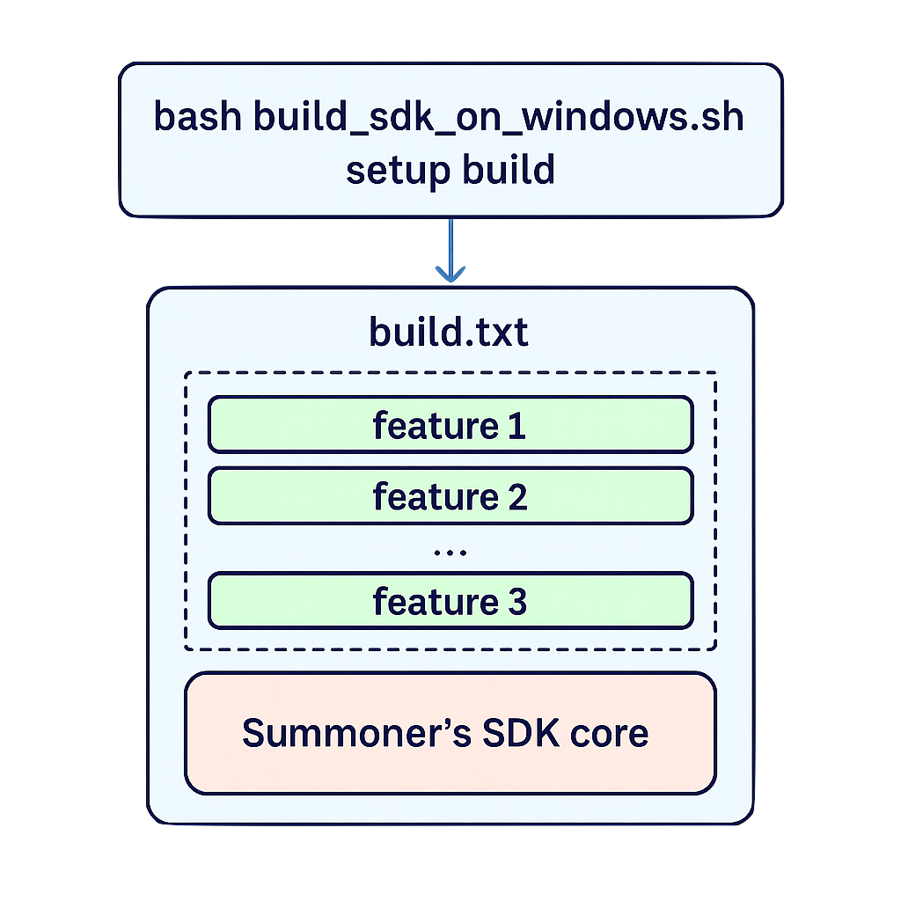
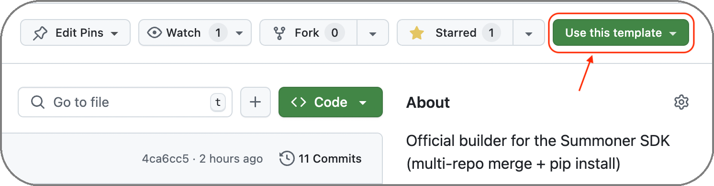

# Installation on Windows (PowerShell)

Because the Summoner SDK spans multiple repositories, we **do not** ship a one-line `pip install`. On Windows we provide a **PowerShell installer** that mirrors our POSIX flow and composes the SDK for you.

Use the script in the SDK template repo: **[`build_sdk_on_windows.ps1`](https://github.com/Summoner-Network/summoner-sdk/blob/main/build_sdk_on_windows.ps1)**. It orchestrates cloning the right repos, creating a virtual environment, installing dependencies, and wiring modules listed in your `build.txt`.

<p align="center">
  
</p>

> [!WARNING]
> The **Rust/Tokio** server is **not available on Windows**. Any `version: "rust"` in your config is ignored on Windows and the server runs with the **Python backend**.
> If you want to experiment with the Rust server, see **WSL2** notes below.

For Linux/macOS users, see the POSIX installer [here](installation.md).


## A Template-Based SDK (Windows edition)

The **[`summoner-sdk`](https://github.com/Summoner-Network/summoner-sdk)** repository is a **GitHub template**. You do not modify it in place: click **Use this template** to generate your own SDK repo that contains only the installer and composition logic.

You decide which features to include by editing **`build.txt`** in your new repo. The Windows installer then composes your SDK accordingly—pulling in the **SDK core** and any modules you list.

> [!NOTE]
> The template's default `build.txt` references:
> * `summoner-agentclass` (public)
> * ~~`summoner-smart-tools`~~ (removed and kept private for now)

<p align="center">
  
</p>


## Required Tools and What the Script Runs

On Windows, the PowerShell script [`build_sdk_on_windows.ps1`](https://github.com/Summoner-Network/summoner-sdk/blob/main/build_sdk_on_windows.ps1) replaces the POSIX script [`build_sdk.sh`](https://github.com/Summoner-Network/summoner-sdk/blob/main/build_sdk.sh) and drives the same high-level steps:

* Clone **summoner-core** and requested modules
* Create a Python **`venv/`**
* Install Python dependencies
* Normalize composed-module imports (rewrites `from tooling.X` to `from summoner.X`)
* **Skip** building the Rust server (not supported on Windows)

**Install these first:**

* **PowerShell** (Windows Terminal or PowerShell 7+ recommended)
* **Git for Windows** – [https://git-scm.com/download/win](https://git-scm.com/download/win)
* **Python 3.9+** available as `python` or via the launcher `py -3`

  ```powershell
  python --version    # or: py -3 --version
  ```

> [!TIP]
> You can run all steps from **VS Code's integrated terminal** (PowerShell profile).


## Build the SDK with a Custom `build.txt`

### Step 1: Create your SDK repository

1. Open the **[`summoner-sdk` template](https://github.com/Summoner-Network/summoner-sdk)**
2. Click **Use this template → Create a new repository**
3. Name your project and confirm

<p align="center">
  
</p>

Clone your new repository:

```powershell
git clone https://github.com/<your-account>/<your-sdk-repo>.git
cd <your-sdk-repo>
```


### Step 2: Choose features in `build.txt` (optional)

Edit **`build.txt`** to list modules you want pulled into your SDK. Example:

```txt
https://github.com/Summoner-Network/summoner-agentclass.git:
aurora
```

> [!WARNING]
> **Aurora** is coming soon. You can keep it listed now or add it later and re-run setup.

You can modify `build.txt` any time and re-run the installer.


### Step 3: Run the Windows installer

Allow script execution **for this session only**:

```powershell
Set-ExecutionPolicy -Scope Process -ExecutionPolicy Bypass
```

Run setup:

```powershell
.\build_sdk_on_windows.ps1 setup
```

This will:

* Detect Python/Git
* Create `venv/`
* Clone **summoner-core** and modules from `build.txt`
* Install Python dependencies
* Normalize composed-module imports (rewrites `from tooling.X` to `from summoner.X`)
* **Skip** Rust server build on Windows

Activate the environment:

```powershell
.\venv\Scripts\Activate.ps1
```

Your prompt should show `(venv)`.

> *🔁 The demo below was run on POSIX; the Windows flow is analogous.*
>
> <p align="center">
>   
> </p>


### Step 4: Quick server check (Python backend)

Start a minimal local server:

```powershell
.\build_sdk_on_windows.ps1 test_server
```

You should see it listening on `127.0.0.1:8888`.
Open another terminal (activate `venv`) and connect with your client; messages will broadcast to other connected clients.

> [!NOTE]
> On Windows, this always uses the **Python server**.


## Script commands (PowerShell)

```text
.\build_sdk_on_windows.ps1 <action> [variant]
```

* `setup [build|test_build]` — Compose/install the SDK (default: `build`)
* `deps` — Reinstall Python dependencies into the existing `venv/`
* `test_server` — Launch a minimal local server (Python backend)
* `delete` — Remove generated artifacts (`venv/`, temp clones, etc.)
* `reset` — Strong clean + re-setup
* `clean` — Light cleanup of caches/temp files

> [!TIP]
> Edit `build.txt` any time and re-run `setup`. The installer is **idempotent**.


## Optional: Using WSL2 to try the Rust server

If you require Rust/Tokio parity with Linux/macOS:

1. Install Ubuntu on WSL2:

   ```powershell
   wsl --install -d Ubuntu
   ```
2. In the **Ubuntu** terminal, follow the **Linux/macOS** guide exactly (install Python + Rust with `rustup`, then run `build_sdk.sh`).
3. Networking usually forwards `localhost` between Windows and WSL2. If needed, bind to `0.0.0.0` or find your WSL IP:

   ```bash
   hostname -I
   ```

> [!WARNING]
> WSL2 works well for many setups but isn't fully certified across environments yet.


## Troubleshooting

If you see **"Script is blocked by policy"**, then run:

```powershell
Set-ExecutionPolicy -Scope Process -ExecutionPolicy Bypass
```

If you see **"Python 3 not found"**, then install Python 3.9+ and ensure `python` or `py` is on `PATH`. Restart the terminal and verify:

```powershell
python --version    # or: py -3 --version
```

If you see **"Dependency build errors"**, then upgrade packaging tools and retry:

```powershell
python -m pip install -U pip wheel
```

If the error mentions a C/C++ compiler on Windows, install the Microsoft C++ Build Tools and re-run the installer.

If you see **"Port already in use"**, then change the port in your config or stop the conflicting process.


<p align="center">
  <a href="installation.md">&laquo; Previous: Installation (Linux/macOS)</a> &nbsp;&nbsp;&nbsp;|&nbsp;&nbsp;&nbsp; <a href="quickstart/index.md">Next: Quickstart &raquo;</a>
</p>
