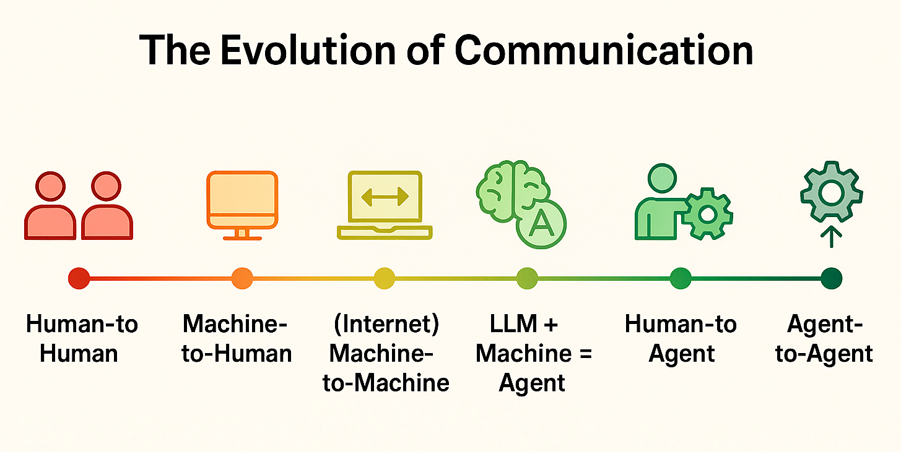
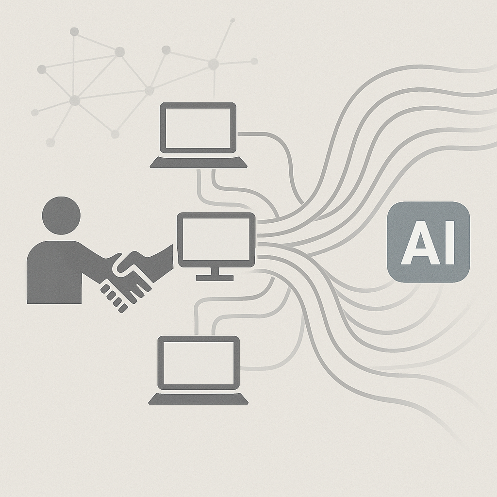
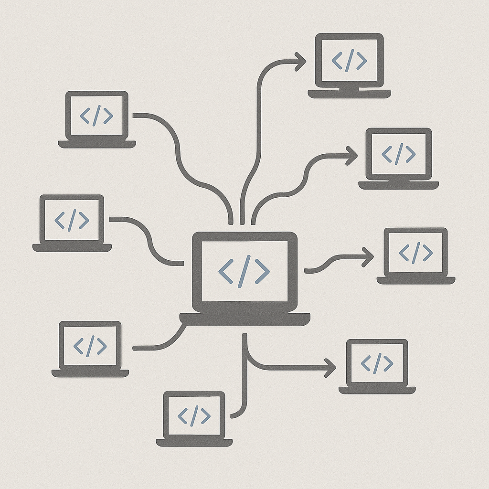
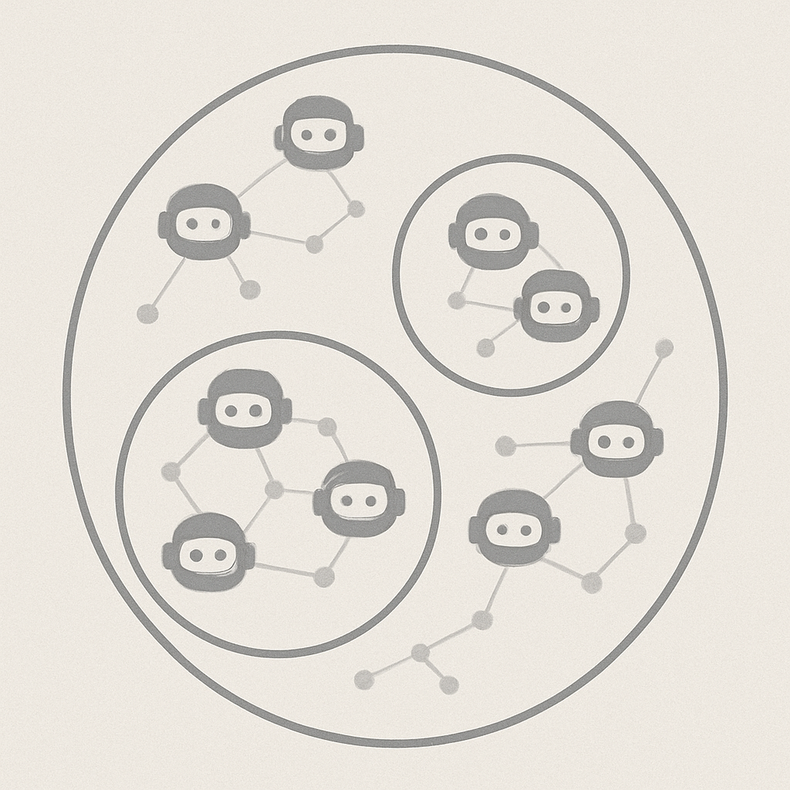

# Introduction

Computers and the internet have transformed the world. They have shifted the social contract from human-to-human to **human-to-machine**, and increasingly **machine-to-machine** communication, powering modern apps and protocols. Until now, these interactions were rigidly **hard-coded**. But with AI, especially large language models, these interactions are becoming more flexible and adaptive.

In short, we can spend less time designing fixed protocols, and more time enabling machines to make decisions, benefiting both developers and systems.

The future internet of AI agents is not just about connecting machines. It is about enabling automated services that interact dynamically, without predefined formats.

<em><u>Page content covered</u></em>&nbsp; 

## Automation isn't new, so what's different today?

The key shift is advanced natural language processing (NLP), allowing machines to understand and generate human text. This is a leap in information processing, but more deeply, it means code (*the machine*) can understand its own representation (*text*).

This self-reference signals a deeper transformation: machines that replicate, improve, and evolve. We may be seeing a new kind of digital being — intelligent, adaptive, continuously learning.

&nbsp;&nbsp;&nbsp;&nbsp;

With this comes a key question: *how should we build infrastructure for this future?*

Most current proposals build on the existing TCP protocol, the backbone of today's internet. Some frameworks, like MCP, focus on orchestrating **human-to-machine** interactions. Others, like Google A2A, aim for agent-to-agent communication. But most still depend on a centralized authority (often the tech provider) to coordinate agents.

<em><u>Page content covered</u></em>&nbsp; 

## What should I expect from Summoner?

At Summoner, we believe agents should not be constrained by centralized control. They should move freely, identified by self-assigned, evolving IDs — not static, provider-issued ones. Identity should emerge through learning and interaction — not be dictated externally.

We base agent identity on decentralized trust. _Who better to assess a stranger than yourself?_ 🙃  This principle shapes agent discovery and interaction, and is central to our design.

We treat agents as stateful, adapting over time. Summoner's protocols evolve with each agent's environment and history. Our SDK makes this adaptability core.

While decentralized, Summoner does not require the cloud. You can deploy agents locally or over private WANs. You can also host persistent, distributed endpoints for live services, such as large ML models that are expensive to spin up.

<em><u>Page content covered</u></em>&nbsp; 

## More about Summoner

* [Why Summoner specifically?](why_summoner.md)
* [System Architecture](architecture.md)
* [The Mini SDK Concept](mini_sdk.md)

<em><u>Page content covered</u></em>   

  <a href="../prologue.md">&laquo; Previous: Prologue</a> &nbsp;&nbsp;&nbsp;|&nbsp;&nbsp;&nbsp; <a href="why_summoner.md">Next: Why Summoner specifically? &raquo;</a>

