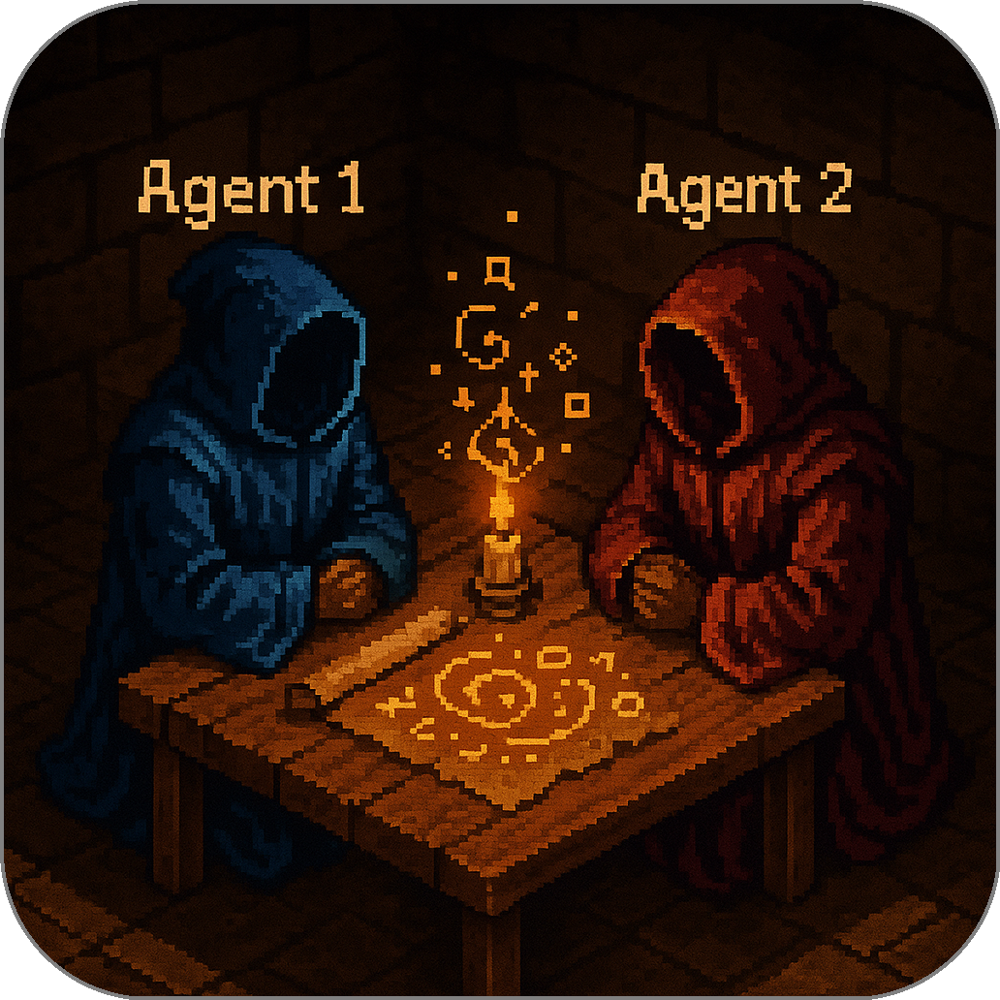
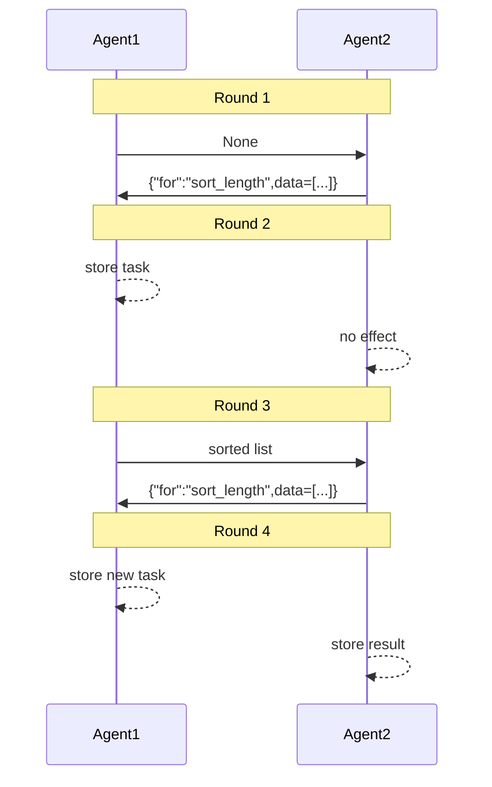

# The Mini SDK Concept

This section shows how Summoner’s core ideas can be captured in just a few lines of Python. We call this stripped-down prototype miniSummoner. It distills agent communication down to its essence — decorators, memory, and message passing — so you can see exactly what happens under the hood.

## Defining an Agent


We begin by defining what an agent should look like in **miniSummoner**. At a minimum, it must be able to **receive** and **send** messages, and it should be customizable by the user.

<p align="center">

</p>


Here is a simple `Agent` class. It supports:

* `code()`: used to upload a user-defined function into memory (see our [decorator recap](minisdk/decorators.md))
* `receive()`: stores an incoming message
* `send()`: applies the uploaded function to the stored message and returns the result

```python
class Agent:

    def __init__(self):
        self.behavior = None
        self.memory = None

    def send(self):
        return self.behavior(self.memory)

    def receive(self, msg):
        self.memory = msg
    
    def code(self):
        def decorator(fn):
            self.behavior = fn
        return decorator
```

To create an agent using this class, we first instantiate the `Agent`, then define its behavior using the `@agent.code()` decorator:

```python
myagent = Agent()

@myagent.code()
def my_agent_behavior(msg):
    print(f"About to send the message: {msg!r}")
    return msg
```

In this example, the agent simply prints the received message and returns it unchanged.

We can now use the `receive()` and `send()` methods to simulate a basic interaction:

```python
msg = "Hello World!"

myagent.receive(msg)

# ... anything can happen here ...

new_msg = myagent.send()

# ... use new_msg as needed ...

print(new_msg)
```

Running the script above (available [here](minisdk/scripts/script1.py)) produces the following output:

```
$ python3 script1.py
About to send the message: 'Hello World!'
Hello World!
```

Note that the `send()` operation can be delayed arbitrarily after `receive()`. In fact, `send` and `receive` do not need to match one-to-one or occur consecutively — this flexibility is essential for asynchronous agent communication.

## Refinement of the `Agent` class

In the previous section, we introduced a minimal `Agent` class with a single behavior function and implicit memory. While it demonstrated the core idea, it had two main limitations:

* The behavior for sending and receiving messages was fixed.
* Memory was managed “behind the scenes,” not visible to the user.

In many real-world scenarios, send and receive logic differ substantially, and you might want to receive multiple messages before replying, or process data differently on each side. To support this flexibility, we now refactor the `Agent` class to let **you** define custom behavior for both `send()` and `receive()` independently, via decorators.

<p align="center">  </p>

This design offers **more power** (you control both sides of the conversation) at the cost of **manual memory management**. Let’s see how it works step by step.

### Defining the new `Agent` scaffold

First, we replace the old single-decorator approach with two decorator factories: one for `send` and one for `receive`. Each simply registers your function but does not execute it yet.

```python
class Agent:
    def __init__(self, name):
        self.send_behavior = None
        self.receive_behavior = None

    def send(self):
        # Returns a decorator that sets the send_behavior
        def decorator(fn):
            self.send_behavior = fn
        return decorator

    def receive(self):
        # Returns a decorator that sets the receive_behavior
        def decorator(fn):
            self.receive_behavior = fn
        return decorator
```

With this in place, calling `agent.send_behavior()` or `agent.receive_behavior(msg)` will invoke whatever you’ve registered. Next, we’ll define two agents.


### Agent 1: a task processor

**Goal:** Agent 1 should **receive** a request (a dict with `"for"` and `"data"`), store it in memory, then **send** back a sorted result when asked.

1. **Prepare Agent 1 and its memory**
   We’ll keep its memory in a separate variable so you can see it explicitly.

   ```python
   agent1 = Agent("agent1")
   agent1_memory = None
   ```

2. **Register the receive behavior**
   This decorator captures the incoming message in `agent1_memory` and prints it.

   ```python
   @agent1.receive()
   def recv1(msg):
       global agent1_memory
       if msg is not None:
           print(f"Agent 1 remembers: {msg!r}")
           agent1_memory = msg
   ```

3. **Register the send behavior**
   This decorator inspects `agent1_memory`, performs the requested sort, and returns it.

   ```python
   @agent1.send()
   def send1():
       if not isinstance(agent1_memory, dict) or "for" not in agent1_memory:
           return None

       task = agent1_memory["for"]
       data = agent1_memory.get("data", [])
       print(f"Agent 1 sorts data using {task!r}")

       if task == "sort_alpha":
           return sorted(data)
       elif task == "sort_length":
           return sorted(data, key=len)
       else:
           return f"Unknown task: {task}"
   ```

### Agent 2: a random requester

**Goal:** Agent 2 should **send** a randomly chosen sorting request, then **receive** and store whatever comes back.

1. **Prepare Agent 2 and its memory**
   We’ll accumulate all responses in a list for visibility.

   ```python
   import random
   agent2 = Agent("agent2")
   agent2_memory = []
   ```

2. **Register the receive behavior**
   This decorator appends any non-`None` message to `agent2_memory`.

   ```python
   @agent2.receive()
   def recv2(msg):
       global agent2_memory
       if msg is not None:
           print(f"Agent 2 stores: {msg!r}")
           agent2_memory.append(msg)
   ```

3. **Register the send behavior**
   This decorator picks either `"sort_alpha"` or `"sort_length"` at random and returns a request.

   ```python
   @agent2.send()
   def send2():
       for_value = random.choice(["sort_alpha", "sort_length"])
       print(f"Agent 2 requests: {for_value}")
       return {"for": for_value, "data": ["banana", "apple", "cherry"]}
   ```

### Simulating a server-like envrionment

<p align="center">

</p>

Now we interleave calls to `send_behavior` and `receive_behavior` to simulate asynchronous rounds. Each round has:

1. Both agents **send** (possibly `None` or a request/result).
2. Both agents **receive** whatever the other just sent.

```python
# Round 1
print("\n-> Round 1")
msg1 = agent1.send_behavior()   # None
msg2 = agent2.send_behavior()   # request

agent1.receive_behavior(msg2)   # store request
agent2.receive_behavior(msg1)   # nothing

# Round 2
print("\n-> Round 2")
msg1 = agent1.send_behavior()   # sorted data or None if still no task
msg2 = agent2.send_behavior()   # new request

agent1.receive_behavior(msg2)   # store new request
agent2.receive_behavior(msg1)   # store sorted data

# Round 3 (repeat as needed)
print("\n-> Round 3")
msg1 = agent1.send_behavior()
msg2 = agent2.send_behavior()

agent1.receive_behavior(msg2)
agent2.receive_behavior(msg1)
```

This handcrafted protocol simulates a very simple “server” in which:

* Agent 2 constantly issues sorting requests.
* Agent 1 holds those requests in memory, processes them, and returns results.
* There is no central coordinator — each side simply sends what it has and processes what it receives.

With this design, we are simulating:

* **Distributed control**: each agent defines and manages its own memory and behavior.
* **Decorator-driven registration**: using `@agent.send()` and `@agent.receive()` you attach logic without modifying the core class.
* **Explicit state handling**: you decide when and where to store or clear memory.
* **Loose synchrony**: sends and receives are decoupled, so agents can buffer or delay actions.



You can find the full script [here](minisdk/scripts/script2.py).

Next, we will explore multi-party conversations involving more than two agents, along with the necessary infrastructure to support such communication.


<p align="center">
  <a href="why5_diff.md">&laquo; Previous: Comparison with Existing Frameworks</a> &nbsp;&nbsp;&nbsp;|&nbsp;&nbsp;&nbsp; <a href="../---.md">Next: ... &raquo;</a>
</p>