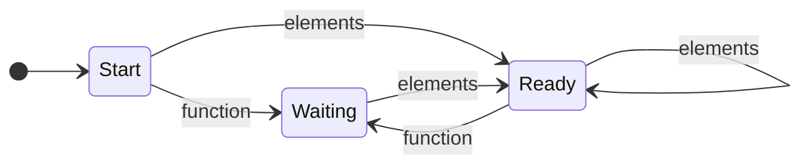

# Finite State Machine Logic

In this section we extend our miniSummoner prototype to manage explicit agent states via a finite state machine (FSM). Rather than inferring readiness solely from memory contents, each agent now **uploads** its current state, then **downloads** a new state based on the messages it processes. This makes complex protocols easier to reason about and debug.

<p align="center">

</p>

This design also lays the groundwork for agents to manage multiple simultaneous interactions, each with its own internal state. For example, an agent coordinating with several groups can maintain a distinct FSM per group or project. While this tutorial focuses on a single shared state per agent, the structure of the code naturally supports more complex cases, and readers can easily infer how to scale it to multi-project scenarios. The use of explicit state upload/download functions ensures that the logic remains organized and extensible.

## Extending the `Agent` scaffold

To support FSM-driven behavior, we introduce two new decorator factories:

* `@agent.upload_state()`: called before each send, returns the agent's current state
* `@agent.download_state()`: called after each receive phase, accepts a list of next states and updates the agent's current state

We also generalize `send` and `receive` to accept an optional **route** identifier, so that you can register multiple behaviors keyed by the state from which they should fire.

```python
from typing import Callable, Optional

class Agent:
    def __init__(self):
        self.send_behaviors: dict[str, Callable] = {}
        self.receive_behaviors: dict[str, Callable] = {}
        self._upload_state = None
        self._download_state = None

    def send(self, route: Optional[str] = None):
        def decorator(fn):
            self.send_behaviors[route] = fn
        return decorator

    def receive(self, route: Optional[str] = None):
        def decorator(fn):
            self.receive_behaviors[route] = fn
        return decorator

    def upload_state(self):
        def decorator(fn):
            self._upload_state = fn
        return decorator

    def download_state(self):
        def decorator(fn):
            self._download_state = fn
        return decorator
```

## Defining the state transition graph

We encode the FSM for our sorter (Agent 1) in a simple lookup table. Each entry maps the current state and the “event” (the return value of a receive handler) to the next state.

```python
state_graph = {
    "Start":   {"elements": "Ready",   "function": "Waiting"},
    "Waiting": {"elements": "Ready"},
    "Ready":   {"elements": "Ready",   "function": "Waiting"},
}
```

<details>
<summary><em>Mermaid state diagram</em></summary>



</details>

## Agent 1: FSM-driven sorter

<p align="center">

</p>

Agent 1 now uses a finite state machine to control when it stores messages, when it replies, and when it resets. Instead of relying on memory inspection, it chooses behavior paths based on a **named state** like `"Start"`, `"Waiting"`, or `"Ready"`. Each of these states is associated with different `@receive()` handlers and, when appropriate, with a `@send()` action.

We begin by initializing the agent and its associated memory and state:

```python
agent1 = Agent()
agent1_memory = {}
agent1_state = "Start"
```

### Handling state-specific receives

Agent 1 uses **three distinct `@receive()` handlers**, one for each state. Internally, each handler calls a helper function `raw_behavior()` that performs memory updates and returns the `"purpose"` field of the message as the state transition event. This is the signal used by the FSM to decide which state should follow.

We now define the core receive logic for Agent 1. This is also a great opportunity to observe how **Summoner cleanly separates your domain logic from orchestration concerns**.

#### User logic: message processing as an independent helper

The first part is a helper function that can be thought of as part of the user's application layer. It defines how messages are handled and remembered — a role that, in a real-world setting, might involve logic specific to your own stack or domain. 

Here, by keeping this logic separate, we see how Summoner lets users plug in custom behavior without mixing it with coordination. The agent doesn't need to know why a message matters — only when to handle it.

```python
def raw_behavior(msg, state):
    global agent1_memory
    if agent1_memory is None:
        agent1_memory = {}
    if msg["purpose"] not in agent1_memory:
        print(f"[{state} - receive] Agent 1 remembers: {msg!r}")
        agent1_memory[msg["purpose"]] = msg
        return msg["purpose"]
```

In other words, this function represents your logic, not Summoner's. You decide what happens inside — Summoner simply makes sure it runs at the right time.

#### FSM wiring: linking behavior to states

Now that we've defined the behavior, we hook it into the agent's FSM by registering three distinct `@receive()` decorators, each linked to a specific state. These decorators do not modify the logic — they simply say ***run this logic when in state X.***

```python
@agent1.receive(route="Start")
def recv_start(msg: dict):
    if "purpose" in msg:
        return raw_behavior(msg, "Start")

@agent1.receive(route="Waiting")
def recv_waiting(msg: dict):
    if "purpose" in msg and msg["purpose"] == "elements":
        return raw_behavior(msg, "Waiting")

@agent1.receive(route="Ready")
def recv_ready(msg: dict):
    global agent1_memory
    agent1_memory = {}             # clear memory on any receive in Ready
    return raw_behavior(msg, "Ready")
```

Each decorator **routes a message to the same user logic** but adds context: 
* in the `"Start"` state, Agent 1 accepts any message with a `"purpose"` and stores it.
* in the `"Waiting"` state, it listens specifically for `"elements"` to complete its task.
* in the `"Ready"` state, it resets memory before accepting new inputs — ensuring that each new task starts cleanly.

This modular design makes it easy to **plug your application logic into multiple states**, while Summoner manages sequencing, transitions, and scheduling.


Here’s a revised version of the **Sending a result when ready** section that integrates your current version while explicitly comparing it to the past approach — showcasing how the FSM simplifies the control logic and strengthens Summoner’s case:


### Sending a result when ready

In the previous tutorial, the `@send()` logic had to manually check that both the `"function"` and `"elements"` messages were present. It used multiple nested conditionals to guard against incomplete inputs, and it was responsible for resetting memory when a task completed. This meant that **the agent had to reason about its own readiness**, mixing business logic with coordination logic.

With the FSM structure introduced here, all of that is simplified.

<p align="center">

</p>

The `@send()` behavior below is active only in the `"Ready"` state. The FSM ensures that we only enter this state after receiving both inputs — so we no longer need to perform explicit checks. Our send logic can now **focus entirely on the task itself**, not on whether it should run.

```python
@agent1.send(route="Ready")
def send_ready():
    global agent1_memory
    task = agent1_memory.get("function", {}).get("for", "sort_alpha")
    data = agent1_memory["elements"]["data"]
    print(f"[Ready - send] Agent 1 sorts data using {task!r}")
    if task == "sort_alpha":
        return {"purpose": "response", "data": sorted(data)}
    elif task == "sort_length":
        return {"purpose": "response", "data": sorted(data, key=len)}
    return None
```

Because readiness is now determined by state transitions — not inline checks — the `@send()` function becomes leaner, safer, and easier to test. Summoner takes care of **when** to run the logic; you just define **what** it does.

This is one of the clearest advantages of using explicit state transitions: logic that was previously defensive and condition-heavy becomes declarative and modular.

### Uploading and downloading state

The FSM relies on the agent reporting its current state before each round and updating it afterward based on which messages it processed. This happens via `@upload_state()` and `@download_state()` callbacks:

```python
@agent1.upload_state()
def upload():
    global agent1_state
    return agent1_state

@agent1.download_state()
def download(next_states):
    global agent1_state
    # pick the highest-priority transition if multiple events occurred
    for state in ["Ready", "Waiting", "Start"]:
        if state in next_states:
            agent1_state = state
            break
```

* **Upload** is called before any sends or receives, so the correct logic can be chosen.
* **Download** is called after the receive phase, and it updates the agent's internal state based on the events returned by the `@receive()` handlers.
* If multiple transitions are triggered in a single round, a simple priority is used: `"Ready"` overrides `"Waiting"`, which overrides `"Start"`.

This separation between memory and state logic allows Agent 1 to participate in structured, rule-based exchanges — ideal for large protocols or multi-party coordination where timing and readiness must be made explicit.


## Agents 2 and 3: uploading and downloading state

Agents 2 and 3 simply record and broadcast, but now also carry a `state` value through each round. Their upload/download handlers store the `agent_state` variable each turn:

```python
# Agent 2
agent2 = Agent()
agent2_memory = []
agent2_state = None

@agent2.receive()
def recv2(msg):
    global agent2_memory
    if msg and msg.get("purpose") == "response":
        print(f"Agent 2 stores: {msg!r}")
        agent2_memory.append(msg)

@agent2.send()
def send2():
    choice = random.choice(["sort_alpha", "sort_length"])
    print(f"Agent 2 requests: {choice}")
    return {"purpose": "function", "for": choice}

@agent2.upload_state()
def upload2():
    return agent2_state

@agent2.download_state()
def download2(state):
    global agent2_state
    agent2_state = state

# Agent 3 (data supplier) follows the same pattern
```

## Simulating the FSM protocol

<p align="center">

</p>

The `server_protocol` function now:

1. **Uploads** each agent's current state
2. Collects all `send` outputs matching `None` or the uploaded state
3. Delivers messages to every other agent via their matching `receive` routes
4. **Downloads** the resulting next states into each agent

```python
def server_protocol(*agents: Agent):
    for round in range(1, 4):
        print(f"\n-> Round {round}")

        # 1. Upload states and send
        msgs = []
        for agent in agents:
            state = agent._upload_state()
            sent = [fn() for route, fn in agent.send_behaviors.items()
                    if route is None or route == state]
            msgs.append(sent[0] if sent else None)

        # 2. Exchange and receive
        for i, agent in enumerate(agents):
            state = agent._upload_state()
            next_states = []
            for msg in msgs[:i] + msgs[i+1:]:
                for route, fn in agent.receive_behaviors.items():
                    if route is None or route == state:
                        event = fn(msg)
                        if route is not None and event:
                            next_state = state_graph[route].get(event, route)
                            next_states.append(next_state)
            agent._download_state(next_states)
```

Running `server_protocol(agent1, agent2, agent3)` yields a clear, state-driven trace of each receive and send, showing exactly how each agent moves through **Start**, **Waiting**, and **Ready**.

## Interpreting the Output

Below is the actual terminal trace when running our FSM-driven protocol. We'll walk through each round to see how states, sends, and receives align with the diagram and code.

```bash
-> Round 1
Agent 2 requests: sort_length
Agent 3 requests for given data
[Start - receive] Agent 1 remembers: {'purpose': 'function', 'for': 'sort_length'}
[Start - receive] Agent 1 remembers: {'purpose': 'elements', 'data': ['banana', 'apple', 'kiwi']}

-> Round 2
[Ready - send] Agent 1 sorts data using 'sort_length'
Agent 2 requests: sort_length
Agent 3 requests for given data
[Ready - receive] Agent 1 remembers: {'purpose': 'function', 'for': 'sort_length'}
[Ready - receive] Agent 1 remembers: {'purpose': 'elements', 'data': ['banana', 'apple', 'kiwi']}
Agent 2 stores: {'purpose': 'response', 'data': ['kiwi', 'apple', 'banana']}
Agent 3 stores: {'purpose': 'response', 'data': ['kiwi', 'apple', 'banana']}

-> Round 3
[Ready - send] Agent 1 sorts data using 'sort_alpha'
Agent 2 requests: sort_length
Agent 3 requests for given data
[Ready - receive] Agent 1 remembers: {'purpose': 'function', 'for': 'sort_length'}
[Ready - receive] Agent 1 remembers: {'purpose': 'elements', 'data': ['banana', 'apple', 'kiwi']}
Agent 2 stores: {'purpose': 'response', 'data': ['apple', 'banana', 'kiwi']}
Agent 3 stores: {'purpose': 'response', 'data': ['apple', 'banana', 'kiwi']}
```

1. **Round 1**

   * **Agent 2** and **Agent 3** each emit a request (`sort_length`) and the data payload.
   * **Agent 1** is in the **Start** state, so both messages match its `@receive(route="Start")` handler.
   * Each receive prints a line like `[Start – receive] Agent 1 remembers: …` and returns the event `"function"` then `"elements"`.
   * According to the FSM graph, seeing both events moves Agent 1 from **Start** → **Ready**.

2. **Round 2**

   * **Agent 1** (now **Ready**) invokes its `@send(route="Ready")` and sorts using `sort_length`.
   * **Agent 2** and **Agent 3** again send a new function request and data.
   * **Agent 1**'s `@receive(route="Ready")` first clears its old memory, then captures the incoming messages.
   * Both storage decorators on Agent 2/3 fire when they see a `"response"`, printing and appending the sorted list `['kiwi','apple','banana']`.
   * The FSM download step sees the events `"function"` and `"elements"` in the **Ready** route, and the transition table keeps the agent in **Ready**.

3. **Round 3**

   * In **Ready**, Agent 1's send logic defaults to `"sort_alpha"` because its memory was reset then replenished with only the latest function request **after** the clear.
   * The results `'apple','banana','kiwi'` propagate back, and Agents 2/3 store them similarly.
   * Throughout, Agent 1 remains in **Ready**, demonstrating that our FSM correctly automates the send/receive cycle based on explicit state transitions.


You can find the full script [here](minisdk/scripts/script4.py).

<p align="center">
  <a href="multiparty.md">&laquo; Previous: Multiparty Communication: Three Agents</a> &nbsp;&nbsp;&nbsp;|&nbsp;&nbsp;&nbsp; <a href="../../tutorials/index.md">Next: Tutorials &raquo;</a>
</p>
