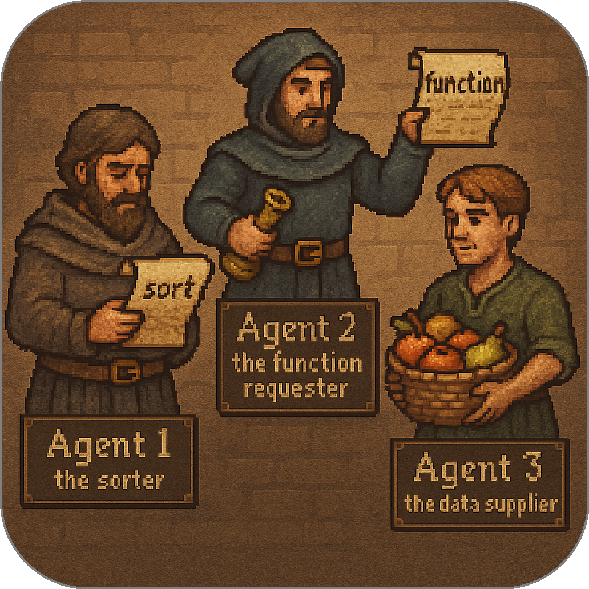
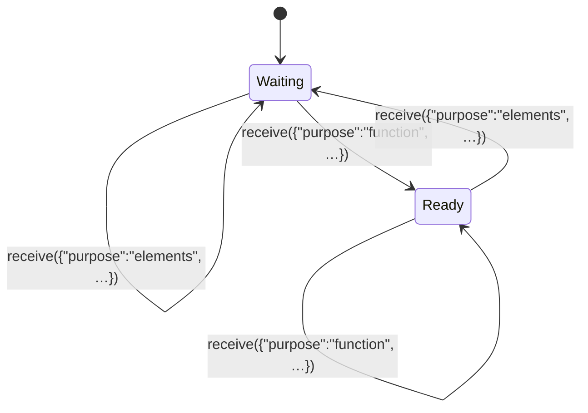

# Multiparty Communication: Three Agents

In the two-party example, each agent defined its own send/receive logic and managed memory explicitly. That same decorator-driven pattern scales naturally to more participants. Here, we introduce three agents — **Agent 1**, **Agent 2**, and **Agent 3** — each playing a distinct role:

* **Agent 1 (the sorter)** collects two types of inputs (a function and a dataset), waits until it has both, then performs the sort and replies
* **Agent 2 (the function requester)** randomly chooses a sort function and stores any responses
* **Agent 3 (the data supplier)** provides a fixed dataset and also stores any responses

<p align="center">

</p>

The only new challenge is that Agent 1 must remember and combine two incoming messages before it can act. Everything else — the `Agent` class and the send/receive decorators — remains essentially unchanged.

## The `Agent` Class (unchanged)

The same minimal `Agent` class underpins all behavior, with decorators defining how each agent sends and receives messages.

```python
class Agent:
    def __init__(self):
        self.send_behavior = None
        self.receive_behavior = None

    def send(self):
        def decorator(fn):
            self.send_behavior = fn
        return decorator

    def receive(self):
        def decorator(fn):
            self.receive_behavior = fn
        return decorator
```

## Agent 1: the sorter

Agent 1 must gather two pieces of information before it can respond: a message specifying which sort to apply (`"purpose": "function"`) and a message carrying the data to sort (`"purpose": "elements"`). The `@receive()` decorator captures each incoming message exactly once, building up `agent1_memory` without ever overwriting existing entries.

```python
agent1 = Agent()
agent1_memory = None

@agent1.receive()
def behavior(msg):
    global agent1_memory
    if "purpose" in msg:
        if agent1_memory is None:
            agent1_memory = {}
        if msg["purpose"] not in agent1_memory:
            print(f"Agent 1 remembers: {msg!r}")
            agent1_memory[msg["purpose"]] = msg
```

Before we look at how `send()` acts, it helps to visualize Agent 1’s readiness as a small state machine. It begins in **Waiting**, moves to **Ready** once both messages have arrived, and then resets to **Waiting** after sending its response:



In this state machine:

* The agent stays in **Waiting** until it has seen both `"function"` and `"elements"` messages.
* Receiving `"elements"` is the final trigger that moves it into **Ready**, even if `"function"` arrived first.
* After sending, the agent clears its memory and returns to **Waiting**.

With that in mind, here is the `@send()` decorator. It checks whether both required messages are present, does nothing if they aren’t, and—once in **Ready**—performs the sort, emits a `"response"`, and resets.

```python
@agent1.send()
def behavior():
    global agent1_memory
    # 1. If memory isn't a dict with both inputs, stay waiting
    if not isinstance(agent1_memory, dict):
        return None

    # 2. Choose sort type, defaulting to alphabetical
    if "function" in agent1_memory and "for" in agent1_memory["function"]:
        task = agent1_memory["function"]["for"]
    else:
        task = "sort_alpha"

    # 3. Verify we have data to sort
    if "elements" in agent1_memory and "data" in agent1_memory["elements"]:
        data = agent1_memory["elements"]["data"]
    else:
        return None

    # 4. Perform the sort, clear memory, and reply
    print(f"Agent 1 sorts data using {task!r}")
    agent1_memory = {}

    if task == "sort_alpha":
        return {"purpose": "response", "data": sorted(data)}
    elif task == "sort_length":
        return {"purpose": "response", "data": sorted(data, key=len)}
    else:
        return None
```

This setup guarantees that Agent 1 only acts when it’s truly ready, then returns to its initial state—ready to process the next pair of inputs.


## Agent 2: the function requester

Agent 2’s role is to ask for a sorting function each round and record only the sorted results it receives. Its `@receive()` decorator ignores everything except messages marked with `"purpose": "response"`, ensuring it doesn’t react to its own function requests or to Agent 3’s data broadcasts.

```python
import random
agent2 = Agent()
agent2_memory = []

@agent2.receive()
def behavior(msg):
    global agent2_memory
    if msg is not None and msg.get("purpose") == "response":
        print(f"Agent 2 stores: {msg!r}")
        agent2_memory.append(msg)
```

Here, whenever Agent 2 receives a response, it prints and appends that message to `agent2_memory`, and all other incoming traffic is simply ignored.

Next, its `@send()` decorator randomly picks one of two sort functions and emits that request each round:

```python
@agent2.send()
def behavior():
    for_value = random.choice(["sort_alpha", "sort_length"])
    print(f"Agent 2 requests: {for_value}")
    return {"purpose": "function", "for": for_value}
```

Every time `send()` runs, Agent 2 chooses between `"sort_alpha"` and `"sort_length"`, logs the choice, and returns a message requesting that sort.

---

## Agent 3: the data supplier

Agent 3 complements Agent 2 by broadcasting a fixed dataset and likewise only cares about `"response"` messages that come back.

```python
agent3 = Agent()
agent3_memory = []

@agent3.receive()
def behavior(msg):
    global agent3_memory
    if msg is not None and msg.get("purpose") == "response":
        print(f"Agent 3 stores: {msg!r}")
        agent3_memory.append(msg)
```

This receive decorator filters out everything but responses, so Agent 3 ignores both the function requests from Agent 2 and its own data broadcasts.

Finally, its `@send()` decorator always sends the same fruit list:

```python
@agent3.send()
def behavior():
    print("Agent 3 provides data")
    return {"purpose": "elements", "data": ["banana", "apple", "cherry"]}
```

On each round, Agent 3 simply emits its data payload and waits to store any sorted results that return.


## Simulating Three-Party Rounds

Each round, **all agents send** their message, then **each agent receives** every message from the other two (but ignores its own):

```python
for round in range(1, 4):
    print(f"\n-> Round {round}")
    agents = [agent1, agent2, agent3]
    msgs   = [agent.send_behavior() for agent in agents]
    # Pair each agent with the two messages not from itself
    exchanges = [(agents[i], msgs[:i] + msgs[i+1:]) for i in range(len(agents))]

    for agent, incoming in exchanges:
        for msg in incoming:
            agent.receive_behavior(msg)
```

This loop acts like a tiny network:

1. Every agent **broadcasts** its current message.
2. Every agent **processes** the two messages sent by the others.

Because send/receive are completely decoupled, the system easily extends from two to three (or more) participants without touching the core `Agent` class.

<p align="center">
  <a href="../mini_sdk.md">&laquo; Previous: The Mini SDK Concept</a> &nbsp;&nbsp;&nbsp;|&nbsp;&nbsp;&nbsp; <a href="mini_fsm_agents.md">Next: Finite State Machine Logic &raquo;</a>
</p>

