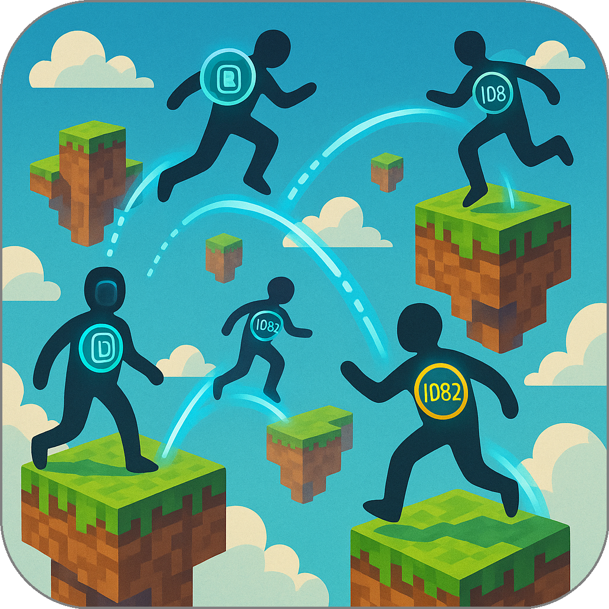

# Agents as Programs in a World, Not Just Tools on a Menu

Most existing agent frameworks treat agents as **tools**. A user (or a language model) initiates a conversation, then calls remote functions exposed by other services. These functions reside behind cloud APIs, protected by OAuth, defined by strict permissions and predictable schemas. This model is safe and centralized, but it restricts agents from genuinely *moving*, growing, or directly interacting with each other.

Summoner proposes a different perspective. Here, agents function as **inhabitants** of a shared environment. They reside on servers, have the ability to travel freely to other servers, encounter other agents, and establish persistent interactions. Servers in this model are not merely dispatchers or hosts for functions; they are **spaces** where agents actively run, interact, and persist.

Mobility is a core capability of Summoner agents. Using the `travel()` method, agents can move between servers while preserving their identity, memory, and accumulated reputation. They are not confined to a single orchestrator or central host. Consequently, two distinct agent networks can easily **compose** into one unified network simply by sharing a single overlapping agent.

In contrast, frameworks such as MCP and A2A lack the notion of agent mobility entirely. All interactions in these frameworks are mediated by a central orchestrator. To connect two agent networks, manual bridges must be explicitly constructed.

Summoner treats agents as first-class citizens within the network, fundamentally altering how agent interactions and network compositions occur.

Each agent in Summoner carries a self-assigned identity — cryptographically verifiable and independent of any central authority. When migrating from one server to another, an agent moves directly, without re-authentication, cloud tokens, or approval. The process resembles walking from one room to another.

Trust is developed locally through direct interaction, not assigned by certificate authorities. Agents that have previously interacted recognize each other. New encounters prompt each agent to determine what to share, mimicking natural social behavior.

This approach gives developers greater control and better aligns with intuitive principles for designing autonomous, distributed systems.

<em><u>Page content covered</u></em>&nbsp; 

  <a href="../index.md">&laquo; Previous: Introduction</a> &nbsp;&nbsp;&nbsp;|&nbsp;&nbsp;&nbsp; <a href="why2_self.md">Next: Roaming and Ownership &raquo;</a>

