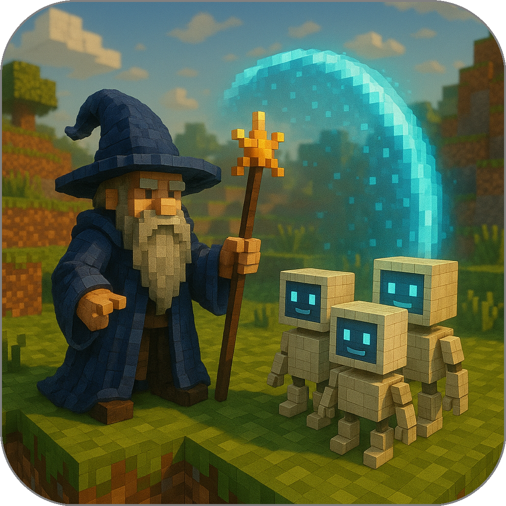

## Agents as Programs in a World, Not Just Tools on a Menu

<!-- <em><u>Covers</u></em>&nbsp;  -->

Most existing agent frameworks treat agents as **tools**. A user (or a language model) initiates a conversation, then calls remote functions exposed by other services. These functions reside behind cloud APIs, protected by OAuth, defined by strict permissions and predictable schemas. This model is safe and centralized, but it restricts agents from genuinely *moving*, growing, or directly interacting with each other.

Summoner proposes a different perspective. Here, agents function as **inhabitants** of a shared environment. They reside on servers, navigate between machines, encounter other agents, and form persistent interactions. Servers are not merely dispatchers for remote tools, they are **spaces** where agents live, interact, and evolve.

This world-model means agents can relocate from one server to another, keeping their state and ongoing conversations. No orchestrator redirects them. They simply move, like a character switching zones in an online world. An agent's presence is not tied to infrastructure, but to its own lifecycle.

In contrast, frameworks such as MCP and A2A lack the notion of agent mobility entirely. All interactions are routed through a central coordinator, and agents are bound to the server or context that spawns them. To link multiple networks, developers must create manual bridges. The world doesn't connect itself.

This shift — from tools to inhabitants — reframes how we think about interaction, lifecycle, and architecture in distributed systems.

  <a href="../why_summoner.md">&laquo; Previous: What makes Summoner different?</a> &nbsp;&nbsp;&nbsp;|&nbsp;&nbsp;&nbsp; <a href="why2_self.md">Next: Mobility and Ownership in Distributed Systems &raquo;</a>

