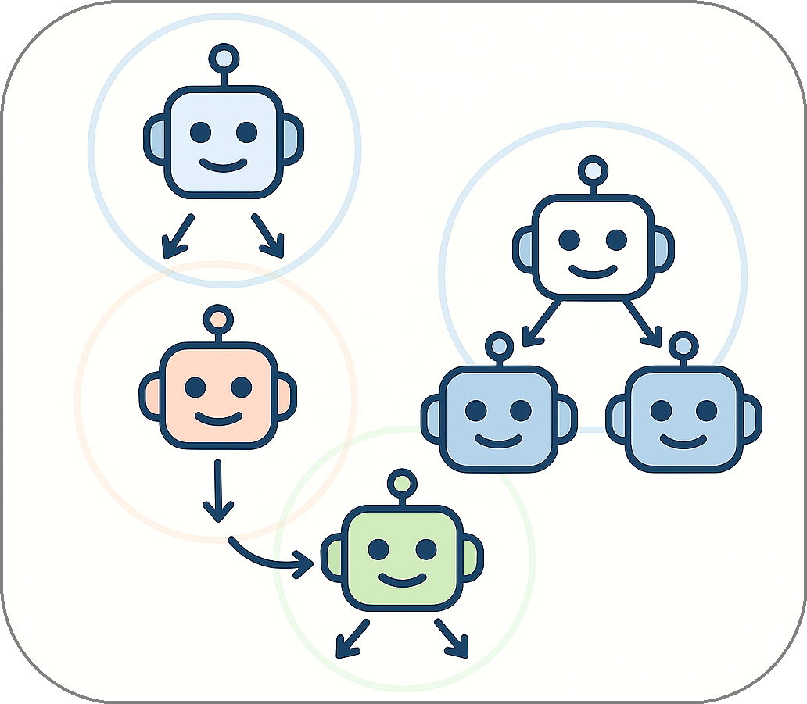

## True Composability: Building Graphs, Not Pipelines

<em><u>Covers</u></em>&nbsp; 

Many frameworks claim **composability**. But what they usually mean is the ability to plug multiple APIs into one orchestrator. That is what one should call coordination: everything still flows through a central hub.

Traditional systems cannot do this. Each orchestrator controls its own domain, defining which agents exist, how they communicate, and under what permissions. To connect two such systems, you must build explicit bridges, align schemas, and manage identities manually.

This process is brittle, slow to evolve, and often requires centralized approval or configuration changes. It reflects coordination, not true structural integration.

<!-- 

  

    

    Many frameworks claim <strong>composability</strong>. But what they usually mean is the ability to plug multiple APIs into one orchestrator. That is what one should call coordination: everything still flows through a central hub.
    

    

    Traditional systems cannot do this. Each orchestrator controls its own domain, defining which agents exist, how they communicate, and under what permissions. To connect two such systems, you must build explicit bridges, align schemas, and manage identities manually.  
    This process is brittle, slow to evolve, and often requires centralized approval or configuration changes. It reflects coordination, not true structural integration.
    

  

  

    
  

 -->

**Summoner** takes a different approach. Here, composability is a <strong>graph-level behavior</strong>. Each agent is made of smaller parts — internal states or subagents — connected like nodes in a graph. And graphs can merge.

If two agents (or entire networks) share a common node — represented by the same _route_ endpoint — the graphs **glue together** along that node. Messages keep flowing. Interactions continue without interruption. There's no orchestrator coordinating it, just a shared structure that now extends across both systems.

**Example**  
> Two research labs each run their own agent networks. At a joint workshop, they realize one of their agents overlaps — a shared node that handles data classification. Instead of linking through an API, they simply connect the graphs at that node. Instantly, all other agents can interact, share tools, and co-author outputs — no reconfig, no manual bridge.

Summoner's model of composition is not merely a technical mechanism. It reflects a broader vision of agents as **self-contained entities**</strong>** with their own structure and behavior. This allows networks to grow _organically_. 

When collaboration arises, there is no need for permission or rewiring — the graphs simply extend. This bottom-up, permissionless model mirrors how real systems collaborate in practice: through shared structure and mutual context.

<!-- 

  

    
  

  

    

    Summoner's model of composition is not merely a technical mechanism. It reflects a broader vision of agents as <strong>self-contained entities</strong> with their own structure and behavior. This allows networks to grow <em>organically</em>. 
    

    

    When collaboration arises, there is no need for permission or rewiring — the graphs simply extend. This bottom-up, permissionless model mirrors how real systems collaborate in practice: through shared structure and mutual context.
    

  

 -->

  <a href="why2_self.md">&laquo; Previous: Mobility and Ownership in Distributed Systems</a> &nbsp;&nbsp;&nbsp;|&nbsp;&nbsp;&nbsp; <a href="why4_mmo.md">Next: From API Gateways to Persistent Worlds &raquo;</a>

