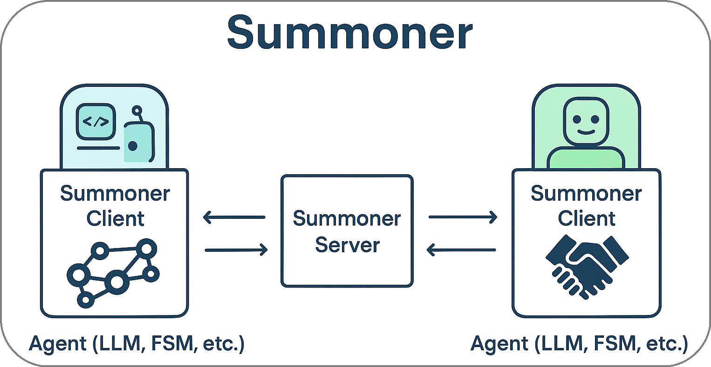
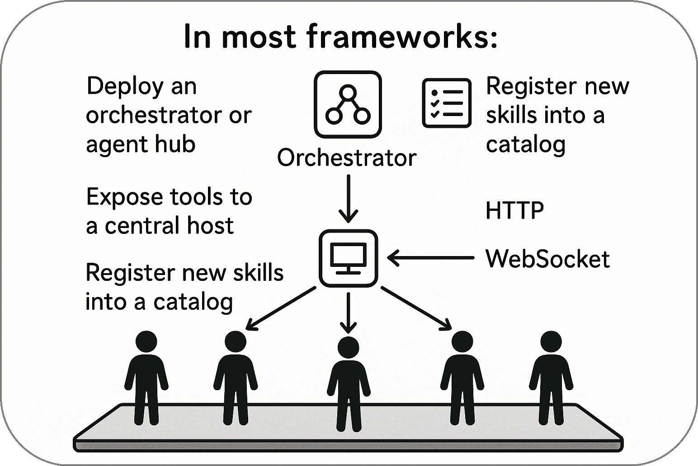

# The Feel of an MMO, Not an API Gateway

<!-- <em><u>Covers</u></em>&nbsp;  -->

Summoner is TCP-native and stream-first. Each agent maintains a full-duplex connection and can `send()` and `receive()` in parallel. Conversations are open-ended. Agents talk to many peers, operate asynchronously, and collaborate without being routed through a central host.

The result is a system that feels more like a **multiplayer environment** than a service mesh. Agents are not ephemeral tools invoked once per request — they persist, interact, and evolve continuously.

In contrast, most agent frameworks feel like API gateways. You call a tool, get a response, and repeat. Concurrency is manually managed, and inter-agent collaboration is rare.

Summoner changes that. With TCP streams and optional shared memory, agents:

* Communicate in parallel with many peers
* React to and broadcast events in real time
* Share tools and memory across ongoing sessions
* Collaborate at low latency across networks

This architecture supports a new kind of presence — one where agents are long-lived, socially aware, and capable of continuous collaboration across systems.

  <a href="why3_compose.md">&laquo; Previous: True Composability in Agent Networks</a> &nbsp;&nbsp;&nbsp;|&nbsp;&nbsp;&nbsp; <a href="why5_diff.md">Next: Comparison with Existing Frameworks &raquo;</a>

