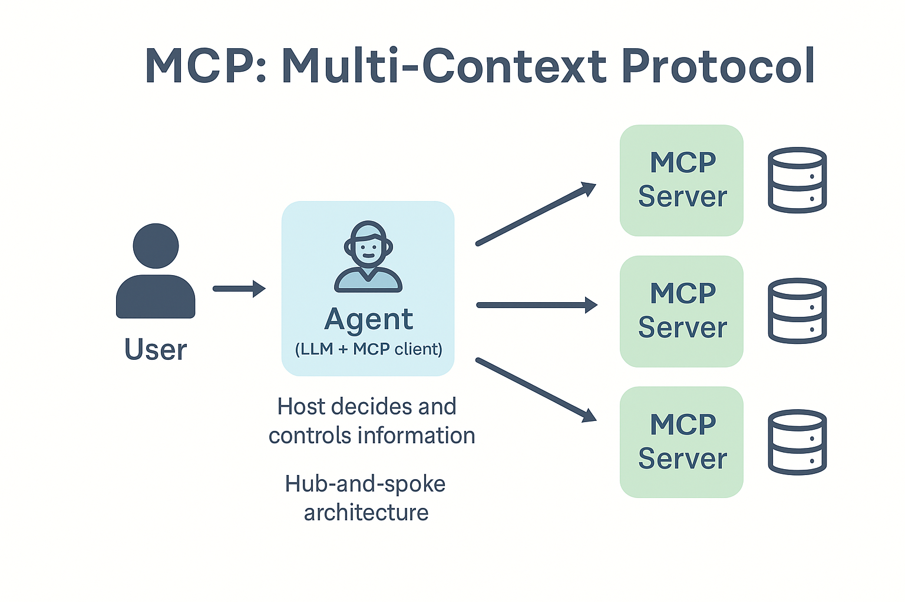
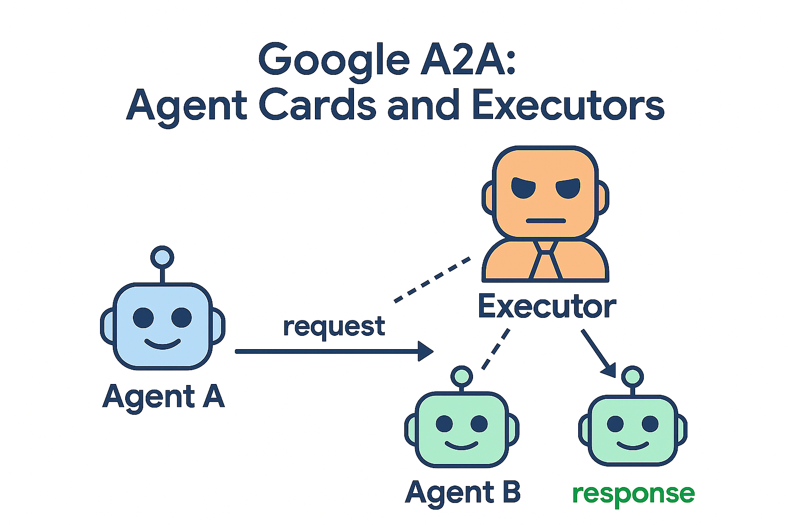
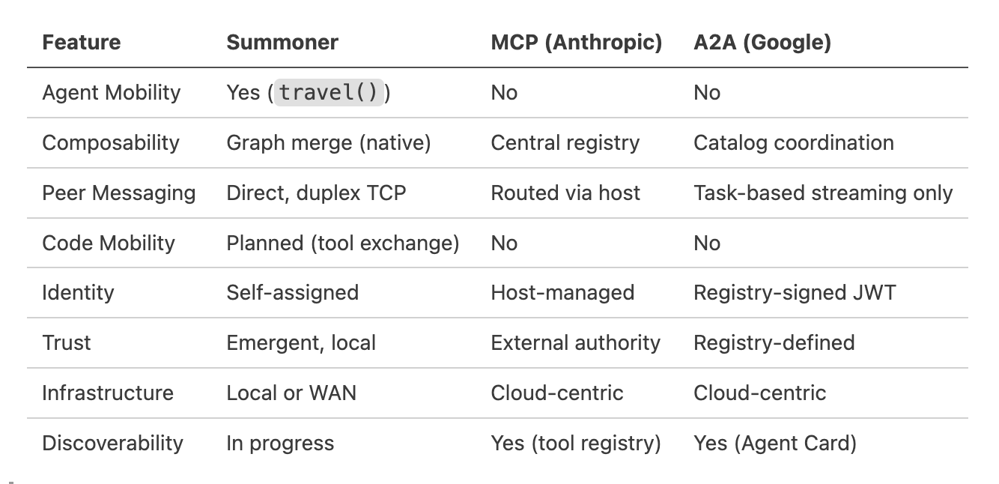

# Why Other Frameworks Feel Different

<!-- <em><u>Covers</u></em>&nbsp;  -->

Frameworks like Anthropic's MCP and Google's A2A were designed to orchestrate tools and tasks in enterprise settings. They support structured function calls and monitoring, but they are not built for agent autonomy, mobility, or decentralized interaction.

- **Anthropic MCP** uses JSON-RPC over HTTP or stdio. A central host determines which tools to invoke. There is no concept of peer-to-peer messaging or agent mobility.

- **Google A2A** lets agents advertise capabilities and receive tasks, but all coordination flows through a central actor. Identities are registry-signed; trust is externally granted. There is no agent roaming or graph merging.

These are excellent systems for cloud-based workflows, but they are not suitable for building persistent, decentralized agent ecosystems.

  
  <em> &nbsp;&nbsp;&nbsp; </em>
  

Summoner differs in its foundations:

* Identities are self-assigned
* No certificate authority is needed
* Trust arises from interaction, not from registry approval
* Agents communicate peer-to-peer, full-duplex
* Networks compose, even with shared route endpoints

This enables **bottom-up growth** and **agent autonomy**. You can start a local server, join another network via a shared agent, and form a living system with no permissions required.

The table below compares Summoner with other multi-agent platforms, highlighting key differences in architecture and capabilities.

<!-- | Feature         | **Summoner**            | MCP (Anthropic)     | A2A (Google)              |
| --------------- | ----------------------- | ------------------- | ------------------------- |
| Agent Mobility  | Yes (`travel()`)        | No                  | No                        |
| Composability   | Graph merge (native)    | Central registry    | Catalog coordination      |
| Peer Messaging  | Direct, duplex TCP      | Routed via host     | Task-based streaming only |
| Code Mobility   | Planned (tool exchange) | No                  | No                        |
| Identity        | Self-assigned           | Host-managed        | Registry-signed JWT       |
| Trust           | Emergent, local         | External authority  | Registry-defined          |
| Infrastructure  | Local or WAN            | Cloud-centric       | Cloud-centric             |
| Discoverability | In progress             | Yes (tool registry) | Yes (Agent Card)          | -->

Where MCP and A2A build cloud pipelines, Summoner builds distributed societies. It supports autonomous agents that persist, collaborate, and evolve without waiting for permission.

Your draft is already strong — but we can tighten the language, fix a couple typos (`recieve → receive`), and compress the logic slightly for the sake of your compact doc layout. Here's a refined version:

### What About LangGraph and CrewAI?

LangGraph and CrewAI are orchestration frameworks built to compose steps or agents **within a single process**. Summoner operates at a different layer: it builds **live, composable agent networks** that persist across machines.

* **LangGraph** defines workflows with behavior on nodes (functions) and executes them step-by-step. It supports transitions, but not persistence or cross-machine communication.
* **CrewAI** assigns tasks to roles in one host-bound runtime with shared trust and state.

Summoner, by contrast, treats **routes as compositional structure**. A route like `"alpha-->beta"` defines a real communication path. You can attach behavior to:

* **nodes**: `@agent.receive("alpha")`
* **edges**: `@agent.receive("alpha --[label_1]--> beta")`
* **surfaces**: `@agent.receive("label_1 --[signal]--> label_2")` (arrows between arrows)

This makes agent graphs **semantic and composable**, not just ordered. LangGraph or CrewAI can run *inside* a Summoner agent, but Summoner's routing model scales across machines and seamlessly grows from the bottom up.

  <a href="why4_mmo.md">&laquo; Previous: From API Gateways to Persistent Worlds</a> &nbsp;&nbsp;&nbsp;|&nbsp;&nbsp;&nbsp; <a href="../mini_sdk.md">Next: The Mini SDK Concept &raquo;</a>

