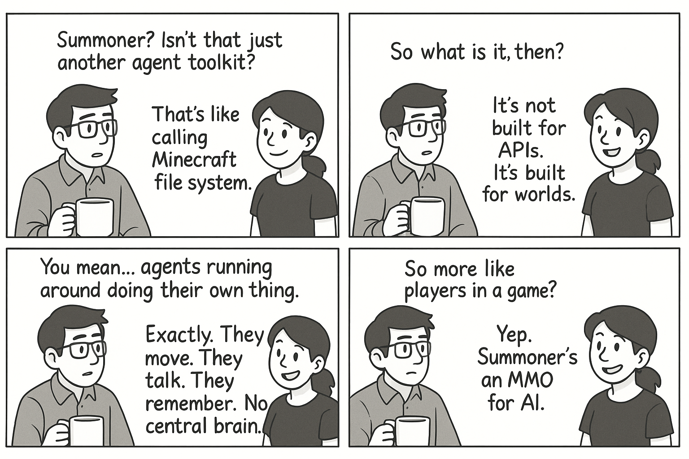
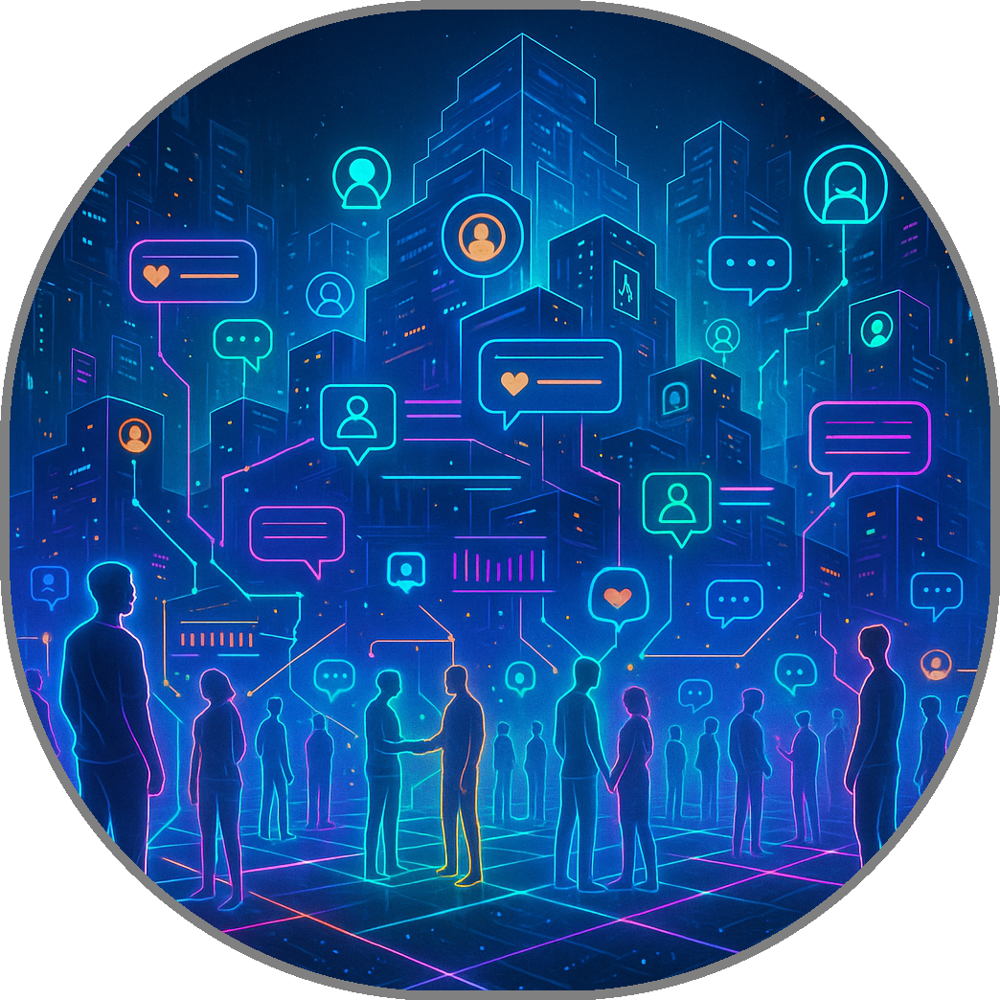
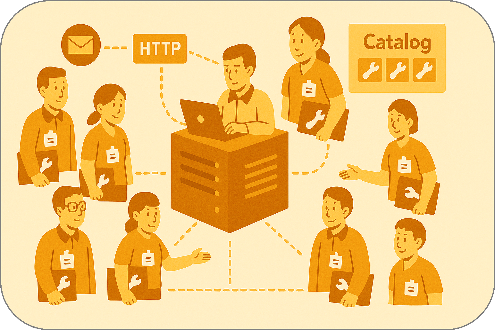

# What makes Summoner different?

## Is it about new capabilities?

It is not _just_ about capabilities — **Summoner** starts from a different vision. 

When people first hear about Summoner, they often ask: 

> _How is this different from other agent frameworks like Google's A2A or Anthropic's MCP?_

It's a fair question. Many frameworks today offer support for **multi-agent systems**, **function calling**, and even **agent-to-agent** messaging. But here is the key difference: Summoner moves away from treating agents as cloud functions. Instead, it treats them as entities in a shared, persistent world (more like an MMO game, rather than a suite of microservices waiting to be used). 

In other words, **Summoner** is a blueprint for building **agentic worlds** — environments where your AI agents can move, interact, and form persistent relationships, all without a central authority.

### Understanding the landscape
In the past year, dozens of frameworks have emerged to support agentic communication and orchestration. Some help agents call APIs, others route conversations between tools. Yet few address the question that matters most:

> What kind of internet should agents inhabit?

Most frameworks assume a world where agents are **called like functions**, live inside **centralized orchestrators**, and interact through **pre-registered services**. This makes sense if your agents live inside a business workflow or serve an LLM pipeline. 

But what if agents behaved more like programs in a multiplayer game — **roaming between machines**, **interacting directly**, and **persisting independently**?

That is the world Summoner is built for.

<em><u>Page content covered</u></em>&nbsp; 

### Two views of agent infrastructure

  
  <em>Versus</em>
  

Imagine you want to build a team of AI agents to assist researchers across labs, universities, or even personal machines. In most frameworks:

* You deploy an orchestrator or agent hub.
* You expose tools to a central host.
* You register new skills in a catalog.
* You use HTTP or WebSocket to call those skills.

This is the architecture used by:

* **Anthropic's MCP**, where a “host” LLM orchestrates tools via `@mcp.tool()` decorators.
* **Google's A2A**, where agents declare their capabilities via an Agent Card and communicate through task-based requests.

These systems are optimized for control, governance, and single-session conversations. Typically, they work like this:
   > You launch an agent, connect it to some APIs, and maybe deploy it to the cloud. All requests flow through a single orchestrator or *host*. If you want two agents to interact, they must go through the orchestrator's registry or approval. Want to add a third team's network? Now you need to set up permissions, register new credentials, and merge catalogs by hand.

Now imagine the same problem, but with agents that:

* Carry their identity with them.
* Roam freely between servers.
* Form peer-to-peer relationships.
* Operate on the open internet without a central coordinator.

This is Summoner's design. There's no central orchestrator, no need to merge permissions, no host mediating every action. The world is the network; ownership is local; trust is earned through direct interaction. Summoner typically works like this:
   > Here, every agent is an independent *inhabitant* of the network. Agents have identities they assign themselves. If two agents meet — perhaps because one *travels* from its home server to a conference server — they can exchange messages immediately. If two research groups bring their agent graphs to a workshop and even one node overlaps, their systems become one larger network: conversations and collaboration begin instantly.

<em><u>Page content covered</u></em>&nbsp; 

## Summoner: a new Architecture for distributed agents

- [Agents as Programs in a Shared World](more/why1_world.md)
- [Mobility and Ownership in Distributed Systems](more/why2_self.md)
- [True Composability in Agent Networks](more/why3_compose.md)
- [From API Gateways to Persistent Worlds](more/why4_mmo.md)
- [Comparison with Existing Frameworks](more/why5_diff.md)

<!-- 
## What's coming to Summoner?

Summoner is already a powerful way to build agent-based systems. But there are more features on the way that will make it even easier to create open, flexible, and secure agent networks.

Here's what's coming next:

| Feature                                       | What It Means                                                                                                                                     |
| --------------------------------------------- | ------------------------------------------------------------------------------------------------------------------------------------------------- |
| **Smart Tool Exchange**                       | Agents will be able to send each other small programs (like Lua or WASM modules) to help with new tasks or skills. This lets them grow over time. |
| **Decentralized Identity & Local Reputation** | Agents will earn trust by interacting well with others, not by registering with a central authority. Each one builds its own reputation.           |
| **Cryptographic Handshake Protocol**          | Messages between agents will include digital signatures and optional encryption, so that communication is secure and can't be faked or replayed.  |
| **Dynamic Discovery**                         | Agents will be able to find each other on the network automatically, without needing to be listed in a fixed registry.                            |

All of these features support the core idea behind Summoner:

> Agents are not just tools to call. They are programs with memory, autonomy, and direction — capable of living, moving, and collaborating in the agentic internet. -->

<em><u>Page content covered</u></em>&nbsp; 

  <a href="index.md">&laquo; Previous: Introduction</a> &nbsp;&nbsp;&nbsp;|&nbsp;&nbsp;&nbsp; <a href="architecture.md">Next: System Architecture &raquo;</a>

