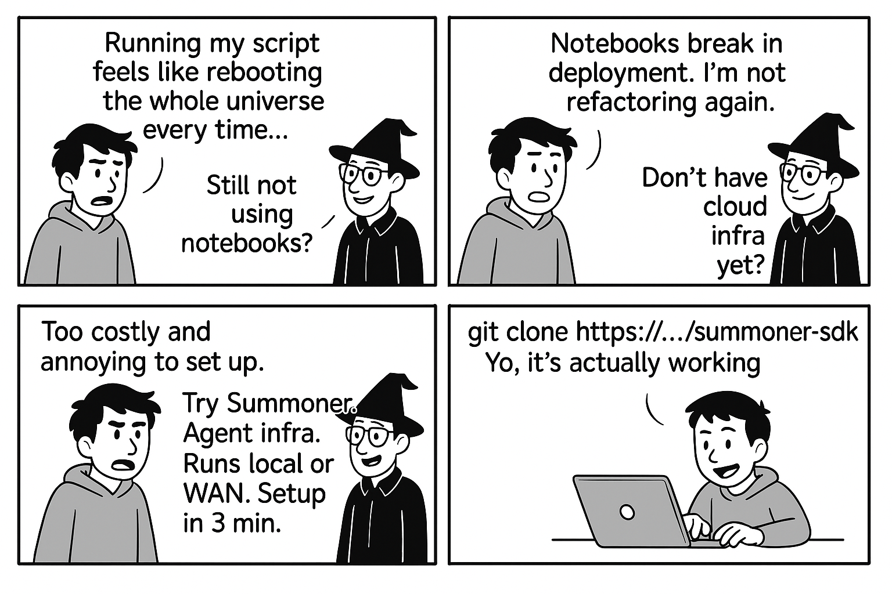
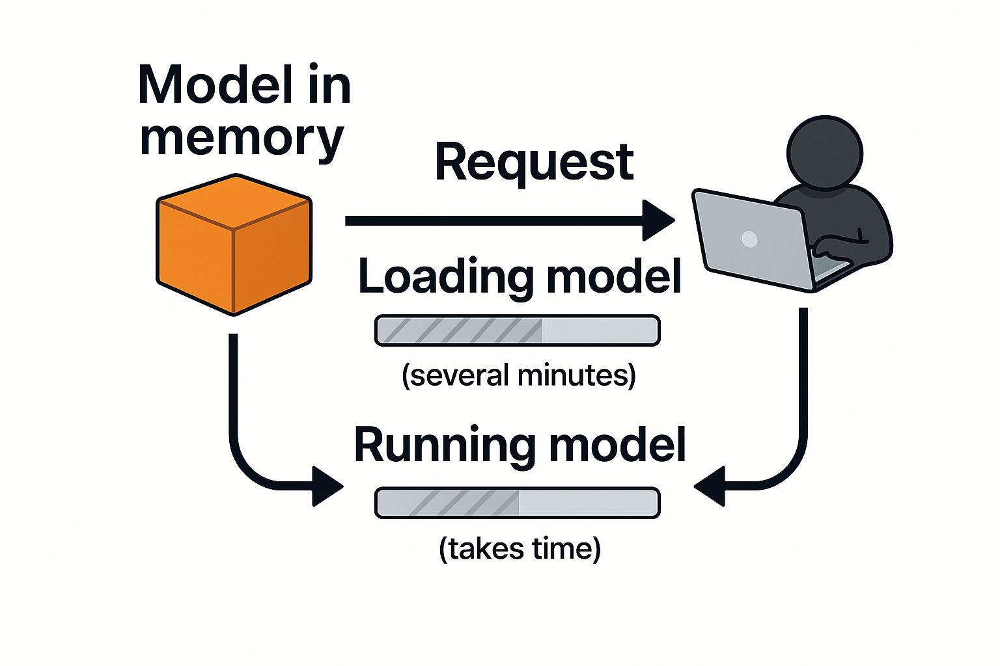

# Prologue

## What is Summoner in simple terms? 

<!-- <em><u>Covers</u></em>&nbsp;   -->

Summoner is a framework for deploying, connecting, and orchestrating multi-agent systems across multiple machines. With its desktop app, you can effortlessly configure, launch, and monitor agents from a unified interface, supporting the emerging infrastructure of the internet of intelligent, autonomous programs.

## Why should you care? 

<!-- <em><u>Covers</u></em>&nbsp;   -->

Just as the internet connects people, a new layer is emerging: **the internet for AI agents.**

Current frameworks for agent-based systems are often limited. Typically, they are built for **human-facing frontends** and rarely support independent, **open-internet** interactions. Yet, agents increasingly interact with web interfaces-scraping data, filling forms, and automating workflows, and this trend is accelerating.

While major tech companies experiment with **agent-to-agent** communication, many solutions still rely on paradigms built around human interaction. Summoner rethinks this architecture from the ground up, enabling direct peer-to-peer communication among intelligent programs and laying the foundation for a genuinely agentic internet.

## What if you are not building agents? Is Summoner still relevant? 

Yes. And in fact, you probably already care about agents without realizing it.

At its core, Summoner helps you reduce compute time and accelerate development. Let us explore a common scenario to illustrate how.

### From local development to deployment 

<!-- <em><u>Covers</u></em>&nbsp;  -->

Consider the transition from traditional **Python scripts** to **Jupyter notebooks**. In notebooks, once you execute expensive operations or load large models, the results are cached and ready for immediate reuse, greatly enhancing productivity.

Contrast that with regular Python scripts, which reload everything from scratch with every run. If loading a model like `word2vec` takes 20 seconds, repeatedly running the script quickly becomes time-consuming and inefficient 🫠.

The industry moved to **cloud solutions** precisely to maintain persistent services in memory, always ready to serve requests instantly.

Distributed systems further improve on this model by running services across multiple machines. AI agents represent the next evolutionary step: persistent, intelligent services capable of independent action, interaction, and dynamic responses.

### Where does Summoner fit in? 

<!-- <em><u>Covers</u></em>&nbsp;  -->

Imagine if LLM services like OpenAI or Claude required loading models for each query: responses would be prohibitively slow. Instead, these services maintain persistent models to provide instant interactions.

Summoner can offer this efficiency for your own applications, bridging the gap between experimental code and robust distributed systems. It lets you run your agents locally or across a network, keeping them persistently active and communicative without the complexity and cost of full-scale cloud infrastructure.

With Summoner, building efficient, persistent, and future-ready agent-based applications becomes straightforward and practical.

<a href="../index.md">&laquo; Previous: Table of Contents</a> &nbsp;&nbsp;&nbsp;|&nbsp;&nbsp;&nbsp; <a href="../introduction/index.md">Next: Introduction &raquo;</a>

