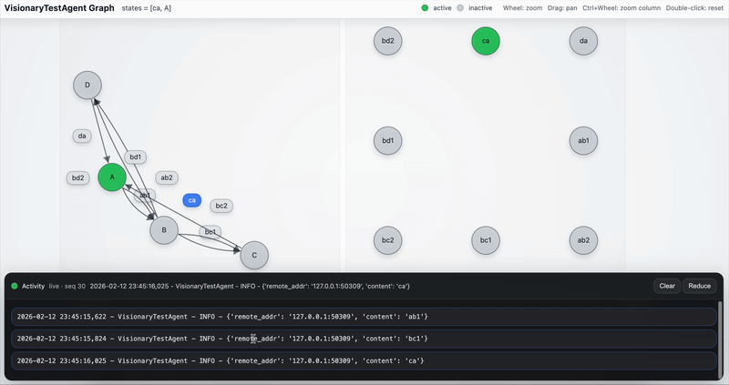
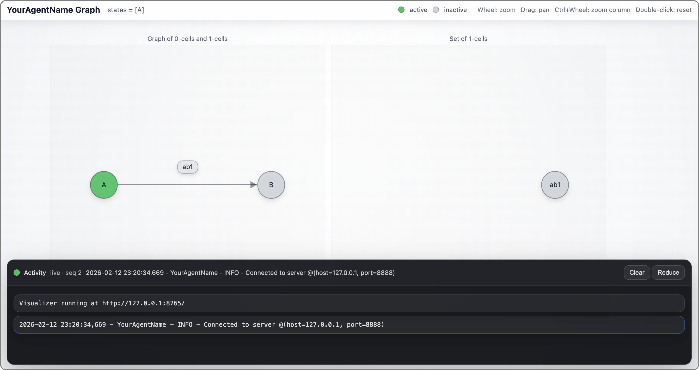
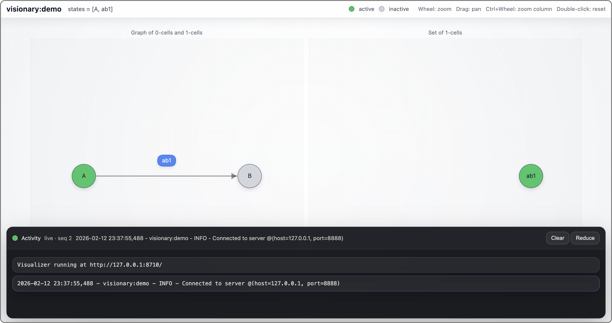

# <code style="background: transparent;">Summoner<b>.visionary</b></code>

This page documents the **Python SDK interface** for running the **Visionary** browser visualizer via `ClientFlowVisualizer`. It focuses on how to install it in an extension-template workflow, how to start it, and how to use it at runtime to publish a graph, highlight active tokens, and stream logs.

<p align="center">
  
</p>

**Visionary** is a lightweight browser visualizer for **Summoner client flow graphs**. It is meant to make your client’s control structure visible while it runs by showing three things at the same time:

* The **static graph** extracted from `client.dna()`, meaning nodes and labeled arrows.
* The **active snapshot** you provide at runtime, meaning a set of tokens that should be highlighted.
* A **live activity terminal**, meaning your Python logger output streamed into the page.

The module is intentionally small and depends only on the standard library. The typical usage pattern is:

1. Construct a `ClientFlowVisualizer` with a title and a port.
2. Attach your client logger (optional, but recommended).
3. Start the visualizer (optionally open a browser tab).
4. Load the graph from `client.dna()` (typically once at startup).
5. Publish active tokens over time using `push_states(...)` (typically from state sync handlers).

### Public entry point

The only public symbol exported by this extension is `ClientFlowVisualizer`. Everything else is internal.

## Installation in an extension-template workflow

**Visionary** is shipped as an extension module hosted in the `extension-utilities` repository. In an extension-template project, you add it to your SDK build list so it is included during composition.

### Add Visionary to `build.txt`

Add the following entry to your SDK builder list:

```text
https://github.com/Summoner-Network/extension-utilities.git:
visionary
```

This tells the SDK composition step to pull the `visionary` module from `extension-utilities` and merge it into the composed SDK.

### Import path

Import the visualizer from the SDK like any other public module:

```python
from summoner.visionary import ClientFlowVisualizer
```

> [!NOTE]
> In the `extension-utilities` repository, local test scripts may import **Visionary** directly from the repo layout as `from tooling.visionary import ClientFlowVisualizer` (that is, without SDK composition). For normal SDK usage, always use the `summoner.visionary` import.


## Choosing ports

You initialize the visualizer by selecting a port and passing it to the constructor:

```python
viz = ClientFlowVisualizer(title="...", port=8765)
```

**Visionary** starts a local HTTP server on `127.0.0.1:<port>`. The port must be free. When running multiple agents locally, the port should be **different for each agent process**. Avoid hardcoding a single shared port if you routinely run agents concurrently, and treat the port as part of your agent’s runtime configuration (similar to a client name).

A simple rule that works well is:

* choose a stable base range (for example 8765–9765),
* pick one port per process from that range,
* avoid collisions across concurrently running agents.

### Example: generating a per-run port

The helper below selects a port in a range using a timestamp-derived hash. It is intended to reduce accidental collisions when you launch multiple agents during the same day.

```python
import time, hashlib

def daily_unique_port(base=8765, span=1000):
    """
    Generates a port unlikely to repeat within the same day.
    base: starting port
    span: size of the port range
    """
    now = time.time_ns()  # nanoseconds
    h = hashlib.sha256(str(now).encode()).hexdigest()
    offset = int(h[:8], 16) % span
    return base + offset

viz = ClientFlowVisualizer(title="...", port=daily_unique_port())
```

Practical notes:

* If you start many agents quickly, collisions are still possible. If you need stronger guarantees, make the port selection depend on the agent id (and optionally retry binds on failure).
* Pick a `base` and `span` that do not overlap with other fixed services you run locally.


## Running it in your client

**Visionary** is designed to be driven from your client runtime, not as a standalone tool. The minimal pattern is:

* start the visualizer,
* load the DNA graph once,
* push active tokens as your agent runs,
* optionally mirror logs via the client logger.

A typical startup sequence looks like:

```python
viz = ClientFlowVisualizer(title=f"{AGENT_ID} Graph", port=daily_unique_port())

...

viz.attach_logger(client.logger)
viz.start(open_browser=True)
viz.set_graph_from_dna(json.loads(client.dna()), parse_route=client_flow.parse_route)
viz.push_states(["A"])  # initial snapshot
```

From there, update highlighting by calling:

```python
viz.push_states(...)
```

Most users publish snapshots from `@client.upload_states()` and `@client.download_states()` so the UI reflects the same post-resolution state the client uses.

## Agent skeleton using Visionary

The visualizer is meant to be embedded in a normal client script. The minimal pattern is:

1. Construct a `SummonerClient` and register routes (so `client.dna()` is not empty).
2. Construct a `ClientFlowVisualizer` with a local port.
3. Start the visualizer and load the graph from `client.dna()` (typically once at startup).
4. Publish active tokens over time with `viz.push_states(...)` (typically from state sync handlers).
5. Optionally attach the client logger so logs appear in the web terminal.

A stripped-down skeleton looks like this:

```python
# Imports: client SDK + protocol tokens + Visionary.
import json
from typing import Any

from summoner.client import SummonerClient
from summoner.protocol import Node, Event
from summoner.visionary import ClientFlowVisualizer

# Client setup: create the agent entry point.
AGENT_ID = "YourAgentName"
client = SummonerClient(name=AGENT_ID)

# Flow setup: enable route parsing and declare the arrow syntax you use in route strings.
client_flow = client.flow().activate()
client_flow.add_arrow_style(stem="-", brackets=("[", "]"), separator=",", tip=">")
Trigger = client_flow.triggers()

# Visualizer setup: choose a free local port (use a different one per concurrently running agent).
viz = ClientFlowVisualizer(title=f"{AGENT_ID} Graph", port=8765)

# Visualization snapshot: tokens you want highlighted (node tokens and/or label tokens).
ACTIVE_TOKENS: set[str] = {"A"}

# State upload: publish your current snapshot and return your state to the flow system.
@client.upload_states()
async def upload_states(_: Any) -> list[Node]:
    viz.push_states(sorted(ACTIVE_TOKENS))
    return [Node(x) for x in sorted(ACTIVE_TOKENS) if x.isidentifier()]  # replace

# State download: apply the merged snapshot and publish the post-merge view.
@client.download_states()
async def download_states(possible_states: list[Node]) -> None:
    ACTIVE_TOKENS.clear()
    ACTIVE_TOKENS.update([str(x).strip() for x in (possible_states or [])])  # replace
    viz.push_states(sorted(ACTIVE_TOKENS))

# Routes: define handlers so client.dna() contains the graph you want to visualize.
@client.receive(route="A --[ ab1 ]--> B")
async def ab1(msg: Any) -> Event:
    # Add your behavior here.
    return None  # replace with your Action(Trigger) pattern

# Startup: start Visionary, load the DNA-derived graph, publish initial state, then run the client.
if __name__ == "__main__":
    viz.attach_logger(client.logger)
    viz.start(open_browser=True)
    viz.set_graph_from_dna(json.loads(client.dna()), parse_route=client_flow.parse_route)
    viz.push_states(sorted(ACTIVE_TOKENS))

    client.run(
        host="127.0.0.1",
        port=8888,
        config_path="path/to/your_client_config.json",  # or config_dict=...
    )
```

Running this agent opens a browser page on startup with a graph and an activity panel similar to the one below.

<p align="center">
  
</p>


> [!NOTE]
>
> * The graph shown in the browser comes from `client.dna()`. If you do not register any routes, the canvas can be empty even if you push states.
> * `viz.push_states(...)` controls highlighting only. It does not change the graph.
> * Publishing from `upload_states` / `download_states` keeps the UI aligned with the state resolution boundary. If you publish elsewhere, it is easy for the UI to drift from the post-merge state your client actually uses.
> * In a composed SDK, the only change is the import path (`from summoner.visionary import ClientFlowVisualizer`).

## `ClientFlowVisualizer.__init__`

```python
def __init__(self, *, title: str = "Summoner Graph", port: int = 8765) -> None
```

### Behavior

Creates a visualizer instance and prepares internal state for serving a graph view.

* Stores `title` and `port`.
* Initializes internal shared state for:

  * the graph payload served at `GET /graph`,
  * the active token snapshot served at `GET /state`,
  * the terminal log ring buffer served at `GET /logs?after=<seq>`.

This constructor does not start any threads or bind any ports. Call `start(...)` to launch the HTTP server.

### Inputs

#### `title`

* **Type:** `str`
* **Meaning:** Title shown in the browser UI header.
* **Default:** `"Summoner Graph"`

#### `port`

* **Type:** `int`
* **Meaning:** Local port used when the HTTP server is started.
* **Default:** `8765`

### Outputs

This constructor returns a `ClientFlowVisualizer` instance.

### Examples

#### Basic initialization

```python
viz = ClientFlowVisualizer(title="agent:graph", port=8765)
```


## `ClientFlowVisualizer.start`

```python
def start(self, *, open_browser: bool = True) -> None
```

### Behavior

Starts the local HTTP server in a daemon thread, serving on:

* `http://127.0.0.1:<port>/`

This method is **idempotent**: if the server thread already exists, the call returns immediately and does nothing.

When the server starts, it:

* serves the frontend page at `/` (or `/?...`)
* serves JSON endpoints at `/graph`, `/state`, and `/logs?after=<seq>`
* disables request logging from `BaseHTTPRequestHandler` (no stderr access logs)
* emits one neutral startup log line into the visualizer terminal buffer:

  * `Visualizer running at http://127.0.0.1:<port>/`

If `open_browser=True`, it waits briefly and opens the page via `webbrowser.open(...)`.

### Inputs

#### `open_browser`

* **Type:** `bool`
* **Meaning:** Whether to open a browser tab automatically after the server starts.
* **Default:** `True`

### Outputs

Returns `None`.

### Examples

#### Start the server and open a browser tab

```python
viz.start(open_browser=True)
```

#### Start the server without opening a browser tab

```python
viz.start(open_browser=False)
```

## `ClientFlowVisualizer.set_graph_from_dna`

```python
def set_graph_from_dna(
    self,
    dna: List[Dict[str, Any]],
    *,
    parse_route: Optional[ParseRouteFn] = None
) -> None
```

### Behavior

Computes a graph from a client DNA specification and stores it as the active graph served at `GET /graph`.

This controls what the browser can render. If the graph is empty, the canvas is empty, regardless of what states you push.

### Inputs

#### `dna`

* **Type:** `List[Dict[str, Any]]`
* **Meaning:** DNA records, typically obtained from `json.loads(client.dna())`.

#### `parse_route`

* **Type:** `Optional[ParseRouteFn]`
* **Meaning:** Optional parser used to extract sources/labels/targets from routes (recommended for flow graphs).
* **Default:** `None` (fallback extraction mode).

### Outputs

Returns `None`.

### Examples

#### Load graph using flow parsing

```python
viz.set_graph_from_dna(json.loads(client.dna()), parse_route=client_flow.parse_route)
```

#### Load graph without parsing (fallback)

```python
viz.set_graph_from_dna(json.loads(client.dna()))
```

## `ClientFlowVisualizer.push_states`

```python
def push_states(self, states: Any) -> None
```

### Behavior

Publishes the current **active token snapshot** for highlighting. The snapshot is served at `GET /state` as:

* `{"states": [...]}`

The frontend highlights tokens by **string identity** after normalization:

* each token is converted to `str(x).strip()`

Input shapes supported:

* a single token
* a list/tuple of tokens
* a dictionary whose values are tokens or list/tuple of tokens

All values are flattened into a single list of strings in insertion order.

This call replaces the previous snapshot.

### Inputs

#### `states`

* **Type:** `Any`
* **Meaning:** Tokens to highlight. Tokens may be `Node("A")`, strings like `"A"`, label tokens like `"ab1"`, or any objects with a useful `__str__`.
* **Normalization:** Each token is stringified and whitespace-stripped.

### Outputs

Returns `None`.

### Examples

#### Push a simple highlight set

```python
viz.push_states(["A", "ab1"])
```

#### Push structured groups (values are flattened)

```python
viz.push_states({"nodes": ["A", "C"], "labels": ["bc1"]})
```

#### Push a single token

```python
viz.push_states("A")
```

## `ClientFlowVisualizer.push_log`

```python
def push_log(self, line: Any) -> None
```

### Behavior

Appends one log line into the web terminal ring buffer.

Normalization rules:

* the line is converted to `str(line).strip()`
* ANSI color codes are removed
* empty lines are ignored

Log storage behavior:

* each stored line is assigned a strictly increasing sequence number `seq`
* the buffer is capped at `max_logs` (default 3000)
* if capacity is exceeded, oldest entries are dropped

The browser retrieves logs incrementally via:

* `GET /logs?after=<seq>`

### Inputs

#### `line`

* **Type:** `Any`
* **Meaning:** A log line (or log-like object) to append.
* **Filtering:** Empty output after normalization is ignored.

### Outputs

Returns `None`.

### Examples

#### Emit an explicit line

```python
viz.push_log("connected")
```

#### Emit a structured object (stringified)

```python
viz.push_log({"event": "travel", "host": "127.0.0.1", "port": 9999})
```

## `ClientFlowVisualizer.push_logs`

```python
def push_logs(self, lines: Any) -> None
```

### Behavior

Convenience wrapper around `push_log(...)`.

* If `lines` is `None`, does nothing.
* If `lines` is a list/tuple, pushes each element in order.
* Otherwise, pushes a single line.

### Inputs

#### `lines`

* **Type:** `Any`
* **Meaning:** Either a single log line or a list/tuple of log lines.

### Outputs

Returns `None`.

### Examples

#### Push multiple log lines

```python
viz.push_logs(["starting", "connected", "ready"])
```

## `ClientFlowVisualizer.attach_logger`

```python
def attach_logger(
    self,
    logger: logging.Logger,
    *,
    level: int = logging.DEBUG,
    formatter: Optional[logging.Formatter] = None
) -> logging.Handler
```

### Behavior

Attaches a logging handler to `logger` that mirrors log records into the visualizer terminal.

Handler behavior:

* The handler formats each `LogRecord` and forwards the formatted string to `push_log(...)`.
* If formatting fails, it falls back to `record.getMessage()`, and if that fails, uses a placeholder string.
* ANSI escapes are stripped in `push_log(...)`, so ANSI-colored console formatters remain safe to reuse.

Formatter selection policy:

* If `formatter` is provided, it is used.
* Otherwise, if `logger.handlers[0].formatter` exists, it is reused.
* Otherwise, a default formatter is installed:

  * `%(asctime)s - %(name)s - %(levelname)s - %(message)s`

The handler is returned to the caller. (This can be used if you want to remove it later.)

### Inputs

#### `logger`

* **Type:** `logging.Logger`
* **Meaning:** The logger whose records should be mirrored to the web UI.

#### `level`

* **Type:** `int`
* **Meaning:** The handler log level threshold.
* **Default:** `logging.DEBUG`

#### `formatter`

* **Type:** `Optional[logging.Formatter]`
* **Meaning:** Formatter to use for the mirrored terminal output.
* **Default:** `None` (reuse or default policy is used).

### Outputs

Returns the attached `logging.Handler` instance.

### Examples

#### Attach the client logger with defaults

```python
viz.attach_logger(client.logger)
```

#### Attach with an explicit formatter

```python
fmt = logging.Formatter("[%(levelname)s] %(message)s")
viz.attach_logger(client.logger, level=logging.INFO, formatter=fmt)
```

## End-to-end example

### Example: start Visionary for a Summoner client

```python
import json
from summoner.client import SummonerClient
from summoner.visionary import ClientFlowVisualizer  # composed SDK path

client = SummonerClient(name="visionary:demo")

client_flow = client.flow().activate()
client_flow.add_arrow_style(stem="-", brackets=("[", "]"), separator=",", tip=">")

# Define at least one route so DNA is not empty.
@client.receive(route="A --[ ab1 ]--> B")
async def ab1(payload):
    client.logger.info(f"received: {payload!r}")
    return None

viz = ClientFlowVisualizer(title="visionary:demo", port=8710)
viz.attach_logger(client.logger)
viz.start(open_browser=True)

viz.set_graph_from_dna(json.loads(client.dna()), parse_route=client_flow.parse_route)
viz.push_states(["A", "ab1"])

client.run(host="127.0.0.1", port=8888)
```

### behavior

* The browser opens to `http://127.0.0.1:8710/`.
* The canvas renders the DNA-derived graph.
* Tokens `"A"` and `"ab1"` are highlighted.
* Client logs are streamed into the Activity panel via the attached logger handler.

<p align="center">
  
</p>

## Troubleshooting

* **Why is the canvas empty?**
  The UI can only draw what exists in the graph served by `GET /graph`. Make sure you called `set_graph_from_dna(...)` with DNA that includes at least one route, and prefer passing `parse_route=client_flow.parse_route` so arrow routes are extracted.

* **Why does nothing highlight?**
  Highlighting depends only on `push_states(...)`. Confirm that you are pushing tokens that match node or label token strings in the loaded graph (after `str(x).strip()`).

* **Why is the terminal empty?**
  The web terminal is opt-in. Call `viz.attach_logger(client.logger)` or push explicit lines with `viz.push_log(...)`.


<p align="center">
  <a href="index.md">&laquo; Previous: Utility Extensions</a> &nbsp;&nbsp;&nbsp;|&nbsp;&nbsp;&nbsp; <a href="pdf_tools.md">Next: <code style="background: transparent;">Summoner<b>.pdf_tools</b></code> &raquo;</a>
</p>