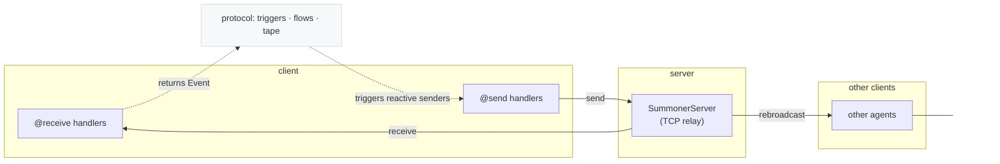

# Core SDK

The Core SDK is the foundation of Summoner. It is split into three layers that are designed to be used together: the **client** (where you write agent behavior), the **server** (which connects agents over the network), and the **protocol** (the small runtime primitives that make routing and state transitions consistent and debuggable).

* [<code style="background: transparent;">Summoner<b>.client</b></code>](client.md) is the decorator-based runtime for building agents. You register your agent's behavior by attaching async functions to decorators such as `@receive` (handle inbound messages), `@send` (produce outbound messages), and `@hook` (validate or transform payloads on the way in or out). The client also manages lifecycle concerns like connecting, reconnecting, shutdown, and optional flow-aware behavior where receiver results can trigger reactive sends. If you want portability, the client can export its behavior as **DNA**, which can later be merged or used to rebuild a client.

* [<code style="background: transparent;">Summoner<b>.server</b></code>](server.md) is the networking relay that makes multiple clients talk to each other. Clients connect to a host and port over TCP, send newline-delimited messages, and the server rebroadcasts them to other connected clients. The server's configuration exists mainly for operational control: logging and observability, plus stability features such as backpressure, rate limiting, and quarantine. In practice, you run the server as local infrastructure during development, and as a more carefully tuned relay in deployment.

* [<code style="background: transparent;">Summoner<b>.protocol</b></code>](proto.md) is the "wiring layer" shared by client and tooling. It defines signals and events (via trigger trees), parses route strings into structured forms (flows), and tracks evolving state using the **state tape**. You can ignore this layer when you are just sending and receiving simple messages, but it becomes important when you use flow-aware routing (for example arrow routes like `A --[x]--> B`), when you want deterministic route normalization, or when you need to debug why a given receiver or sender fired.

## Mental model



## Quick start in two files

### 1) Start a relay

```python
# server.py
from summoner.server import SummonerServer

SummonerServer(name="demo-server").run(host="127.0.0.1", port=8888)
```

### 2) Connect a client

```python
# client.py
from summoner.client.client import SummonerClient
from summoner.protocol.process import Direction

agent = SummonerClient(name="demo-client")

@agent.hook(Direction.RECEIVE, priority=(0,))
async def drop_empty(payload):
    return payload or None

@agent.receive("check")
async def on_check(payload):
    print("got:", payload)

agent.run(host="127.0.0.1", port=8888)
```

## Flow-aware client

If you use arrow routes in decorators, configure the client flow first (see [protocol overview](proto.md)):

```python
from summoner.protocol.triggers import load_triggers, Move

flow = agent.flow().activate()
flow.add_arrow_style(stem="-", brackets=("[", "]"), separator=",", tip=">")
flow.compile_arrow_patterns()  # optional sanity check

Trigger = load_triggers(text="OK\n  minor")

@agent.receive("A --[ greet ]--> B")
async def on_greet(payload):
    return Move(Trigger.minor)  # returned Event can drive reactive senders
```

<p align="center">
  <a href="../index.md">&laquo; Previous: SDK Reference (Intro)</a>
  &nbsp;&nbsp;&nbsp;|&nbsp;&nbsp;&nbsp;
  <a href="client.md">Next: <code style="background: transparent;">Summoner<b>.client</b></code> &raquo;</a>
</p>
